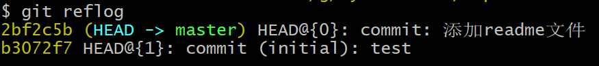
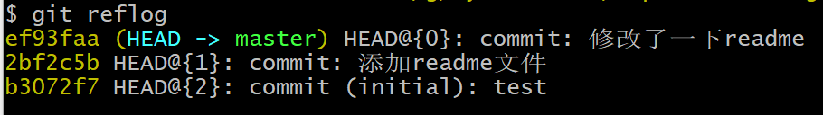
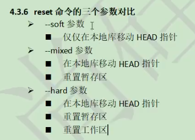

# g'i'tgit 版本控制


## 初始化：git init

用于创建一个.git 文件夹，里面有配置文件

## 设置签名

用户名

email地址

作用是区分不同的开发人员

------

辨析：（用于远程代码托管中心）

```
git config user.name tom
git config user.email 9484654651@qq.com
保存在.git/config

git config --global user.name tom
git config --global user.email 9484654651@qq.com
保存在~/.gitconfig
```


## 从工作区添加到暂存区

git add <file>

从暂存区删除 git rm --cached <file>


## 从暂存区添加到本地仓库

git commit <file>

然后git会自动调用vim编辑器

：wq为写入并退出

## 修改工作区的文件

git会自动识别出来


## 查看历史记录

```
git status

git add <file>

git commit <file>
git commit -m "context of message" <file>

git log
git log --pretty=online
git reflog

```



## 恢复历史版本

head指针指向当前版本，可以前进后退



基于索引值进行操作

```
git reset --hard <局部索引>
git reset --hard HEAD^ 
一个^代表回去一步
git reset --hard HEAD~n
回去n步
```



