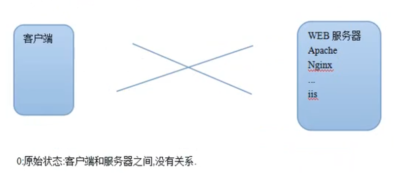
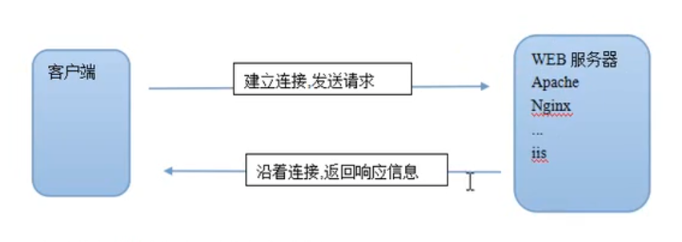
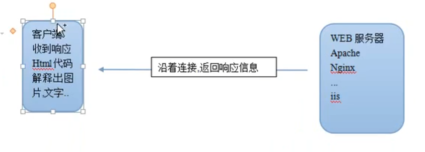
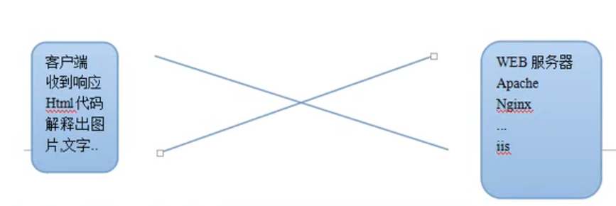
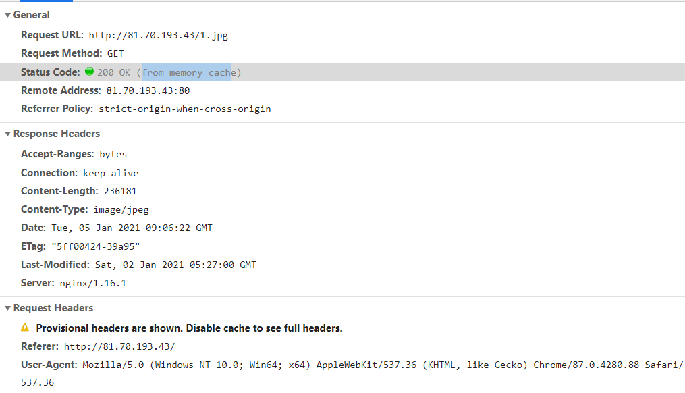
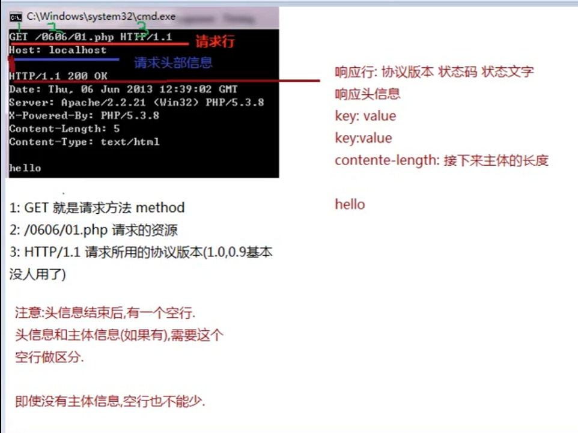
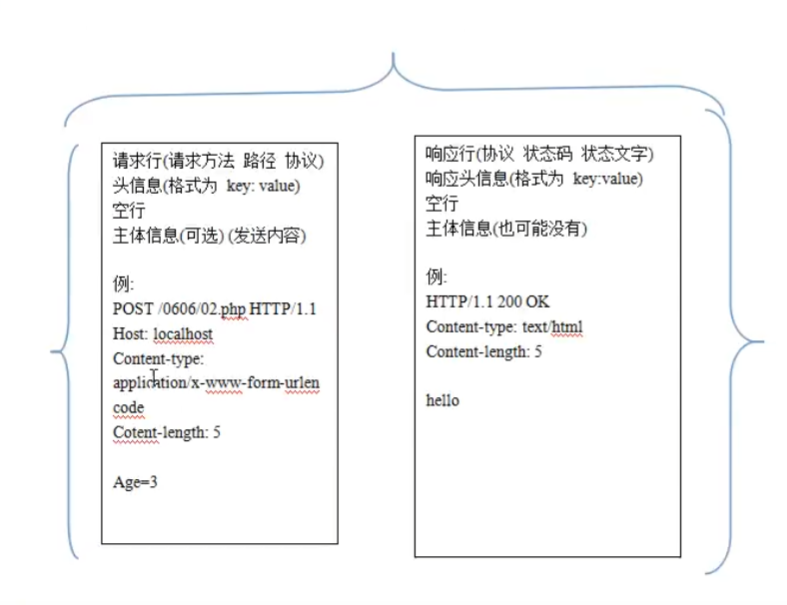
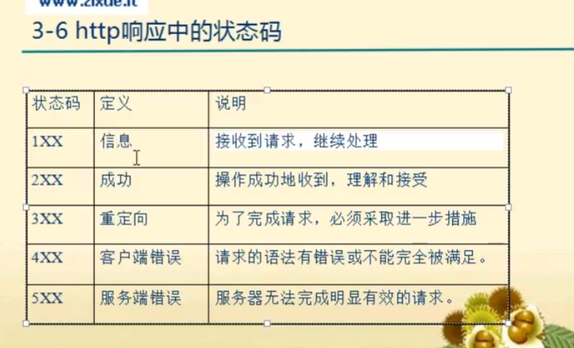

# HTTP协议的学习

目前比较普遍的协议有

ftp，http，stmp，pop，tcp/ip 协议

## HTTP协议的工作流程

客户端 <--->  web服务器

初始状态：0 没有建立连接

请求头信息；

响应头信息。

## 请求

请求行

请求头信息

请求主体信息

请求行分为三部分：

请求方法，请求路径，所用协议

其中请求方法有：get，post，put，delete，trace等

Status Code: 304 Not Modified 从缓存里自己取的

