# 《大话数据结构》读书笔记

## 第一章

程序设计 = 数据结构 + 算法

数据结构是一门研究非数值计算的程序设计问题中的操作对象，以及它们之间的关系和操作等相关问题的科学。

### 基本概念和术语

数据：描述客观事物的符号，是计算机中可以操作的对象，是能被计算机是被，并输入给计算机处理的符号集合。

数据元素：组成数据的，有一定意义的基本单元，在计算机中通常作为整体处理，也被称为记录。

数据项：一个数据元素可以有若干个数据项组成

数据项是数据的最小单位

数据对象：是性质相同的数据元素的集合，是数据的子集。

**数据结构：是相互之间存在一种或多种特定关系的数据元素的集合**

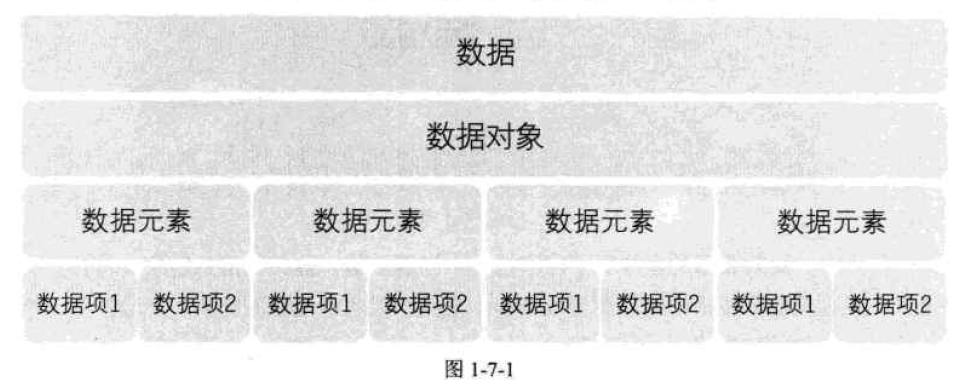

### 逻辑结构与物理结构

#### 逻辑结构

1. 集合结构

   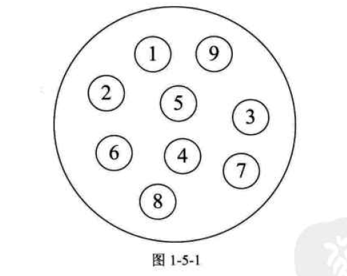

2. 线性结构

   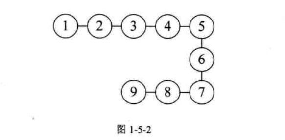

3. 树形结构

   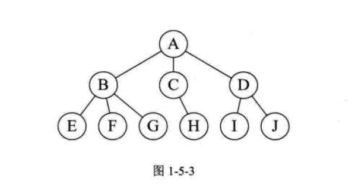

4. 图形结构

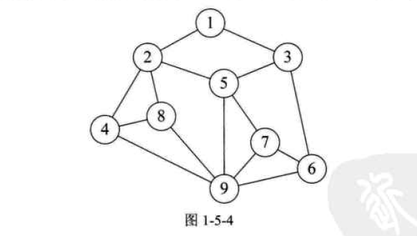

#### 物理结构

数据的逻辑结构在计算机中的储存形式。主要分为两种**顺序储存结构**，**链式储存结构**。


顺序储存结构比如说数组，比如说int数组，计算会自动计算 int大小*个数，开辟一个连续的内存空间，把数据放进去。

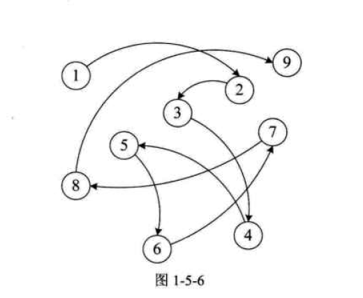

链式结构把数据元素存放在任意的储存单元里，可以是连续的。元素的储存关系不能反映其逻辑关系，因此需要一个指针存放数据元素的地址。

## 第二章

**算法是解决特定问题求解步骤的描述，在计算机中表现为指令的有限序列，并且每条指令表示一个或多个操作。**

### 引子

求1-100的和：

```python
%%timeit
sum = 0
for i in range(1,101):
    sum += i
```

    4.09 µs ± 47.4 ns per loop (mean ± std. dev. of 7 runs, 100000 loops each)

```python
%%timeit
sum = 0
n = 100
sum = (1+n)*n/2
```

    88.3 ns ± 0.685 ns per loop (mean ± std. dev. of 7 runs, 10000000 loops each)

for循环用了4微秒，而等差公式只用了88纳秒，速度不在一个量级上，但解决了同一个问题。

### 算法的基本特征

输入输出、有穷性、确定性、可行性。

### 算法效率的度量方法

事后分析估算---一般不用

事前分析估算：

计算对运行时间有小号的基本操作的执行次数，运行时间与这个计数成正比。

比如，问题输入规模为n，对每一次输入都执行n次操作，总的操作数量为n*n：

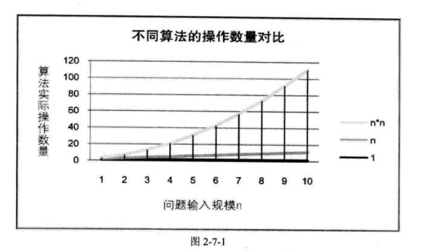

### 算法时间复杂度

在进行算法分析是，语句总的执行次数T是关于问题规模n的函数，进而分析T随n的变化情况并确定T的数量级。算法的时间复杂度是算法的时间度量。可以记为：$\mathrm{O}(n), \mathrm{O}(1), \mathrm{O}\left(n^{2}\right)$ 

比如：

算法执行10次---> $\mathrm{O}(1)$

算法执行1000次--->$\mathrm{O}(1)$

输入一个n，算法执行n次 --->$$\mathrm{O}(n)$$

**考虑时间复杂度的时候，我们要考虑最坏情况：比如说在一个n位数组中寻找一个数字，此时我们的时间复杂度$\mathrm{O}(n)$**

### 算法空间复杂度

有时我们写程序时，可以用空间换取时间。

当我们遇到这种情况：输入一个年份，判断是否为闰年

一种方法是，输入后进行计算，判断是否为闰年

第二种方法是，储存10000个闰年年份在硬盘里，输入后就进行比对，判断是否为闰年。

算法的空间复杂度通过计算算法所需要的储存空间实现。

## 第三章

### 线性表list

线性表：零个或多个数据元素的有限序列

几个关键点：

* 首先它是一个序列
* 线性表强调有限的

如果用数学语言堆线性表进行定义，如下：

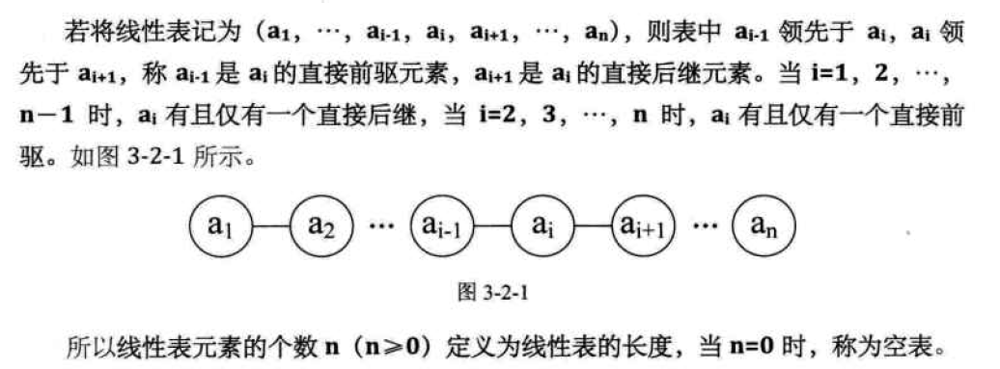

### 线性表的抽象数据类型

线性表有以下基本操作：

*  初始化一个空的线性表 

* 若线性表为空，返回True

* 将线性表清空到第i个元素

* 在线性表表中找到与e值相等的元素，并返回序号

* 在i个位置插入新元素e

* 删除第i个位置上的元素

* 返回length

用这些基本操作可以完成一些非常复杂的操作

### 线性表的储存结构

线性表有两种物理结构：顺序储存结构，链式储存结构。

#### 顺序储存结构

线性表的顺序存储结构，指的是用一段地址连续的存储单元依次存储线性表的数据元素。

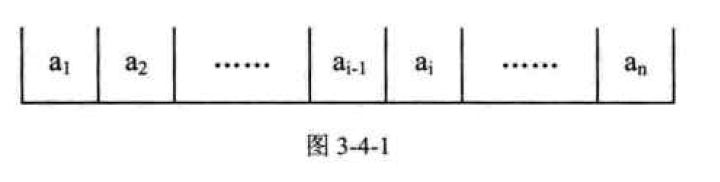

#### 顺序储存方式

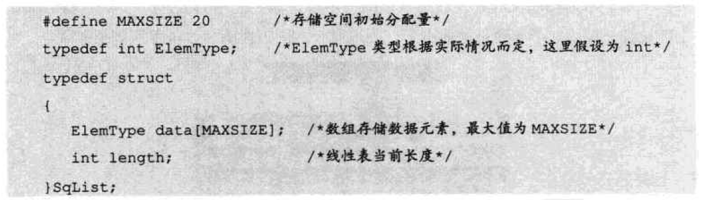

**数据长度与线性表长度的区别：**

线性表的长度是数据元素的个数，

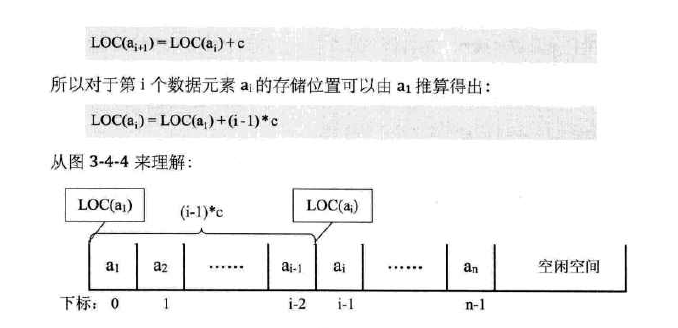

通过以上的方法，可以随时算出线性表中任意的地址。

所以它的存取性能为o(1)，通常我们把具有这一特点的储存结构称为**随机存取结构**。

对于顺序储存结构，取元素很简单

插入和删除元素的时间复杂度为o(n)

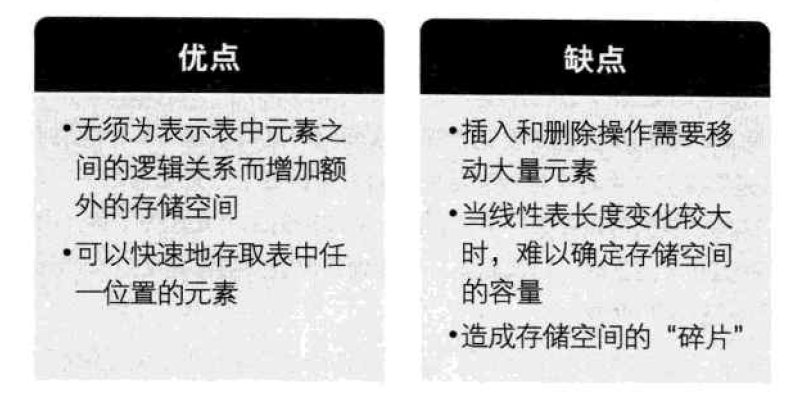

#### 线性表的链式储存结构

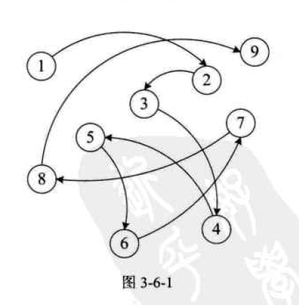

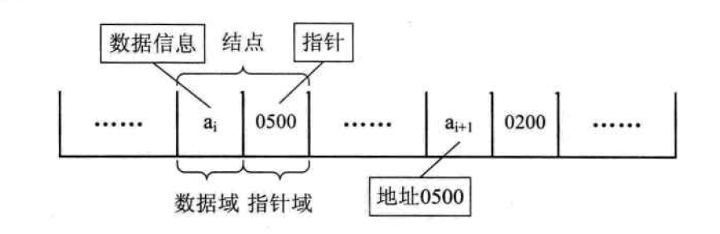

头节点的数据域不存储任何数据

最后一个结点的指针指向null

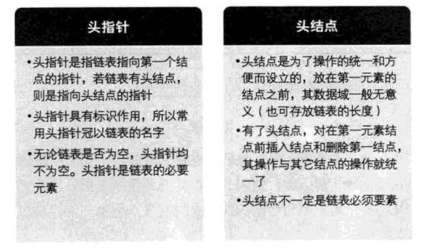

所以链表的查找相对来讲时间复杂度高，因为要从头找起O(n)

但是插入和删除只需要改变前一个节点的指针即可，O(1)

#### 单链表的创建

1. 声明一个节点p和计数变量i
2. 初始化一个空链表L
3. 让L的头节点的指针指向null，即建立一个带头结点的单链表
4. 循环
   1. 生成一新节点赋值给p
   2. 数据装入p的数据域
   3. 将p插入到头节点与前一新节点之间

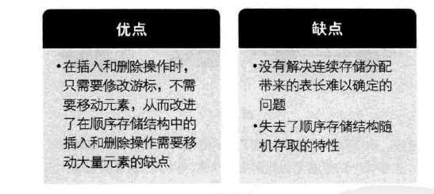

#### 链表的其他结构

循环链表

双向链表

## 第四章

**栈是限定尽在表尾进行插入和删除操作的线性表。**

运行插入和删除的一端叫栈顶top，另一端叫栈底bottom

后进先出的线性表 Last in fast out，简称LIFO结构。

