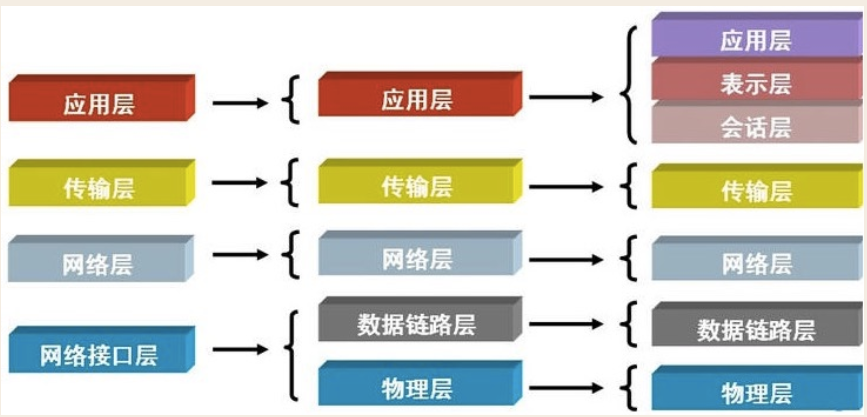

# 网络协议——初识

应用层指的是客户一端，物理层指的是电压01，也就是最远离用户的一端。

## 物理层

物理层的实现主要是借助光缆，电缆，双绞线实现的电压10101010。

## 数据链层

单纯的01001010没有意义。

所以大家形成了统一的标准--以太网协议Ethernet

head中包含的源和目标地址由来：ethernet规定接入internet的设备都必须具备网卡，发送端和接收端的地址便是指网卡的地址，即mac地址

mac地址：每块网卡出厂时都被烧制上一个世界唯一的mac地址，长度为48位2进制，通常由12位16进制数表示（前六位是厂商编号，后六位是流水线号）

广播：有了mac地址，同一网络内的两台主机就可以通信了（一台主机通过arp协议获取另外一台主机的mac地址）

ethernet采用最原始的方式，广播的方式进行通信，即计算机通信基本靠吼

## 网络层

广播是个低效的方法：因为它会传输给所有联网的计算机。所以要把计算机分组，采用**路由**的方式来相不同的广播域/子网。

***IP协议：***

- 规定网络地址的协议叫ip协议，它定义的地址称之为ip地址，广泛采用的v4版本即ipv4，它规定网络地址由32位2进制表示
- 范围0.0.0.0-255.255.255.255
- 一个ip地址通常写成四段十进制数，例：172.16.10.1

**ip地址分成两部分**

- 网络部分：标识子网
- 主机部分：标识主机

注意：单纯的ip地址段只是标识了ip地址的种类，从网络部分或主机部分都无法辨识一个ip所处的子网

例：172.16.10.1与172.16.10.2并不能确定二者处于同一子网

然后继续将数据打包，放入到前面数据链层的data部分。所以：

### 总结上两层

**ARP（Address Resolution Protocol）即地址解析协议， 用于实现从 IP 地址到 MAC 地址的映射，即询问目标IP对应的MAC地址**。发挥了巨大的作用：

