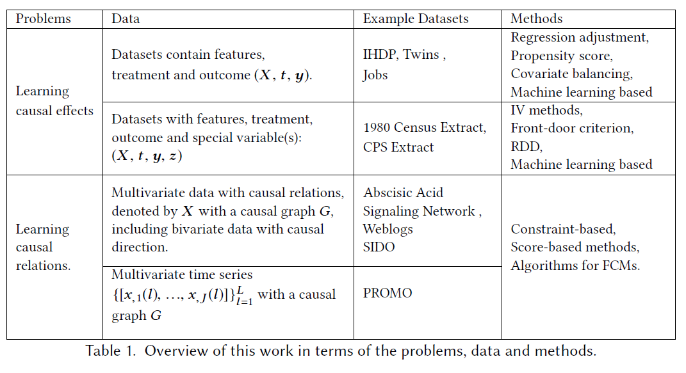
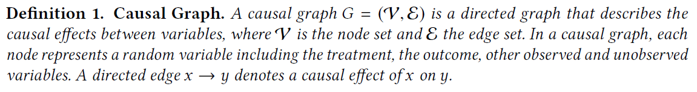

# 《A Survey of Learning Causality with Data: Problems and Methods》阅读笔记

## intro

因果是一effect与cause的本质联系，很难被定义，但是人类通常能知道。当尝试使用数据来学习因果的时候，首先应该明确statistical associations与causations。

学习因果的能力是人工智能达到human-level intelligence的重要组成部分。

### 1.1 overview and organization

机器学习任务通常predictive 或者 descriptive

在理解什么是因果之前，先考虑两个问题：

1. 如果我们改变一个变量的值，另一个变量会改变多少？
2. 如果想改变这个变量的值，我们应该操作那些变量呢？

问题1，定义为causal inference。问题2，定义为causal discovery。

将被改变/操作的变量称为treatment

观察到的改变为outcome

### 1.2 data for learning causality

为了研究Yelp的评级对餐厅客流量的因果影响casual effect，可以使用现有的观察数据，或者通过操作餐厅评级来获得干预数据。

casual effect和casual relationship。

**学习causal effects**

特征向量X，treatments t，outcome y

**学习casual relations**

多变量的数据X，估计一个因果网络G

### 1.3 previous work and contributions

Pearl  aims to convey the fundamental theory of causality based on the structural causal models.

Gelman provides high-level opinions about the existing formal frameworks and problems for causal learning.

Mooji et al. focus on learning causal relations for bivariate data

Spirtes and Zhang summarize methods for learning causal relations on both i.i.d. and time series data with a focus on several semi-parametric score based methods.

Athey and Imbens describe decision trees and ensemble machine learning models for learning causal effects. 

##  preliminaries

现有两个基础框架，structural causal models，potential outcome framework。

为了formulate causal knowledge，首先需要一个casual model，也就是前面提到的两种，是定量描述因果关系的数学模型。

### structural causal models

SCM包括两部分，causal graph 和 structural equations

因果图形成了一类特殊的贝叶斯网络，其边表示因果效应，因此它继承了定义良好的条件独立性准则。

### potential outcome framework

## learning causal effect

## causal discovery: learning causal relations

### 传统方法

- constraint-based
- score-based
- functional causal models

**constraint-based algorithm** 学习一组因果图，这些因果图满足嵌入在数据中的条件独立性。统计检验用于验证候选图是否满足基于faithfulness assumption的独立性

