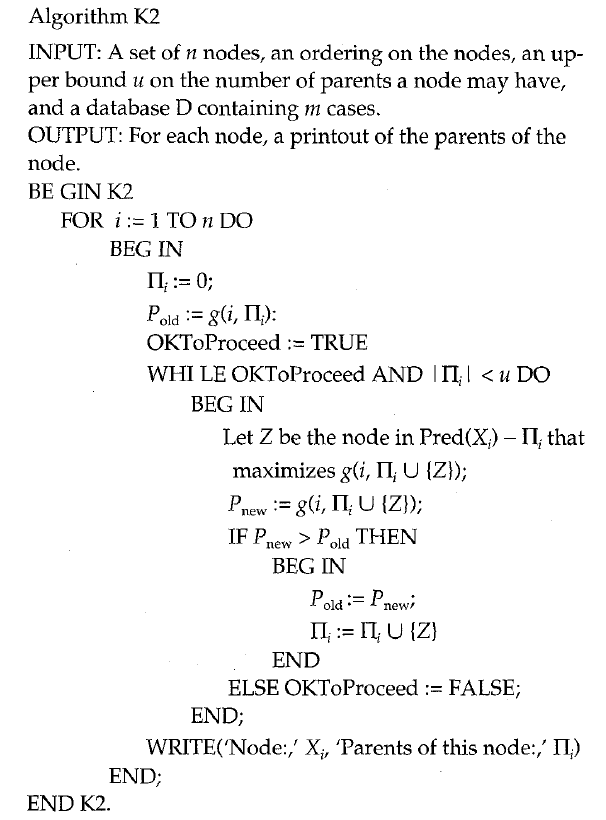
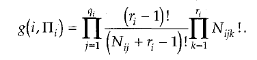
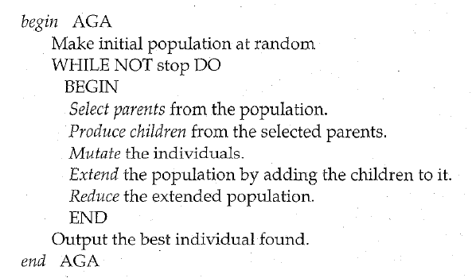

# 《Structure Learning of Bayesian Networks by Genetic Algorithms》阅读笔记

## Abstract

假设 an order between the nodes of the BN, 这个假设可以保证遗传算法生成的网络是一个合法的BN。此外，提出一个repair operator来讲非法结构转化为合法结构。

## introduction 

Joint probability: 
$$
P\left(x_{1}, \ldots, x_{n}\right)=\prod_{i=1}^{n} P\left(x_{i} \mid \pi_{i}\right)
$$
K2 algorithm: 

## Genetic algorithm 

但是crossover之后，不能保证后代是一个合法的BN。

## assume a order between the nodes

假设一个一个order，可以使得n*n的矩阵缩小为一个三角矩阵。

$n^2$ 变为$\left(\begin{array}{l}n \\ 2\end{array}\right)$ 

设置最大parents数目q：设置一个局部优化器，在parents过多的时候，找到最佳的q个parents. 

## With ordering between the nodes

生成 $\lambda$ 个 gene

计算每个 gene 的适应度

在t时刻，第j个个体的排名为$I_t^j$

第j个个体，选为父母的概率为$p_{j, t}=\frac{\operatorname{rank}\left(g\left(I_{t}^{j}\right)\right)}{\lambda(\lambda+1) / 2}$

