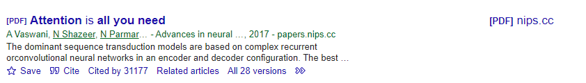
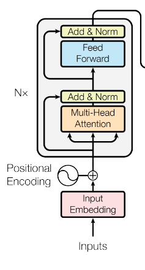
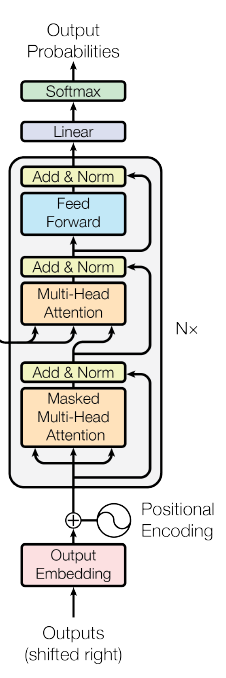
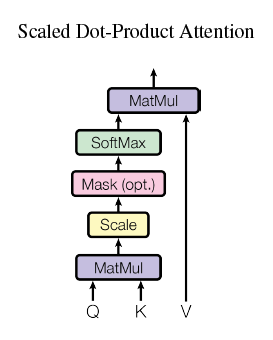
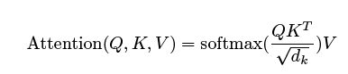
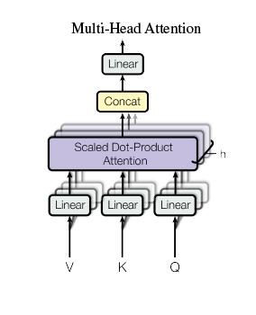
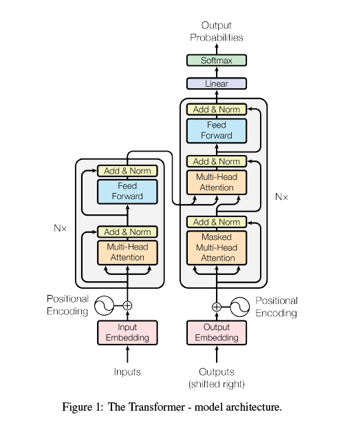

# 《attention is all your need》阅读笔记

这是一篇深度学习领域的重要文章，来自谷歌。

## abstract

主要的句子翻译模型主要是基于复杂的循环神经网络或者卷积神经网络，包含了编码器解码器结构。目前最好性能的模型使用attention机制来连接编码器解码器。本文提出了Transformer，简单的网络结构，只依据attention机制，彻底摒弃了循环和卷积的网络结构。

表现：1. 更加利于并行。2. 比当前最好的翻译模型好2BLEU。

## intro

RNN。

LSTM。

gated recurrent neural networks。

attention。

## background

略

## model architecture

输入是一个序列：
$$
x_1,x_2,...,x_n
$$
encoder输出为：
$$
z_1,z_2,...,z_n
$$
给定了$[z_1,..,z_n]$, 解码器得到：
$$
y_1,y_2,...,y_m
$$
transformer 也服从这样的整体构造，下面查看细节：

### encoder and decoder stacks

**encoder：**

编码器由N（N=6）个这样的结构组成，第一个是多头注意力，第二个是前馈网络（多层感知机）。

**decoder：**

解码器是N（N=6)个这样的结构组成，encoder的输出先进入到masked 多头注意力，然后在进入到和编码器相同的两个结构中去。

### attention

attention函数：将一个query和一系列的key-value pairs映射到输出。

#### scaled 点乘 attention

Q：是一个固定维度（$d_k$）的向量，在这里一般向量是 $1 \times d_k$的矩阵

K：也是固定维（$d_k$）度的向量

V：固定维度（$d_v$）的向量

如果把向量全部打包到一起，那么计算公式写为：

在此，只需要了解这样的attention模块需要QKV三个输入，最终得到一个输出。

对于一个样本来说, attention 函数的写法为：
$$
QK^T=一个标量\\
(QK^T)V= 1 \times d_v 的向量
$$
对于n个样本来说：Q就变为 $n \times d_k$ 的；K, V分别为：$m \times d_k$，$m \times d_v$

#### 多头注意力

V 是一个向量进来，用$W^v$做一个线性变换，得到 $d_v$维度的向量

K 进来，用$W^k$做一个线性变换，得到$d_k$维度的向量

Q 进来，用$W^Q$做一个线性变换，同样一个得到$d_k$维度的向量

这样的话就是得到了一个head，计算出8个头（多头注意力，可以并行）

因为 **scaled 点乘 attention** 出来是一个 $d_k$维度的向量，所以就得到了 8 个 $d_k$ 维度的向量。每一个$d_k$ 是64 维度，所以这样就能得到 512 维的向量。

## 总结

1. 一个句子进来，通过分词和embedding得到, 假设是n个词，每个embedding向量为512维度：[n, 512] 。

2. 位置编码，根据文中的公式，每个位置（1,2,...,n) 都有对应的位置编码，位置编码为 [1，512] 的向量。对应位置相加，得到 [n,512]。

3. 进入到多头注意力模块。此时Q,K,V 都相同，都是 [n,512]。

   

4. 对V [n,512]，做一个线性映射，得到 [n,64]; 同样 对K，和Q做一样的操作，但是线性映射的权重不同。都是 [n,64]。这样的操作就得到了一个head: Q,K,V 。

5. 因为一个head里面的QKV都是[n,64]，执行8次第四步（这8次的参数都是独立的），得到了8个QKV，其中每个QKV都是 [n,64]

6. 对于一个head来说，进入到**scaled点乘注意力结构**中，得到了 [n,64] 的输出。
7. 现在有8个头，得到了8 个[n,64]的输出，将它们concat到一起，得到[n,512] 
8. 又经过一个线性变换，他还是输出 [n,512]。
9. 进入到 add&norm层，维度不变
10. 进入到多层感知机，隐藏层个数为2048，用ReLU激活，输出层512.所以结果还是[n,512]
11. 第一步到第十步重复执行6次，得到最终编码器输出的[n,512]
12. 复制三份[n,512]，两个进入到解码器的对应位置。

