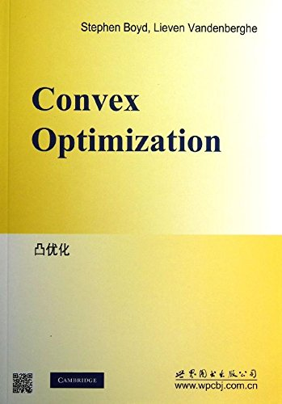

# 皇家马德里书单

Huang&Ma are reading these books:
<table>
    <tr>
        <th>
            
        </th>
        <th>
            《算法导论》
        </th>
        <th>
            
        </th>
        <th>
            《数值优化》
        </th>
    </tr>
    <tr>
        <th>
            
        </th>
        <th>
            《刀锋》
        </th>
        <th>
            
        </th>
        <th>
            《人性的枷锁》
        </th>
    </tr>
    <tr>
        <th>
            
        </th>
        <th>
            《深度学习》
        </th>
        <th>
            
        </th>
        <th>
            《底层逻辑》
        </th>
    </tr>
    <tr>
        <th>
            
        </th>
        <th>
            《凸优化》
        </th>
        <th>
            
        </th>
        <th>
            《撒哈拉的故事》
        </th>
    </tr>
</table>

