# 凸优化学习笔记

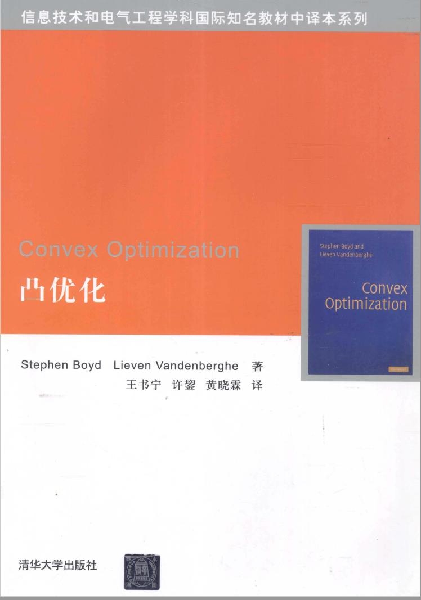

## 拉格朗日乘数法

极大值

极小值

最大值

最小值

费马定理

利用费马定理找最大值

### 多元函数的极值与最值

#### 拉格朗日乘数

#### KKT定理

拉格朗日定理是为了求多元函数的最值

KKT是拉格朗日定理的推广

## 数学优化：

#### 优化问题

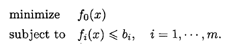

优化变量

目标函数

约束函数

最优解、解

#### 线性规划

目标函数和约束函数都是线性函数。

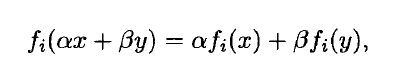

#### 凸函数

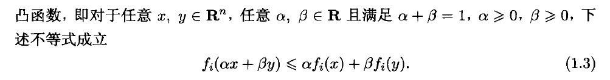

所以说，线性规划是凸优化问题。凸优化问题是线性规划的扩展。

#### 最小二乘问题

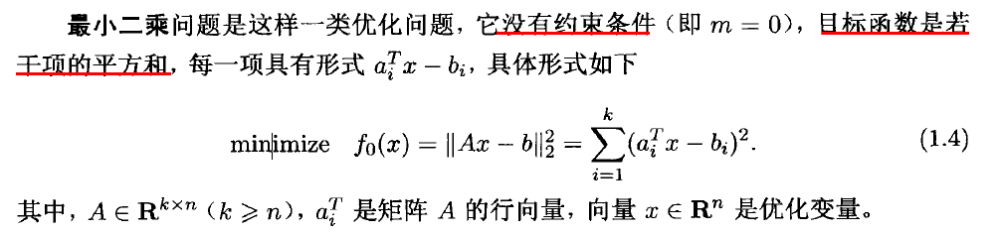

解析解：

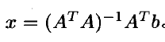

> A的转置用于构造方阵

#### 线性规划

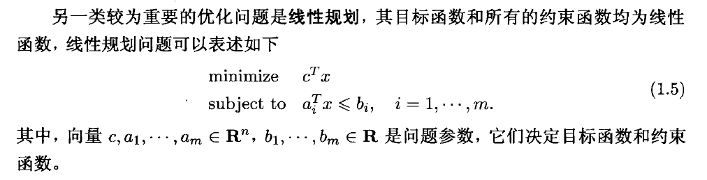

> 一般情况下，$x=[x_1,x_2,...,x_n]$ 都给的是一个行向量。但是有时一个加粗的  x ，指的是列向量。

求解线性规划，单纯形法，内点法

## 凸优化

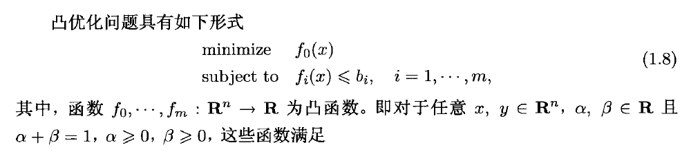

### 非线性优化

非线性函数的约束函数是非线性的，所以不一定是凸函数（非线性优化和凸优化是有交集的）

* 局部优化
  * 起始位置
  * 大部分局部方法仅仅要求目标函数和约束函数可微
* 全局优化

### 非凸优化中的凸优化

将凸优化和局部优化结合起来。

* 局部优化，利用凸优化进行初始值的选择
* 非凸优化中的凸启发式算法
* 全局优化的界

## 凸集

介绍一些概念与定义

### 直线

**过$x_1,x_2$的直线**：

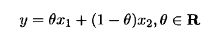

### 仿射集合

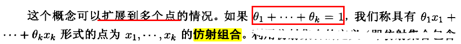

一个仿射集合：C中任意两点构成的直线，仍然在C中

例子：

直线，平面

### 仿射包

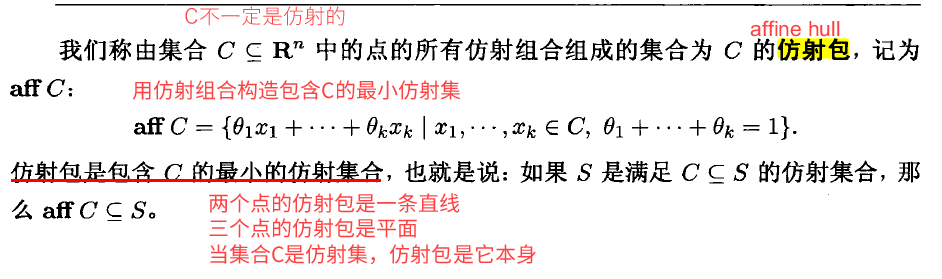

C是任意集合，C中所有仿射组合组成的集合为aff C仿射包。（一种扩大情况）

两个点的仿射包是一条直线 

三个点的仿射包是平面 

### 仿射维度

C的放射维度为其仿射包的维度。

### 凸集

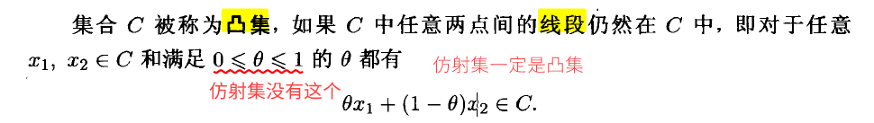

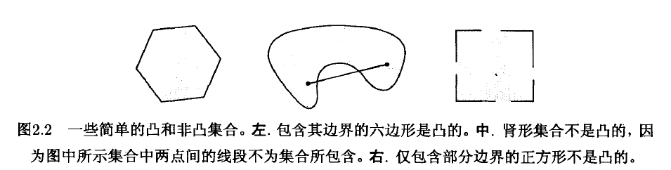

### 凸组合

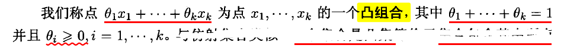

如果C是凸集，$x_1,..x_k$属于C，那么凸组合也属于C

### 凸包

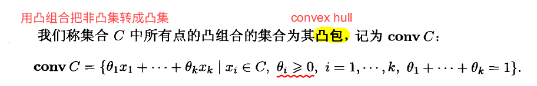

凸包总是凸的

也就是一种松弛条件，将C集合，转化为凸集。

convC是包含C的最小凸集。

例子：

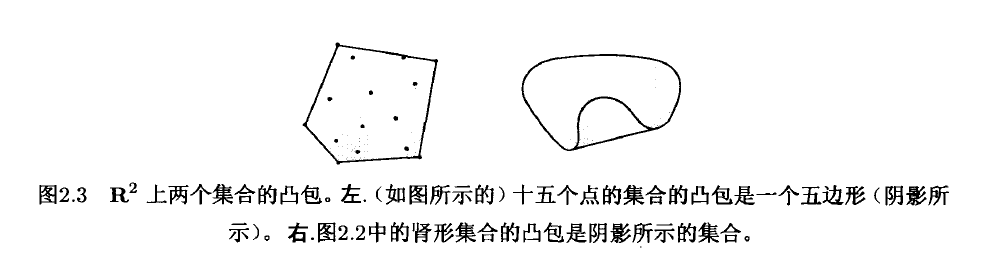

### 锥

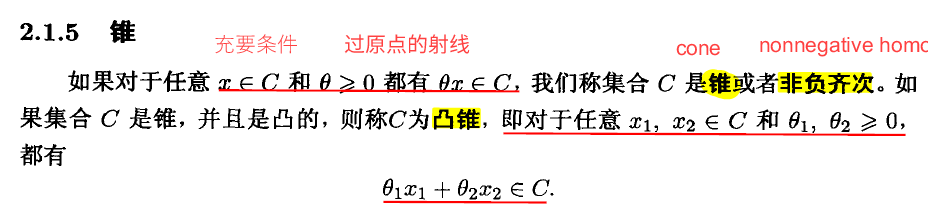

### 锥组合

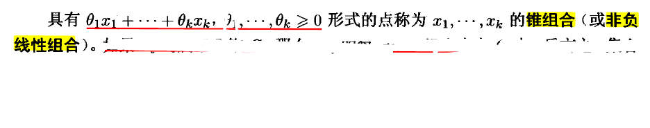

### 超平面

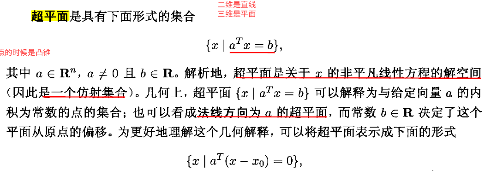

### 半空间

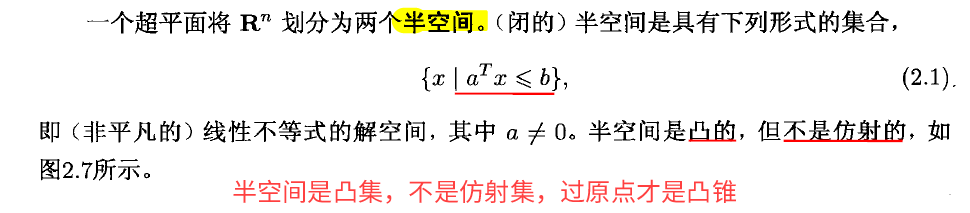

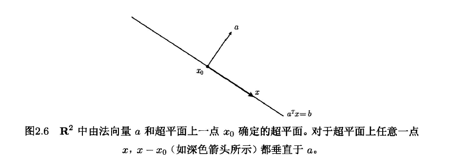

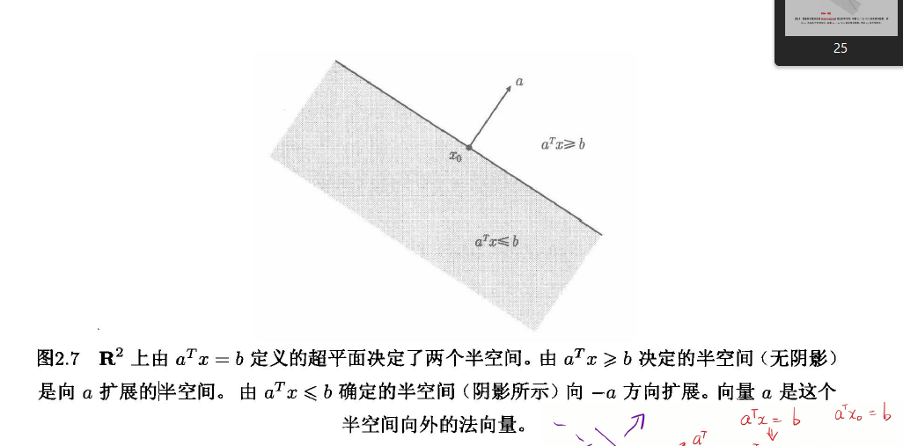

### 多面体

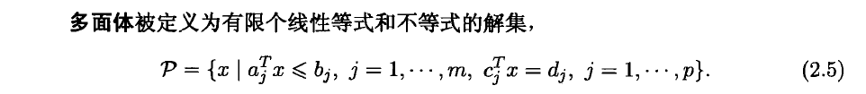

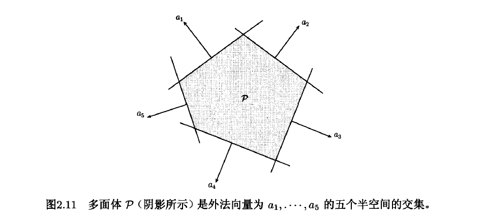

紧凑表达式：

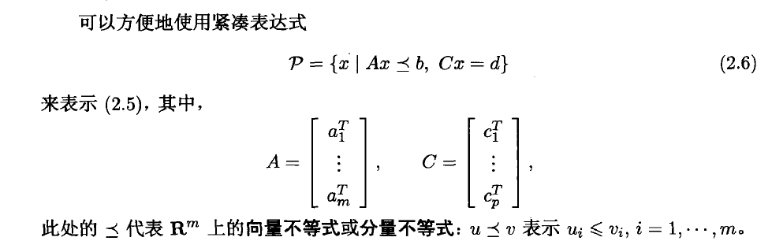

对面体是有限个的半空间和超平面的集合

### 单纯形

单纯形是一类重要的多面体。

* 线段
* 三角形
* 四面体

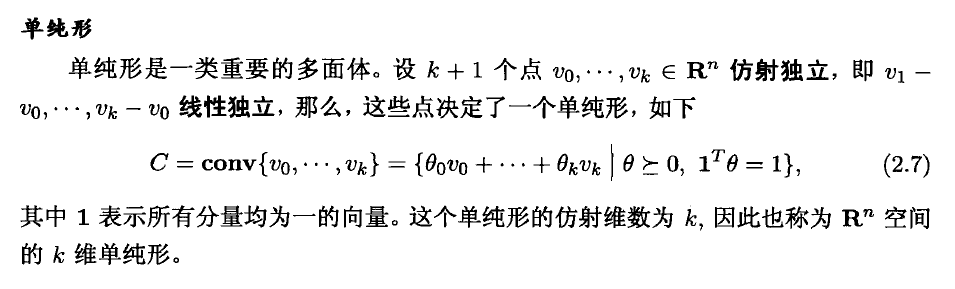

## 线性规划

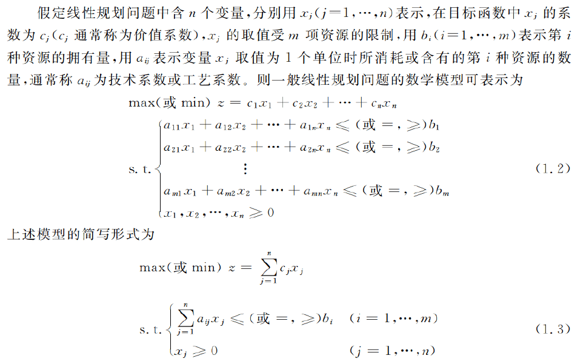

### 转化为标准形式

* max
* 增加变量，使得约束条件为等式
* b>0 

### 基本概念

* 可行解
* 最优解
* 基
  * 假设A为约束方程 $m\times n$ 的举证，其秩为 $m$ , 如果B是矩阵A中的一个 $m\times m$的满秩子矩阵，则B为一个基。
  * M * N 的系数矩阵
  * 里面的一个M*M的满秩子矩阵 就是一个基
  * 如果人为的定义非基变量为0，两个方程是同解的。

* 基解
  * $C_n^m$ 个基解
  * 集解是顶点位置
  * 强约束方程的所有交点
* 基可行解
  * 满足非负约束的基解为基可行解
  * 可行域的顶点

### 解法一：图解法

### 解法二：单纯形法

#### 原理详解

1. 由定理可知，如果说线性规划存在最优解，那么一定**有一个基可行解是最优解**，换而言之，有一个顶点肯定是最优解。一共有$C_n^m$ 个顶点
2. 系数的增广矩阵可以写为：

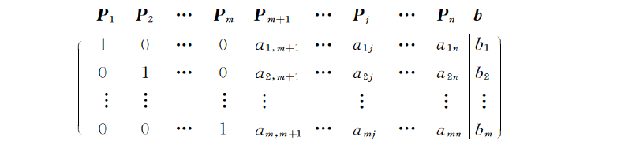

​	这个情况可以找到一个基可行解为：

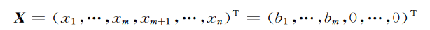

3. 探索下一个基可行解。
4. 判断是否为最优解。

### 判别数

$\theta_i$  :

1. 基变量的检验数必为0
2. 存在$\theta_i$大于0，就说明不是最优解
3. 当你引入一个单位的变量的时候能给目标函数带来多大改变。

### 单纯形

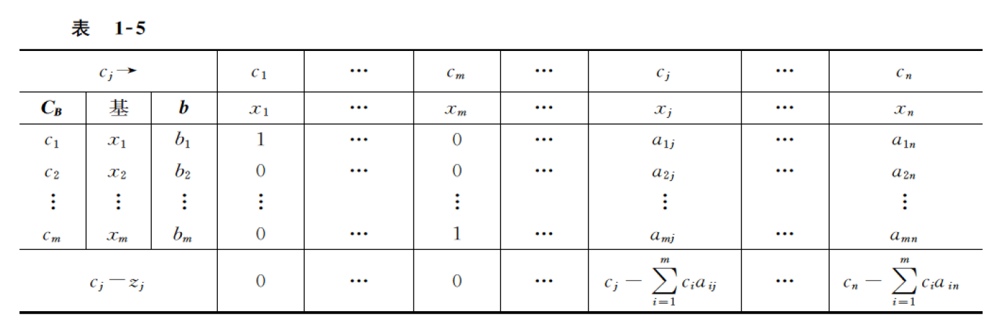
$$
\sigma_{j}=c_{j}-\boldsymbol{C}_{\boldsymbol{B}} \boldsymbol{B}^{-1} \boldsymbol{P}_{j}=c_{j}-\sum_{i=1}^{m} a_{i j} y_{i}
$$
$c_j$ 产品利润

$z_j$ 生产该产品消耗各种资源的影子价格

一般线性规划：确定资源分配情况，每个x都是一种产品

对偶问题：每个y都是对资源的估值

#### 小结

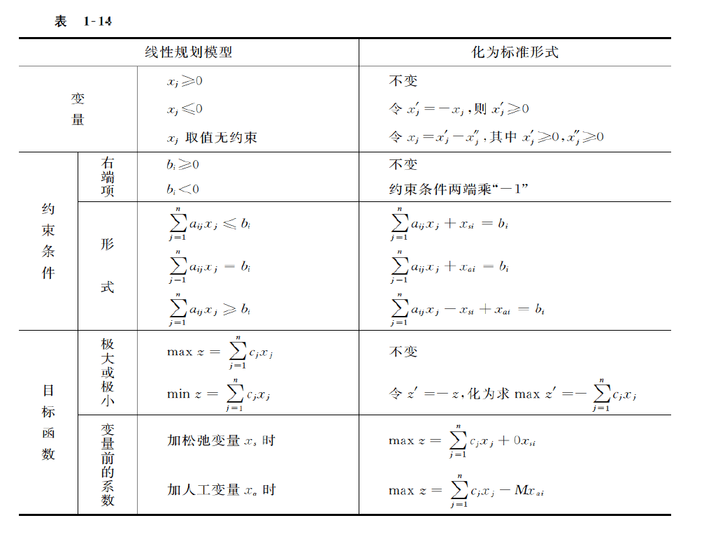

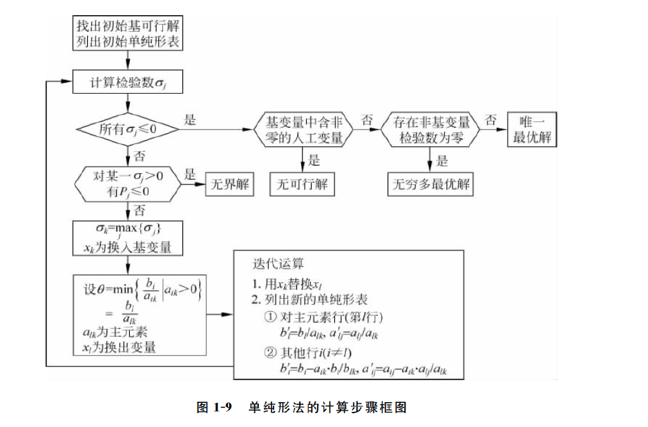

### 解法三：单纯形法，人工变量法

### 解法四：单纯形法， 二阶段法

### 数据包络分析（DEA分析）

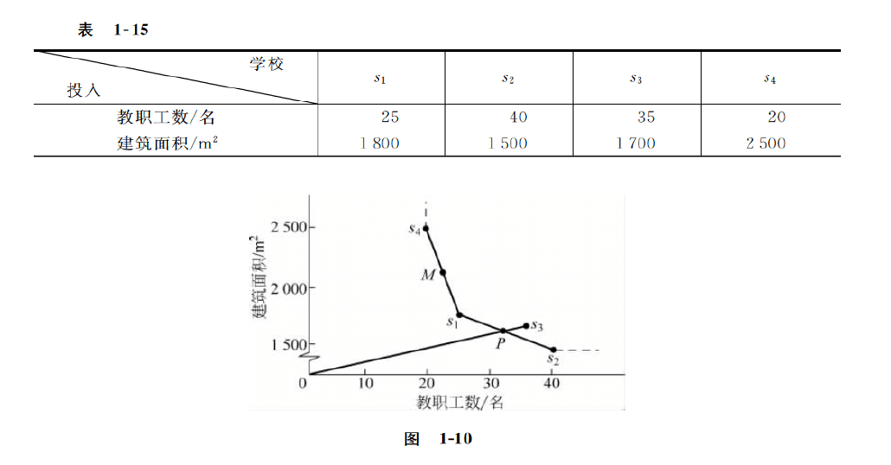

四所学校都培养800名学生，为了缩减成本，教职工和建筑面积都要尽可能小，所以就形成了**生产前沿面**

## 线性规划的对偶理论

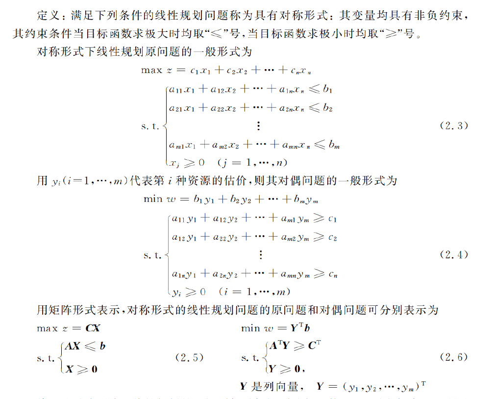

### 对偶问题的基本性质

1. 弱对偶性
   1. 原问题最优解的口标函数伯是艾对偶问题口标函数值的下界；反之对偶问题最优解的口标函数值是其原问题口标函数值的上界。
   2.  
   3.  
2. **最优性**

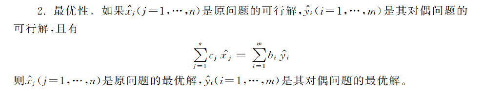

3. **强对偶性** ：若原问题及其对偶问题均具有可行解，则两者均具有
   最优解，且它们最优解的口标函数值相等。
4. 互补松弛性

### 影子价格

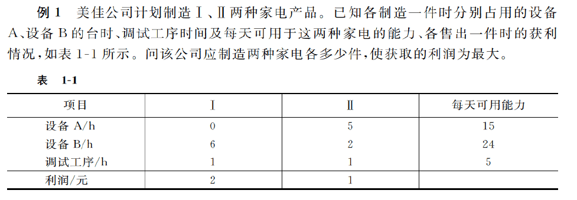

生产家电，有两种家电，利润分别为2，1：

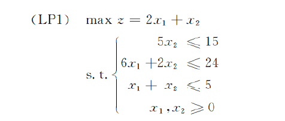

**换个角度思考：**

收购该公司，必须出价要高于它的生产利润：

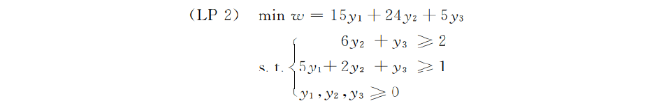

这样就可以算出收购公司的最低价。

通过计算出$y_1,y_2,y_3$ 可以计算出公司三种资源的估价，也称之为影子价格。

### 灵敏度分析

## 运输问题

## 整数规划

