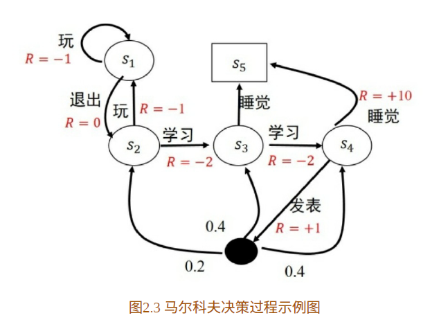
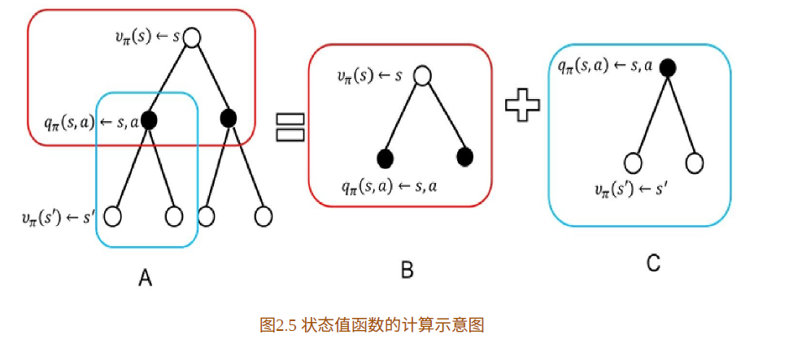
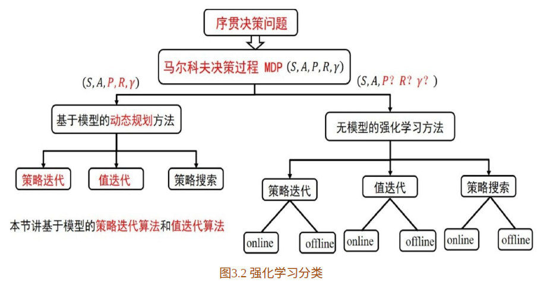
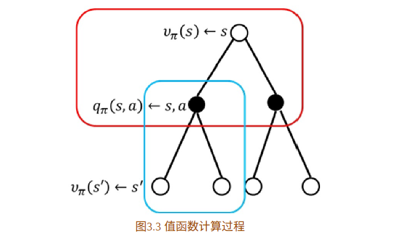
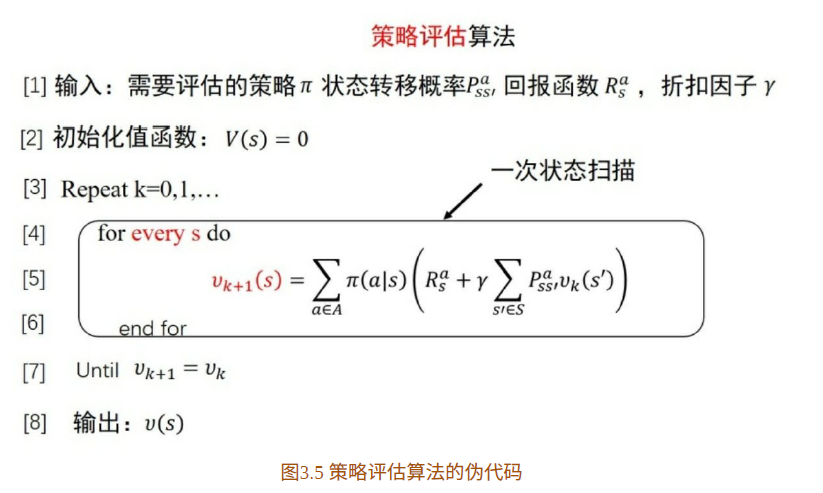
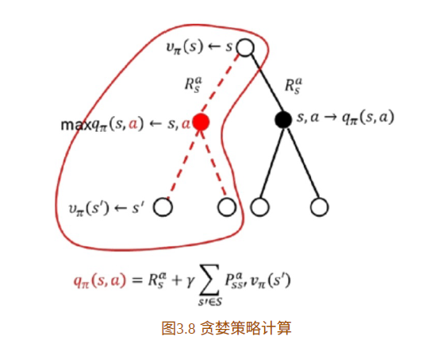
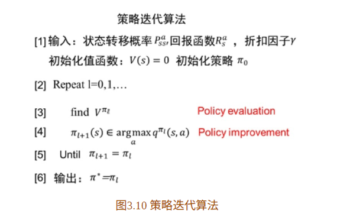
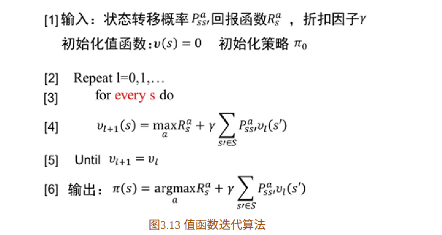

# 《深入浅出强化学习：原理入门》

**马尔科夫决策过程**

**马尔科夫性**：指的是系统的下一个状态$s_{t+1}$仅与当前状态$s_{t}$有关，而与以前的状态无关。
$$
p(s_{t+1}|s_t)=p(s_{t+1}|s_1,...,s_t)
$$
**马尔科夫过程**：马尔科夫过程用二元组表示，(S,P)，其中S是有限状态集合，P是状态转移矩阵。

**马尔科夫决策决策过程**：

$(S,A,P,R,\lambda)$ 

(状态集，动作集，状态转移矩阵，回报函数，折扣因子)

马尔科夫决策过程的状态转移矩阵是包含动作的

## 强化学习的基本概念

给定一个马尔科夫决策过程，寻找最优策略。

### 策略

**策略**是状态到动作的映射，常用$\pi$表示。它指的是给定状态s时，动作集上的一个分布，即：
$$
\pi(a|s)=p(A_t=a|S_t=s)
$$
强化学习一般采用随机策略，原因是随机策略可以将探索耦合到采样过程中。

当给定策略$\pi$的时候，状态序列可能为：
$$
\begin{aligned}
&s_{1} \rightarrow s_{2} \rightarrow s_{3} \rightarrow s_{4} \rightarrow s_{5} \\
&s_{1} \rightarrow s_{2} \rightarrow s_{3} \rightarrow s_{5} \\
&\vdots
\end{aligned}
$$
因为策略与状态转移都具有随机性！所以累积回报：
$$
G_{t}=R_{t+1}+\gamma R_{t+2}+\cdots=\sum_{k=0}^{\infty} \gamma^{k} R_{t+k+1}
$$
是随机的，为了评价状态$s_1$，需要找到一个确定的值，所以用累积回报的期望来表示。

### 状态价值函数

给定策略$\pi$，累积回报服从一个概率分布，累计汇报在s处的期望值定义为：
$$
v_{\pi}(s)=\mathrm{E}_{\pi}\left[\sum_{k=0}^{\infty} \gamma^{k} R_{t+k+1} \mid S_{t}=s\right]
$$
这就是状态价值函数。

### 状态行为价值函数

$$
q_{\pi}(s, a)=E_{\pi}\left[\sum_{k=0}^{\infty} \gamma^{k} R_{t+k+1} \mid S_{t}=s, A_{t}=a\right]
$$

状态行为价值函数，它描述的是在给定状态，给定策略，该动作的价值。

#### 贝尔曼方程

$$
\begin{aligned}
&v(s)=E\left[G_{t} \mid S_{t}=s\right] \\
&=E\left[R_{t+1}+\gamma R_{t+2}+\cdots \mid S_{t}=s\right] \\
&=E\left[R_{t+1}+\gamma\left(R_{t+2}+\gamma R_{t+3}+\cdots\right) \mid S_{t}=s\right] \\
&=E\left[R_{t+1}+\gamma G_{t+1} \mid S_{t}=s\right] \\
&=E\left[R_{t+1}+\gamma v\left(S_{t+1}\right) \mid S_{t}=s\right]
\end{aligned}
$$

## 最优状态价值函数

最优状态价值函数为所有策略中，值最大的值函数：
$$
v^{*}(s)=\max _{\pi} v_{\pi}(s)
$$

## 最优状态行为价值函数：

$$
q^{*}(s, a)=\max _{\pi} q_{\pi}(s, a)
$$

## 小结

## bootstraping 算法

状态价值函数可以改写为以下形式：
$$
v_{\pi}(s)=\sum_{a \in A} \pi(a \mid s)\left(R_{s}^{a}+\gamma \sum_{s^{\prime} \in S} P_{s s^{\prime}}^{a}v_{\pi}\left(s^{\prime}\right)\right)
$$
可以看到，价值函数是未知的，这该如何解呢？

这个式子里已知，$R_{s}^{a}, \pi, P^{a}_{ss'}$ ，未知 $v_\pi$ 

这是一种迭代算法，不断地更新$v()$。

通过这个策略评估算法，可以得到某个动作函数的值函数。

在通过这个值函数来改善策略：

如果采用贪婪得方式，那么：

如果只评估一次后就对策略进行改善，则称为值函数迭代算法：

### 值函数迭代算法：

值函数评估过程中，包括两个迭代循环：

- 外层是为了保证值函数的准确性
- 内层是是对所有状态空间的扫描

这里反映出了dp算法与无模型的强化学习的本质区别：状态转移矩阵P！

dp已知模型，所以可以确切地知道每一步执行后的状态，这个性质使得智能体不需要采取任何行动就能对未来进行评估。

