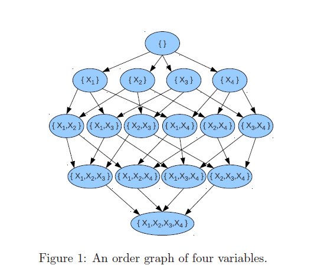
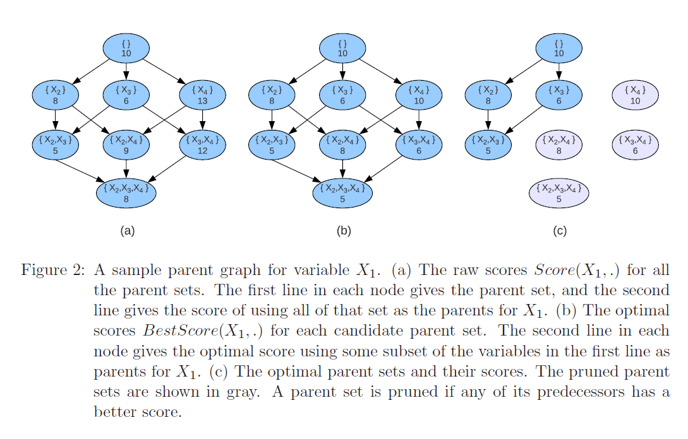
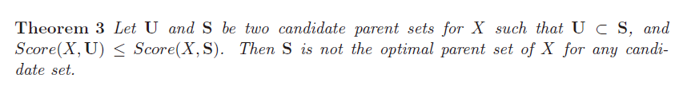

# Bayesian network structure learning: 最短路径问题

## order graph

order graph 实际上记录了：在这么多节点的情况下，有多少种排序方式。

对于 n个变量，order graph 一共有n! 种排序方式，$2^n$个节点。

U --> X + U

order graph 边的权重为 BestScore(X,U)

order graph 的边的权重用parent graph进行计算。

## parent graph

使用parent graph 来计算order graph的边的权重。每个变量都有自己的parent graph。

对于$x_1$来说，parent graph 如图

通过计算这个图，可以得到
$$
BestScore(X_1,\{\})\\
BestScore(X_1,X_2)\\
BestScore(X_1,X_3)\\
...\\
BestScore(X_1,\{X_2,X_3,X_4\})
$$
对于n个变量，parent graph 里共有 $2^{n-1}$ 个节点，所以一共有$n 2^{n-1}$ 个 BestScore 。与之对应的 order graph里刚好也有$n 2^{n-1}$ 个边。

依据上面的定理

## conclusion 

首先对每个变量都构建parent graph，得到一系列的 BestScore，然后构建order graph，使用BestScore来完善order graph的权重，最后寻找最短路径。

frozenset() frozenset({'tub'}) 324.8488083696086
frozenset({'tub'}) frozenset({'lung', 'tub'}) 1040.536428179004
frozenset({'lung', 'tub'}) frozenset({'lung', 'tub', 'smoke'}) 3370.702169702024
frozenset({'lung', 'tub', 'smoke'}) frozenset({'bronc', 'lung', 'tub', 'smoke'}) 3222.269284216359
frozenset({'bronc', 'lung', 'tub', 'smoke'}) frozenset({'either', 'lung', 'bronc', 'tub', 'smoke'}) 39.51805503466176
frozenset({'either', 'lung', 'bronc', 'tub', 'smoke'}) frozenset({'either', 'lung', 'bronc', 'asia', 'tub', 'smoke'}) 256.31658272029216
frozenset({'either', 'lung', 'bronc', 'asia', 'tub', 'smoke'}) frozenset({'either', 'lung', 'bronc', 'asia', 'tub', 'xray', 'smoke'}) 966.700642651686
frozenset({'either', 'lung', 'bronc', 'asia', 'tub', 'xray', 'smoke'}) frozenset({'either', 'lung', 'dysp', 'bronc', 'asia', 'tub', 'xray', 'smoke'}) 2133.9156545006185
11354.807625374253