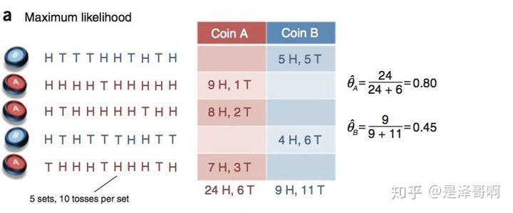
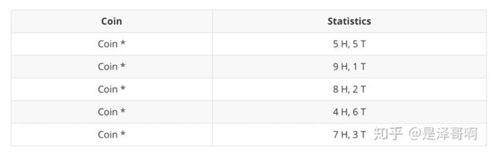

# EM algorithm 期望最大算法

## background

EM 算法，全称 Expectation Maximization Algorithm。期望最大算法是一种迭代算法，用于含有隐变量（Hidden Variable）的概率参数模型的最大似然估计或极大后验概率估计。

本质上是一个优化算法，用于求解：
$$
\hat \theta = \arg \max _\theta p(x,z;\theta)
$$

## Example

假设有两枚硬币 A 和 B，他们的随机抛掷的结果如下图所示：

我们很容易估计出两枚硬币抛出正面的概率：

**-->问题转化：**

现在我们加入隐变量，抹去每轮投掷的硬币标记：

此时就多了一个隐变量：$Z = (z_1,z_2,z_3,z_4,z_5)$ 用于代表硬币的种类。

如果想要估计参数 $\theta_A, \theta_B$ ,我们首先要知道 $Z$ 。

但是想要估计 $Z$, 首先要知道 $\theta_A, \theta_B$ 。

## solve：

抽象模型：

如果说，x，z都能被观测到，那么**联合概率分布**写为：
$$
P(X,Z)=P(X|Z)P(Z)
$$
**联合概率分布**是概率论的最高目标，获得了联合概率分布，某种程度上就是对这个模型有了透彻的了解。

在这个问题我们的目标并不是联合概率分布，而是次级目标：
$$
p(X=上|Z=A种硬币)=?\\
p(X=下|Z=A种硬币)=?\\
p(X=上|Z=B种硬币)=?\\
p(X=下|Z=B种硬币)=?\\
$$
也就是**条件概率分布**
$$
P(X|Z)
$$
**边缘概率分布** P(X) 为：
$$
P(X;\theta)=\sum_{Z}P(X,Z;\theta)=\sum_{Z}P(X|Z;\theta)
$$

最大似然法求参数可以写为：
$$
\hat \theta = \arg \max _\theta P(X;\theta)\\
= \arg \max _\theta \sum_i^{样本数} \log p(x^{(i)};\theta)\\
=\arg \max _\theta \sum_i^{样本数} \log \sum_{z^{(i)}} p(x^{(i)},z^{(i)};\theta)\\
=\arg \max _\theta \sum_i^{样本数} \log \sum_{z^{(i)}} p(x^{(i)}|z^{(i)};\theta)
$$
当 $x^{(i)},z^{(i)}$ 是可观测, 那么可以使用梯度下降等最优化方法来找到$\hat \theta $

如果，只能观测到 $x^{(i)} $, 使用梯度下降漫无目的地更新 $\theta $, 会导致收敛速度过慢。

**上文的$\sum_{Z}P(X,Z;\theta)=\sum_{Z}P(X|Z;\theta)$ 是建立在硬币案例的情景下的，一般情况X与Z的依赖关系不能确定，所以后面的推到使用联合概率分布的形式。**
$$
\sum_i^{样本数} \log \sum_{z^{(i)}} p(x^{(i)},z^{(i)};\theta)\\
=\sum_i^{样本数} \log \sum_{z^{(i)}} Q_i(z^{(i)})\frac{p(x^{(i)},z^{(i)};\theta)}{Q_i(z^{(i)})}\\
>=\sum_i^{样本数}  \sum_{z^{(i)}} Q_i(z^{(i)})\log \frac{p(x^{(i)},z^{(i)};\theta)}{Q_i(z^{(i)})}\\
$$
假设 $z^{(i)}$ 服从分布 $Q_i$ , 根据Jenson不等式：
$$
f(E(x)) \geq E(f(x)), \text { 如果 } f(x) \text { 是凹函数 }\\
\\
log(E(\frac{p(x^{(i)},z^{(i)};\theta)}{Q_i(z^{(i)})}))\\
\geq E(log(\frac{p(x^{(i)},z^{(i)};\theta)}{Q_i(z^{(i)})}))
$$
并且带入：
$$
\sum_{z^{(i)}} Q_i(z^{(i)}) =1
$$
最终就能得到上面的不等式。且当$\frac{p(x^{(i)},z^{(i)};\theta)}{Q_i(z^{(i)})}=constant$ 的时候取等号，详情可见：

> https://baike.baidu.com/item/%E7%90%B4%E7%94%9F%E4%B8%8D%E7%AD%89%E5%BC%8F/397409

然后，
$$
p(x^{(i)},z^{(i)};\theta)=constant \times {Q_i(z^{(i)})}\\
\sum_{z^{(i)}} Q_i(z^{(i)}) =1\\
$$
三个未知数，两个等式，肯定能化简为两个未知数的一个等式。所以两边同时对z求和，并回代得到：
$$
Q_{i}\left(z^{(i)}\right)=\frac{P\left(x^{(i)}, z^{(i)} ; \theta\right)}{\sum_{z} P\left(x^{(i)}, z^{(i)} ; \theta\right)}=\frac{P\left(x^{(i)}, z^{(i)} ; \theta\right)}{P\left(x^{(i)} ; \theta\right)}=P\left(z^{(i)} \mid x^{(i)} ; \theta\right)
$$
也就是说：当上式满足时，似然函数达到最小，也就是似然函数达到其**下界**。

我们需要不断地去**提高下界**来使似然函数达到最大值。这就是M部分。

E部分是求期望的过程

## 算法步骤

输入：观测数据：$x=\left(x^{(1)}, x^{(2)}, \ldots x^{(m)}\right)$ , 联合概率分布模型：$p(x, z ; \theta)$

1. 随机初始化 $\theta_0$

2. 迭代：

   1. E-step

      对于当前的模型参数$\theta$
      $$
      Q_{i}\left(z^{(i)}\right)=p\left(z^{(i)} \mid x^{(i)} ; \theta\right)
      $$
      似然函数的下界为：
      $$
      L(\theta) = \sum_i^{样本数}  \sum_{z^{(i)}} Q_i(z^{(i)})\log \frac{p(x^{(i)},z^{(i)};\theta)}{Q_i(z^{(i)})}\\
      $$
   
   2. M-step
   
      最大化 $L(\theta)$
      $$
      new\_ \theta=\arg \max _{\theta} L\left(\theta\right)
      $$

## 思考

EM 算法适用于很多最优化问题，它和梯度下降算法有的差别有：

1. 整个算法不需要求导，即可得到目标函数的最大值（局部最优）。
2. 在一些最优化问题中，可以人为地引入隐变量来简化模型的计算。
2. 需要计算$p\left(z^{(i)} \mid x^{(i)} ; \theta\right)$, 这个后验概率在高维度，大样本数据的时候，其实非常难以计算。

