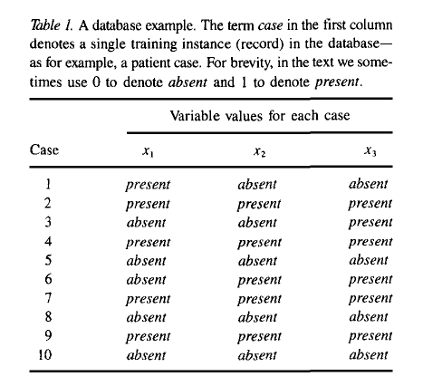
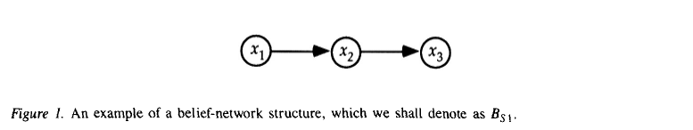
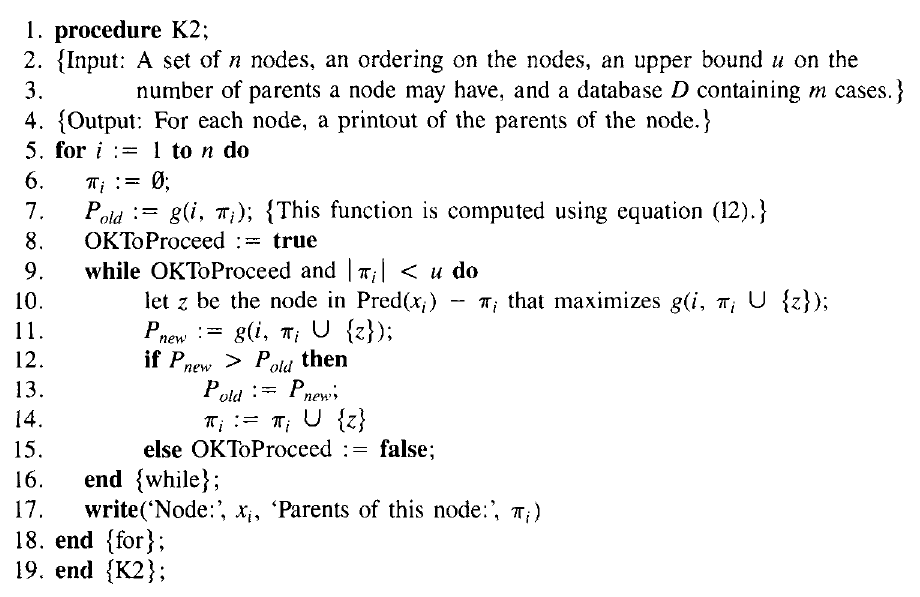

# K2算法《A Bayesian Method for the Induction of Probabilistic Networks from Data》阅读笔记

## abstract 

Paper proposes a new method on constructing Bayesian network. 

BN potentially is applied in computer-assisted hypothesis testing, automated scientific discovery and automated construction of probabilistic expert systems. 

Our method are able to handle missing data and latent variable. 

## Introduction 

Suppose the database is: 

Introduction of BN:

1. DAG
2. variable should be continuous or discrete 
3. the arc from $x_1$ to $x_2$ indicates these two variable are probabilistically dependency.  

The construction of the network remains difficult and time-consuming task. 

## The basic model 

## Formulate:

$P\left(B_{S}, D\right)=P\left(B_{S}| D\right) P(D)$ 

**Assumption 1**: variables $Z$ are discrete. 

$P\left(B_{S}, D\right)=\int_{B_{p}} P\left(D \mid B_{S}, B_{P}\right) f\left(B_{P} \mid B_{S}\right) P\left(B_{S}\right) d B_{P}$

$B_P$ is the conditional probability assignments associated with the structure $B_S$. 

**Assumption 2**: cases occur independently, given a belief-network model. 

$P\left(D \mid B_{S}, B_{P}\right)=\prod_{h=1}^{m} P\left(C_{h} \mid B_{S}, B_{P}\right)$

$P\left(B_{S}, D\right)=\int_{B_{P}}\left[\prod_{h=1}^{m} P\left(C_{h} \mid B_{S}, B_{P}\right)\right] f\left(B_{P} \mid B_{S}\right) P\left(B_{S}\right) d B_{P}$

$m$ is the number of cases, $C_h$ is the $h$-th case in $D$. 

**Assumption 3**: there is no cases that have variables with missing values. 

**Assumption 4**: $f\left(B_{P} \mid B_{S}\right)$ is uniform. 

**Theorem 1**: 
$$
P\left(B_{S}, D\right)=P\left(B_{S}\right) \prod_{i=1}^{n} \prod_{j=1}^{q_{i}} \frac{\left(r_{i}-1\right) !}{\left(N_{i j}+r_{i}-1\right) !} \prod_{k=1}^{r_{i}} N_{i j k} !
$$
assume that each possible network structure have same probability, we can get $P\left(B_{S}\right)$, and denote all possible structure are included in $Q$

$P\left(B_{S_{i}} \mid D\right)=\frac{P\left(B_{S_{i}}, D\right)}{\sum_{B_{S} \in Q} P\left(B_{S}, D\right)}$

However, $Q$ grow rapidly with the number of variable.

## Finding the most probable structure

Since $P\left(B_{S}, D\right) \propto P\left(B_{S} \mid D\right)$,

we need to maximize it: 
$$
 P\left(B_{S}, D\right)=P\left(B_{S}\right) \prod_{i=1}^{n} \prod_{j=1}^{q_{i}} \frac{\left(r_{i}-1\right) !}{\left(N_{i j}+r_{i}-1\right) !} \prod_{k=1}^{r_{i}} N_{i j k} !
$$

$$
\max _{B_{S}}\left[P\left(B_{S}, D\right)\right]=c \prod_{i=1}^{n} \max _{\pi_{i}}\left[\prod_{j=1}^{q_{i}} \frac{\left(r_{i}-1\right) !}{\left(N_{i j}+r_{i}-1\right) !} \prod_{k=1}^{r_{i}} N_{i j k} !\right]
$$
denote the $\pi_i$ is the parents of $x_i$, assume $P\left(B_{S}\right)=\Pi_{1 \leq i \leq n} P\left(\pi_{i}^{S} \rightarrow x_{i}\right)$. this assumption makes the equation decomposable. 
$$
P\left(B_{S}, D\right)=\prod_{i=1}^{n} P\left(\pi_{i}^{S} \rightarrow x_{i}\right) \prod_{j=1}^{q_{i}} \frac{\left(r_{i}-1\right) !}{\left(N_{i j}+r_{i}-1\right) !} \prod_{k=1}^{r_{i}} N_{i j k} !
$$
if there is an order on the nodes, sufficiently tight limit on the number of the parents, $P\left(\pi_{i}^{S} \rightarrow x_{i}\right)$ is dependent to each other. 

## Heuristic method

$$
g\left(i, \pi_{i}\right)=\prod_{j=1}^{q_{i}} \frac{\left(r_{i}-1\right) !}{\left(N_{i j}+r_{i}-1\right) !} \prod_{k=1}^{r_{i}} N_{i j k} !
$$

