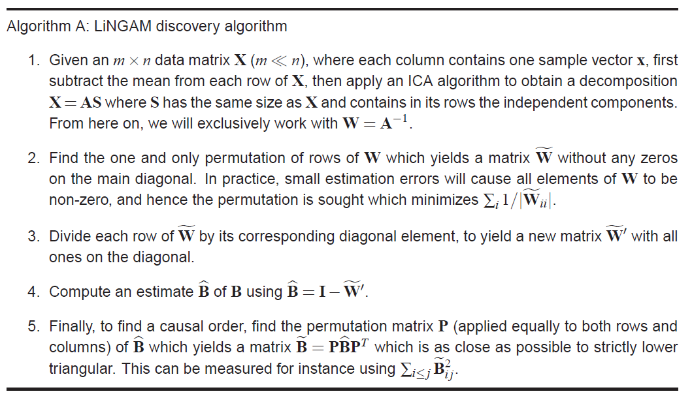

# A Linear Non-Gaussian Acyclic Model for Causal Discovery

这个模型被因果推断领域的算法广泛使用。

## abstract

discover the causal structure of continuous-valued data

assumptions:

1. 数据的生成过程是线性的
2. 没有隐变量
3. 扰动变量不服从高斯分布

## intro

现有方法主要分为两种：

离散数据，没有方程形式的依赖关系。

连续数据，主要使用的是线性高斯。

## linear Gaussian network

特点：

- 对于观测到的数据 $x_{i}, i \in\{1, \ldots, m\}$ 观测变量存在一个casual order, so that no later variable causes any earlier variable。

- 每个变量的取值，是由earlier variable、噪声、偏置决定的。

$$
x_{i}=\sum_{k(j)<k(i)} b_{i j} x_{j}+e_{i}+c_{i}
$$

- $e_i$是一个连续变量，服从非高斯分布，并且相互独立。

这就是LiNGAM

## model identify

$$
\mathbf{x}=\mathbf{B x}+\mathbf{e}
$$

如果知道$k(i)$,那么可以通过变换将$\mathbf{B}$写为一个严格下三角矩阵（对角线元素以及上三角为0）
$$
\mathbf{A}=(\mathbf{I}-\mathbf{B})^{-1}
\\
\mathbf{x}=\mathbf{A} \mathbf{e}
$$
对于一个合适的$k(i)$，$A$可以被变换为下三角矩阵。

可以通过ICA求解A和e。

但是得到的A并没有满足causal order，所以可以对independet component进行排序，以得到等价的ICA模型。

第二个未解决的问题是，independent components的大小还没确定。因为在ICA模型中假设每个扰动变量的方差为1，实际上模型的方差只要求不为0，所以需要固定住每个connection weight的比例，进行等比缩放，使A的对角线元素为1。

## 算法

