# 《Atomistic Line Graph Neural Network for improved materials property predictions》 阅读笔记

本文来自于《npj 计算材料学》。领域是结合计算模拟与设计的材料学。由中国科学院上海硅酸盐研究所与英国自然出版集团（Nature Publishing Group，NPG）以伙伴关系合作出版。 

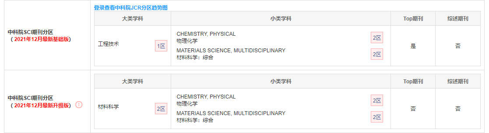

# abstract

GNN相比起基于descriptor-based machine learning，在原子材料表征与建模方面具有优势。

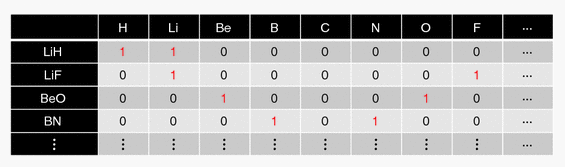

> 表示化学元素存在的二进制元素描述符。二进制元素描述符的数量对应于训练数据中包含的元素类型的数量

现有的GNN模型一般是基于 atomic distance information，并不显式地考虑bond angle（键角，通常以度为单位）。然而这个特征对于一些原子结构非常重要。

![7.6: Molecular Structure and Polarity - Chemistry LibreTexts](data:image/png;base64,iVBORw0KGgoAAAANSUhEUgAAAX8AAACDCAMAAABSveuDAAABZVBMVEX///8AAAD/AAD38P7o0vy8vLzJycn8+v/w2v/r1v7axuzSweJlXG1ZUl/w8PD6+vrn5+fv7+/29vbj4+OFhYUuOz3b29vYAAB+fn7BwcEjLS3Pz89sbGzxAABaAAA+Pj5KSkqkpKRXV1cTExM6Ojq1tbWYmJgfHx+ioqInJyceJSZ1dXWtra2oAACKioqUlJTmhJAyMjJdXV3QAABRUVHR29rDAAAnMjOyAADzAAAXHR2HQEiFAACCl5aqu7psgYEzQECWAADrlZWWqqjE0dAALCwbPD7jAADeUVF+AABsAAB+lJOjs7JedHVNZWVidXY/T1AAGBnAjpTXhpPWXGLOMzLuqKnzzM2sEBDoICiyJCbtQEbsdXiWHR2ckae9rcqNgpdsR0vPbmzHTWfyxMTOI0bGFEtyIynjqakAERJyOztxAADLPDxHQ0uQhZp7cIXxm5uEIyO1Skzx4uOncHIyAABOAADaZBJYAAAOPklEQVR4nO2di3/ayBHHd9NIse8uWj2wjJAcSQgBshQowhjbDTgJ9JyHk9j3SHrXNrler49c2l6vae/v7+wKO3LM0yYIR/p+8iGABYjfzs7szK4WhDIyMhaMq8NNniR9Gqkl58INzvRPihwHN06mf1LUKqZpVjL9kyKz/2Rh/j/TPzHyAcrib0ZGRnKo+aTPIOU0xKTPIN1oRtJnkHK8rAMkCpd1gGRpKEmfQbrhsw6QLGYWARIl6wAJY6pJn0G60YtJn0HKKWVDoETJOkDClLIIkCj61jzfzXXn+W6pwJxjBFDsIMsoZkSxzj4W8r5fe39uslyFG/+8cWsC75/ct8CThfCoXJ7/SX7MbJ2NAGJFkOohOKaqhoimVlVEAq5qIzZtr9gcQpxY5enfRU706nqOtwX6ugBkl7ZKJMuqZ0Q9GwHEBpsacE29aBNc4zAxalyFztjnOBHz+TzyDB4rqsMXG8QLdByULfq6BrRC3a3R9qkn8C2uMEU9/kjCpolVasSCRTAMkASHoBrTX6sHiFToxFmeB6EVD47SDYQc+KNQgpsGEqExlbmG9I8f1Yw/ovYvY9KQQE4Z7ptSBSGb+R8tZxlGHpUklOPzPJIaVP88QhX6MgshHochFpFoDv2Y88hKq9USRXneX+iqcaYDUP0RFnwNaSGh+gsVCVmR/3HBs7ioQfWvlpHrQVOc6E/t34L3CXJT23+r229JgiBIUsqXIp3pACK2rEoZjNtqiLJDZyk5bIXU/mH8UzQdFzkS8jlSMfMllK8EMOLB9HUNQaH/g8ua0v/3D/stRZIpaQ/YIT/zSxQe6Vb8CfdUdfBPU9Dv9fs8eB9FEYg81Ss+XpRpPfY7ZLPknR24FgcPWa4wmceHfU0SdVUhIiFSqmOAmzP0yUfNF73T1VxZ4TgVqTJKsweyPaxPPWSZG71Ot3soqFVbB/2JnNYyuJTDDobxihGLAOo8nIEwoa7a6Rx2DyUiSTIB/QUlnQ5IdspBsQHai6XT59Tzw0f/zACxPtpZhO/uWuNN+jHo3xNUm9q/IEutdOoPftjTmfSGdvLMloLEcEtHSljkkcuFoeTiEHFFA9LeMuQBOi4hvRjlDGoxVOBBqKKyVjRIHeeQveXLKF+v0oRsDL393mFPiPy/JIn9D/kdlxgYs5v0aqQo7WJ3IBR4imARRyGeVDVJYCBHVktI9ZDDDjUVAQvwD7pPRVCLgiOLFeQb0DpCBdoJcSHC7qRhqPqk0+tJCs+rpKUorZTqL2NFrkR3TzqA7iOJ9gi1pGmhVrXBxpGDqr6mYSE61BQ1SHp96AC0+ANya1pJ9HnE1eC9/DqnOcgTogPG8HS/0zvs9oFWq9VNafw1T70OEr3ofz030L/BuZxUDZAaMv1dl5NH6A8HyvAQ9PeQX3NdjemfH5/U6U/3B/pDC5B0JmC1XOzBoAOA3KiiyJZMywxCmdk/JqqJRIMVOumaCXA5MvU/giMoRclDskEHUKA/pot61RzTvzhhTK9GPaDb7UPslYUP9BWXGb0UfyQNOkCDILFo8aC75UL8RUoOlS3kWlsqipbLuSVZtyzmXfQteJa34Ogy/G+jvIGqVigiAyT1Jn288uTJfqfTazHpU9gBiHPWQn0WXZE9Xf1gEnV78glonWf7hy1WgCbp6wB+cPaxMLDY/DxsUcpNPoay3+m2WP05dSUg9VzNIc8t/izkJ4d9JZUeqHGuQiA7CZyG/XjQAeR0zcK4/vnncsH554Yga5OPmRr5Wa/fEqj26Vq75QwJeNJ0HUANJx8zPdp+tw8hWDdwmhrAHRofc5MHLfQoc56DFfKk1xfF+tHa2lGKQnBjaLiLRwCBH45eq0mWNuKPF6kjtJ4c7rcLT4/WCj4SUhKF9REupBacHpB3ueFA5iWP+BNXL14ge8jhvUJ77end9ibGr/FxLoFh2KIZNeE4KLEhbUh0no5g9lcqeG+zvXa0tlkotIHCcVg+pfPFr8/w5Vdff/3g+YuLnt2yMDLQRmmreIklbNXZw2geg/RM/TVGG+4P+O3vrsVY314/ONgAvnl+8RNcArSR2SlhHcC+zHz4lJlv/EOhA8Tkj/P5tzH5myD/xi67u/vNVQ7WY2rz9elygPlyd2+E/Gf0j8kPfHOF87UxtUniLN6w6piZ/xprgLvAUP23d5ox+a9d+/2V7QFjl5tUoW/86lLMejoCcz9g/hB7C6wBWBBgfP7t7gZjd/s2mD+VfxdgLugPl5BgIfBsTWBNhcy25vMwNhn4Fr424YUr1y/DrKdpR+bfbm/uGcZme9AB2lH8/eN6RPPeDnU/13Y3DtYHbmjjxsyKLBTbAD8jb1kwni5pYkkNFD6q3FQn+Hj+5cvrq6srM7O6unp95dXLYMb0uADmT+1/04ecT3g26ADQGsDxo9sRd5j+u7sHD17Ib79f36AdYMkHQZJM9WfbrXoyMnjVHizdqY2fGrfCV9/hT1d++mxGbn4CDXDz5qsqnmk9Lxv9gP6FAqphzEmn+m9tHR0d/ek3jFsPI/s/eIC+3/kzur8OHWD3wcW1WQjRjAot6/O4ARmvMIhYxtgyQWCglZVXr1Y/mRmQ/+XNletInKmQzUejz8Kmj+4W2k+fHQ38/3H8oB8j+z9Y/+HFzl/++lxubtAx6JI7oFP9SUWIdl2NCMcO7w0N/P/qxVj56eXq9RuoMkv+YEf2X9jMozXoBZvRMLTdPo5NUNz4G7X/5sFB8+3ftw/W76PmAei/vuSTloTpn9OQjBEqv7ssYrz+vhvpfxH/D/qvgP7OjPpHHaCAfPza5wuDJPh9/W/vNNcPmj+82F5vPpe3wf43msutf97CVqBa2LNQ2bOsdyc7Xn+tAf7n5cuVz27OyD/BAb2qrK4ivjTu/d+HO9H/uI7qdVTeHNj/63iC9eMb0H8bhkHU//8D0QC8u9G8ohnAeP1R3fmOavnpzNBO8y/vp3B4cXsUEugfeaDjth2s7bUj+Qt7Ni3AfXGf8u+fb925d3u7CQ3w1Qv5xfdNGAltHHx1KRWSIz+hTC8wKS8YAT75dNYtPbAz0L9Q2NuLyhC0DNqO1992H725RyNAc725vQ2BADKyg+aXF1YgWcrjSpSqeNn8a9ZRSf20A0QFaFaELhTO1h8OaAdgDQAcAOvNnbeXESFB3HFXKHrQOW5MyfADZz0dddABWAucqL/5fv3n3iPWAIMWAEe0859LSJAo4pgJ9Fl2ZRXntHmQTxtgb9AAEZuFc/W3O9AArAWgCcAJ7dy7quY/GJcOZ4ZdiUkumFMDMP2jLkATAUr7tP4GbGzQm0esAW7vMG7fubLywwBopG7cqG3p5UHNQuHpa0UWwXPlOV23WNpznNMG2Ix3hNP6G/U4bx49hBa4R8tB95ZBfrter74/BOaHTT/JjbOPuZEF0MaIlEY1oz7jeoHHIbfCPqVYmfpUx1J/DSMf1gWiJog1xfHPt2O8ufXozcM7d+48fPjfJZCfYFUtg7Iqp4B5ihyMunmeZwascioiusSBfeqarNIrJ3guls+MEm6k+fODK/RcCfE+0lgr635uLivhBLxJJ1+cqAX29nCc/906wy+/0NsvlkB9ttcCvWzFLbkNTca5Mkb2VlCiyrglzuSJ49uYBKXA9MHh+4Ydm9katf5h9OSXcNqFQn0wgWyol5mnf0cdRzWfzddM8VJubPr2dim0pxDPNLFGd3BTt2hILRFTRAG1YIHn8nW6L0ZJshQUgP60B5TfVeBG7DsZjJ47P9Gf0OkEpr+EXRfPYb2U1OsWj9u04Bzq1ap6dS4Fo/YvVISShERLNhEySUlAzP/ULA30B8UsqUQdBvEEbJlWLO0avu3emLlfOfI/QvRC6n/KeY6rTZpJm+JbdLotuXUEAx58xXYhoPqjLb2oIz6M9LfU6JouT0b5cqR/UUVl0J+uK1FjsZUflgKMMX+3jANdslBoBLZGgrwViPQKMHL5nxFr9fqiQOTqGr5qG/cRbBhWiBTP8ER69ZYn8I5RpPZfbYRlrFfoj+zojmH40FJBIzTj1m0NiQB4tPnzGq+pREc6r2k60uCREl0BdukSZKffYrsAKftXbkGJLAjRtVOEzjOi6DpC9i3gebAp+pSq0rXO5y8xVBrn3m6M+X84tG5LFGRZEPtXzPtMie6Ew1Pa3LmVsgms/EGk12ebYEmt7uI/fDGM6taV95JgO4l9I3sn5p++S+DV95KwysLNX1Ra3T6VH8w/hTtABGfGQPaihx9yv98SJVGKvP8VnUq8FEZMcjaYXSTyYZ+6HkKY+bcW/OnLAWRkJz8CtuhtsxUYdyow8KcIH2/wHQ/x9CCab1n4sucemH9LFQVJFGWipC74nlDRK+y7L978u6A/ZCc6kaTUbgDqG3rJp1F4DnWE2eiC/n0eEmmXiIqc1v0P5cCrYKwm8KMJHaq/RssZRFRlQblytYd5oRu4iEhl0d+f7j+pcUjVdaKoQnr3P0T02gyxPNV17/Ok87jX7XIosKuyoopiOoefJ5A5zePOgP6sc3jIIY4D/99K7f6HA6bYq2reyE8f9w67Cq1jq/1WP9X2LySx788hNMDpBogpTb8GTLntz5zpPYEG6DJ6SXz+0pDItleATTegZKQ0+xqQjPkDSm8f6KQ79ibj/U9Ia+EhRj4p88+gyIsf+2fESGLTz4xThInbNGd8SPzM/JNEysw/UYzM/JNEzMw/UTLzTxTx/BrcjAWSmX+iiDNtU5Ixb4zZf/Y3Y35M+IXAjA9MuPAf/c2Icf73dzIWSTEz/yTJzD9hUrziLyPVsJ/6S+mK72UgT/eBWPSC/4xT2A8MOZn+SVEz7Gp14Sv+M06o1XSez+w/MXLU/2f6J0YWf5NFp2PPNP3YaMZy8n/7Y+qKSzPplQAAAABJRU5ErkJggg==)

本文提出ALIGNN，atomistic line graph neural network。这个网络结构同时考虑 interatomic bond graph 与 代表键角的 line graph。展示了键角的信息可以有效地进入网络，并且提升多个任务的性能。

ALIGNN预测了JARVIS-DFT数据集上的52个固态的分子性质，准确度达到85%。

# introduction

图是一种非常有效的数据结构，可以描述features（nodes）和relationships（edges）。

GNN被广泛应用：社群发现，基因调控网络，分子和固体物质的性质预测。从量子化学的角度来说，GNN提供了一个机会来更快地预测 solids，molecules，protein的性能，而不是求解Schrodinger equation 薛定谔方程。

现有：SchNet，CGCNN等等，这一系列模型将分子或晶体材料表示为一个图，每个组成原子都有一个节点，边对应于原子间键。一个共同点是使用元素属性作为节点特征和原子间距离和/或键合价作为边特征。

但是有些重要的物性并未考虑：能隙，或者说是带隙（电子脱离束缚态所需的最小能量。当满足带隙能量时，电子被激发成自由态，因此可以参与传导），带隙对于键角和局部的几何变形非常敏感。《Machine learning with force-field-inspired
descriptors for materials: Fast screening and mapping energy landscape》这篇文章已经证明了，通过特定的descriptor来显式地增加角度信息可以提高模型性能。

本文使用 line graph neural network 来表达角度信息。 Line graph 是一个图，由另一个图g推导而来，用于描述边的连接性。

图 g 的节点代表原子，边代表键

线图 line graph 的节点代表原子间键，边代表bond angle。

GNN在两个图上进行卷积。

本文的实现用的是DGL，deep graph library。

使用JARVIS-density functional theory 和 material project datasets和QM9数据库进行训练。

# result and discussion

## Atomistic graph representation

ALIGNN使用 edges-gated graph convolution，同时使用atomistic bond graph和line graph。

* atomistic bond graph中atoms 是节点，bonds 是edges
* line graph中，bonds是节点，bond pairs with one common atom 是edges

以四氧化硅为例。每个节点都是一个原子，原子有9个特征：electronegativity,
group number, covalent radius, valence electrons, first ionization energy, electron affinity, block, and atomic volume.

e 记录的是 化学键长度的信息

t 记录的是化学键角度的信息

# edge gated graph convolution

ALIGNN使用 edge gated 卷积操作来更新节点和边的特征。

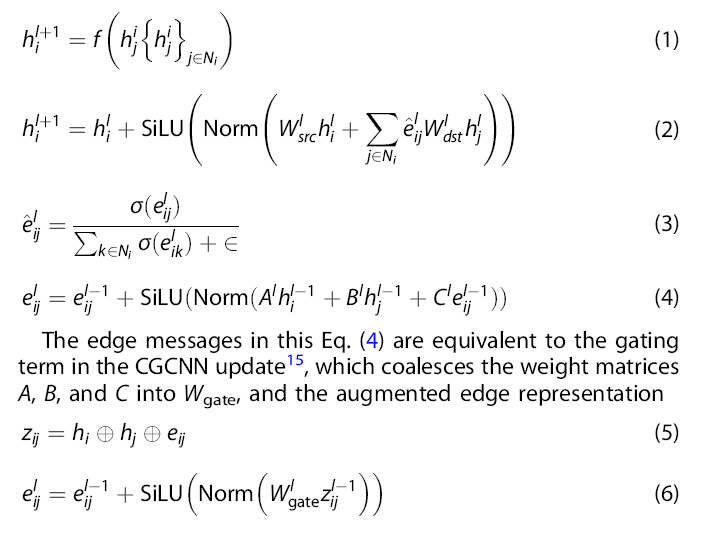

先看（4）

对于一个当前的$e_{ij}$来说，$h_i,h_j$ 都是已知的，ABC是权重，可以计算下一层的$e_{ij}$：

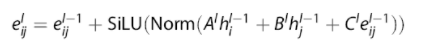

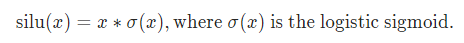

$N_i$是 $i$ 节点的邻节点，那么：

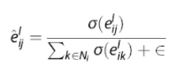

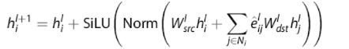

所以说，现在给定 h和e，就能按照上面的公式进行更新。

把以上公式简化，重新改写为：

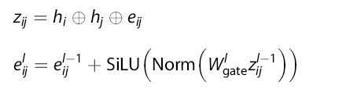

# ALIGNN update

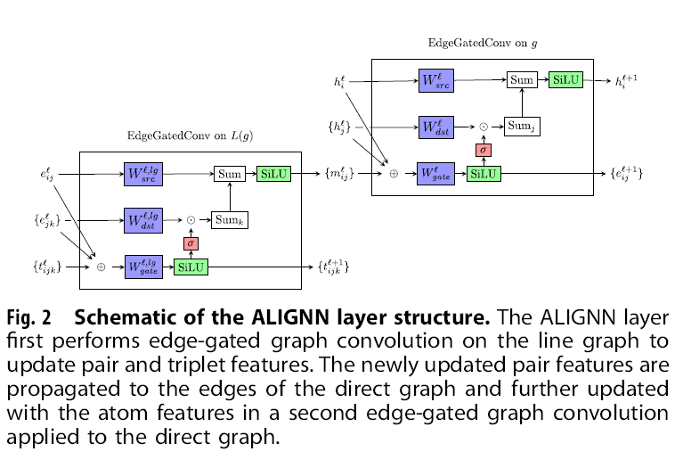

一一对应来看：

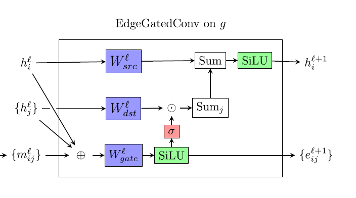

$h_i,h_j,m_{ij}$ 分别对应 h，e：

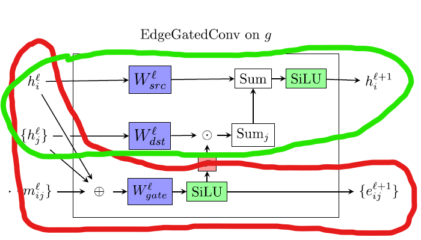

红色对应（4）

绿色对应（2）

整体上来看：

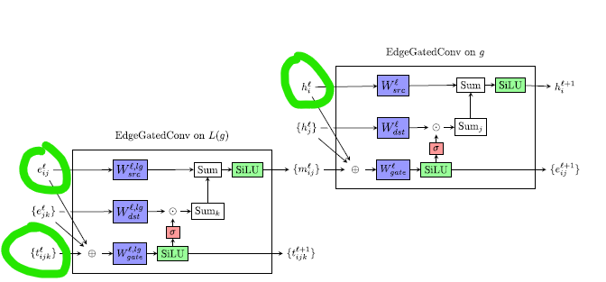

输入了h，e，t，并且将其更新。

把以上操作记为EdgeGatedGraphConv操作，那么可得：

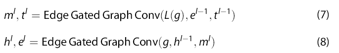

# Overall model architecture and training 

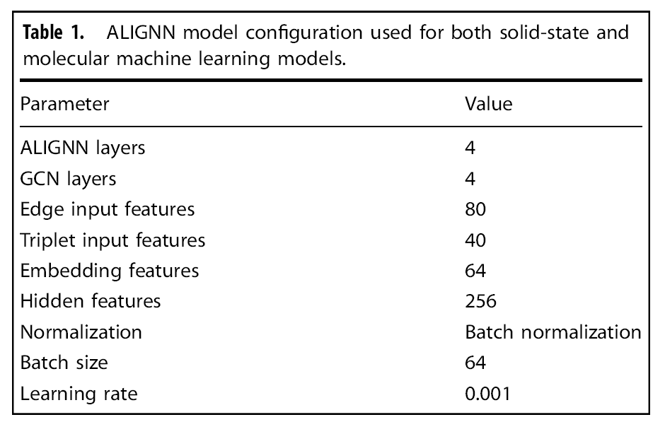

模型由4个ALIGNN 层和4个GCN层。

ALIGNN层指的是前面的 **ALIGNN update**

GCN层指的是 仅仅 edge-gated graph convolution 操作 在 bond graph( 也就是只输入 h 和 e)

经过了 4 + 4 的卷积层，再执行**全局平均池化**，最后**全连接**进行预测任务。

# Model performance 

数据集： Materials Project，JARVIS-DFT 和 QM9， 并不是将3个数据集整合同时训练，而是分别在三个数据集上进行训练，预测任务。数据划分为8：1：1。

其中 MP 2018年6月1日版本，有69239种材料，以及PBE bandgaps 和 形成能等。

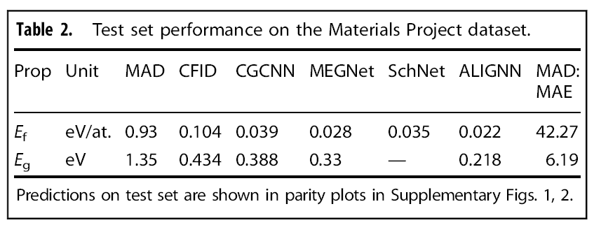

CFID,CGCNN,MEGNet, SchNet 都是用于对比的

MAD 是平均绝对偏差 

MAD: MAE 平均绝对误差标准（？）观察到42.27，一般来讲大于5则说明模型性能很好。

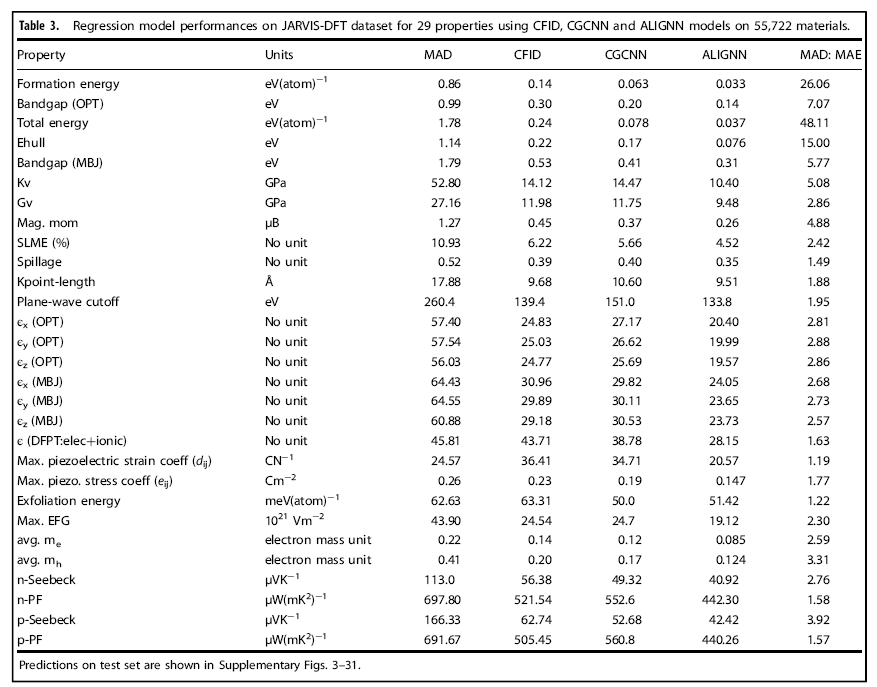

数据使用在JARVIS-DFT数据集上，比CFID要好4倍。

但是回归任务不算表现优异，MAD：MAE低于5。

详细讨论：

对于分类任务，使用指标为 ROC AUC，一个随机猜测模型的ROC AUC为0.5，完美的模型为1.

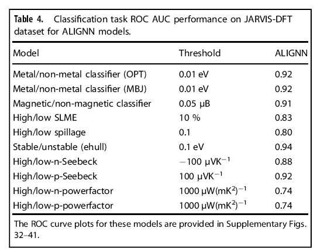

对于回归模型：

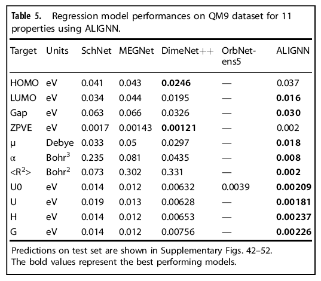

