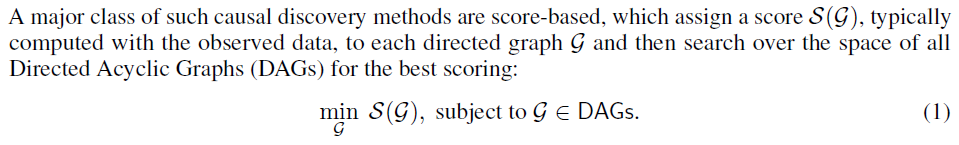
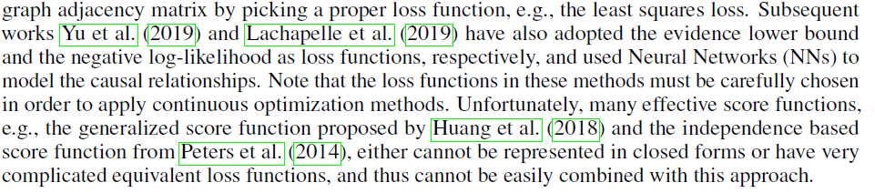
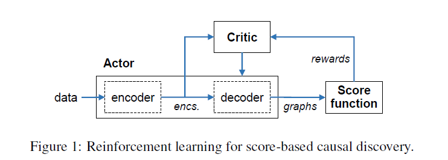
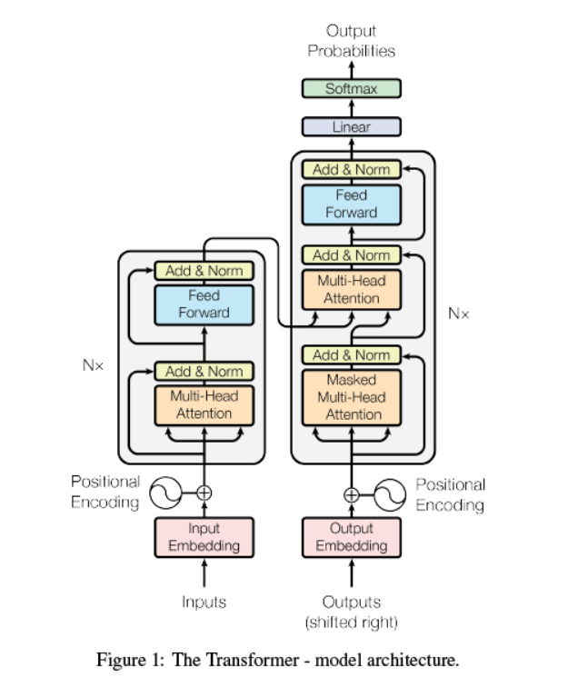
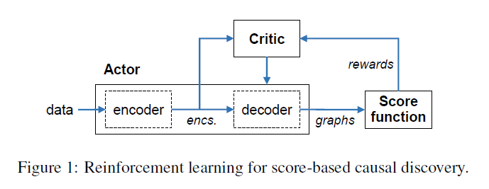

# 《CAUSAL DISCOVERY WITH REINFORCEMENT LEARNING》 读书笔记

作者Shengyu Zhu华为诺亚实验室，发表在ICLR。

https://cn.linkedin.com/in/shengyuzhu 

https://github.com/huawei-noah/trustworthyAI/tree/master/Causal_Structure_Learning/Causal_Discovery_RL

## abstract

causal inference = causal effect + causal relationships（贝叶斯网络做的是因果关系发现）

因果发现。传统的因果发现基于的是local heuristics，依据 score function。

但是，greedy equivalence search 可能在无限的样本数目下，一定的模型假设情况下有不错的结果，它的表现在有限数据已经假设不满足的情况下表现欠佳。

基于neural combinatorial optimization的工作，提出RL 来搜索DAG。

encoder-decoder模型：输入数据，生成邻接矩阵，并计算reward。reward考虑了score function 和 两个惩罚项来保证无环性。

与传统的RL模型，为了得到policy。我们使用RL来得到一个search strategy，我们最终的结果是一个DAG。

synthetic data与real data同样适用。

## intro

问题：

其中$S()$已经被大量研究，例如：BIC, MDL, BGe.

这个问题是一个NP难问题。

常用local heuristic解决：Greedy Equivalence Search，MMHC。

最近：X. Zheng, B. Aragam, P. Ravikumar, and E. P. Xing. DAGs with NO TEARS: Continuous optimization for structure learning. In Advances in Neural Information Processing Systems, 2018. 将问题转化为连续优化问题。

随后还有人在此基础上做了改良：

本文提出：使用RL来搜索DAG。

1. 使用编码器-解码器输出一个 G
2. 根据这个G计算reward，这个reward考虑了：‘得分’与‘无环性’。
3. 使用policy gradient与随机优化策略来优化 ‘编码器-解码器’。

## related work

基于constraint-based 的因果推断方法，首先使用条件独立性检验来确定骨架，然后再决定方向。PC算法。

还有一类因果推断方法基于properly defined functional causal models。例如：

- LiNGAM
- the nonlinear additive noise model
- post-nonlinear causal model

## model definition

$$
x_{i}:=f_{i}\left(\mathrm{x}_{\mathrm{pa}(i)}\right)+n_{i}, i=1,2, \ldots, d
$$

其中$\mathrm{x}_{\mathrm{pa}(i)}$是$x_{i}$的父节点（s），$f_{i}()$是一个固定的函数，$n_{i}$固定分布的噪音。

对于样本
$$
X_{n \times d}
$$
记为：
$$
\mathbf{x}:=\left\{{x}_{i}\right\}_{i=1}^{d}
$$

## Neural network architecture for graph generation 

在数据中，随机抽取n个样本（可重复），$x^k$是第k个样本，共有n个样本。

所以数据为：
$$
\{x^l\}^n_{l=1}
$$
一共有n行，d列，所以记：
$$
s =\{\tilde{x}\}^d_{i=1}
$$
使用指针神经网络：

1. 随机抽取n个样本出来（with replacement），$\left\{\mathrm{x}^{l}\right\}_{l=1}^{n}$
2. 得到$\mathbf{s}:=\left\{\tilde{\mathbf{x}}_{i}\right\}_{i=1}^{d}$ ，这里的$\tilde{\mathbf{x}}_{i}$，是一个变量的所有取值，就是原来x的一列。
3. $\tilde{\mathbf{x}}_{i} \in R^{1\times n}$, 类比于TSP问题，它是$d$ 个城市的 n-dim坐标。

### encoder

使用transformer模型。

过程：

观测数据 [n,d]  转置一下 [d,n]

进encoder（假设最后的feed forwad为），得到 [d,512]

encoder--->   $enc_i,i=1,2,3...d$

### decoder

以成对的方式考虑边的情况。building relationship between two $enc_i$, 所以decoder得到的结果：
$$
g_{i j}\left(W_{1}, W_{2}, u\right)=u^{T} \tanh \left(W_{1} \text { enc }_{i}+W_{2} \text { enc }_{j}\right)
$$

$$
[g_{0, 0},g_{0, 1},...,g_{0, j}],\\
[g_{1, 0},g_{1, 1},...,g_{1, j}],\\
...\\
[g_{1, 0},g_{1, 1},...,g_{i, j}]
$$

## Reinforcement learning for search

使用RL作为搜索策略。

### score function, acyclicity, reward

评分函数：本文使用RL agent来最大化评分函数

BIC评分：
$$
\mathcal{S}_{\mathrm{BIC}}(\mathcal{G})=\sum_{i=1}^{d}\left(m \log \left(\mathrm{RSS}_{i} / m\right)\right)+\#(\text { edges }) \log m
$$

$$
\mathcal{S}_{\mathrm{BIC}}(\mathcal{G})=m d \log \left(\left(\sum_{i=1}^{d} \operatorname{RSS}_{i}\right) /(m d)\right)+\#(\text { edges }) \log m
$$

acyclicity：
$$
h(A):=\operatorname{trace}\left(e^{A}\right)-d=0
$$
reward：
$$
\text { reward := }-\left[\mathcal{S}(\mathcal{G})+\lambda_{1} \mathbf{I}(\mathcal{G} \notin \mathrm{DAGs})+\lambda_{2} h(A)\right]
$$
$I$是一个指示函数。

所以现在要处理的问题被改写为：
$$
\min _{\mathcal{G}}\left[\mathcal{S}(\mathcal{G})+\lambda_{1} \mathbf{I}(\mathcal{G} \notin \mathrm{DAGs})+\lambda_{2} h(A)\right]
$$
原问题是:
$$
\min _{\mathcal{G}} \mathcal{S}(\mathcal{G}), \text { subject to } \mathcal{G} \in \mathrm{DAGs}
$$
**两个问题在什么情况下等价呢？**

因为h(A)的计算采用的是近似算法，所以并不能严格遵守h(A)=0。一般情况下h(A)<$h_{min}$就认定A为无向图。

记：$h_{min}$ 是最小的有环图，$S^*$是原问题的最低分。$S_L$是松弛以后的下界，$S_U$是松弛以后的上界。（$S_L$<=$S^*$<=$S_U$）

两个问题等价，当：
$$
\lambda_{1}+\lambda_{2} h_{\min } \geq \mathcal{S}_{U}-\mathcal{S}_{L}
$$
证明：
$$
对于原问题来说：假设 G 是一个解，那么 S^* = S(G) \\
如果说G 不是"改写问题" 的解，那么存在一个 G（可能有向）\\
\mathcal{S}^{*}>\mathcal{S}\left(\mathcal{G}^{\prime}\right)+\lambda_{1} \mathbf{I}\left(\mathcal{G}^{\prime} \notin \text { DAGs }\right)+\lambda_{2} h\left(A^{\prime}\right)\\
很明显，\mathcal{G}^{\prime}不是一个DAG，\\
\mathcal{S}\left(\mathcal{G}^{\prime}\right)+\lambda_{1} \mathbf{I}\left(\mathcal{G}^{\prime} \notin \text { DAGs }\right)+\lambda_{2} h\left(A^{\prime}\right)>S_L+\lambda_{1}+\lambda_{2} h_{\min }>=S_U
$$

### actor-critic algorithm

policy：
$$
\pi(\cdot \mid \mathrm{s})
$$
NN（编码器，解码器）的参数：
$$
\psi
$$
训练的目标，期望奖励为：
$$
J(\psi \mid \mathbf{s})=\mathbb{E}_{A \sim \pi(\cdot \mid \mathrm{s})}\left\{-\left[\mathcal{S}(\mathcal{G})+\lambda_{1} \mathbf{I}(\mathcal{G} \notin \mathrm{DAGs})+\lambda_{2} h(A)\right]\right\}
$$

### 算法详细：

data 先进入 encoder，得到 encs

encs进入critic，得到预测到的reward

encs和预测reward进入到decoder，得到图，图再使用准确计算，得到真实reward

真实的reward-预测的reward，得到loss，使用这个loss来更新critc

然后使用更新后的critc预测的reward，encs进入到decoder，使用这个loss来更新actor

