# 《Exploiting Experts’ Knowledge for Structure Learning of Bayesian Networks》阅读笔记

这是一篇数学功底很不错的融合专家知识的结构学习算法

## Abstract

In this paper, it is investigated whether Bayesian network structure learning can be improved by exploiting the opinions of multiple domain experts regarding cause-effect relationships. 

每个专家的准确性被三个参数衡量。

提出了两个新的评分函数。第一个评分函数，专家的准确性用EM算法来估计；第二个评分函数marginalizes out the accuracy parameters to obtain more robust scores。

## Introduction 

the challenges faced by Bayesian network structure learning：

1. candidate graph is super exponential in the number of the variables
2. insufficient data
3. Markov equivalent graph encodes the same joint distribution 

**in this paper**:

proposed two scoring functions, advantages: 

1. impossible have a completely reliable expert 
2. expert only have to label some of the edges
3. deal conflicts

approaches:

1. EM algorithm to estimate the accuracy of experts
2. propose a Bayesian alternative by taking into account the
   uncertainty in the accuracy of each expert.

Thus the first one is named as **explicit accuracy based score**, the second one is **marginalization-based score**

## Bayesian networks 

Omitted 

If two graphs encode the same set of independences, then we say that these graphs are **Markov equivalent.**

usually convert DAG to CPDAG to determine whether DAGs are in Markov equivalent class.

## Score-based structure learning 

introduce BD score

## edge types, experts' opinions and accuracies 

there are three types of  opinions

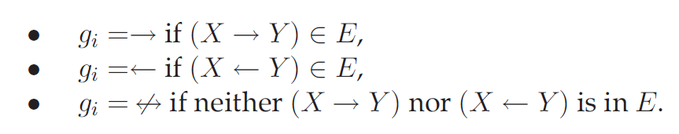

three parameters model the accuracy of an expert 

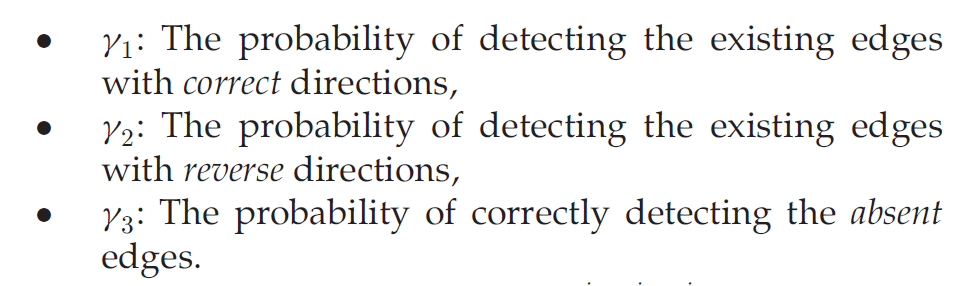

an example to illustrate: 

an expert with $\gamma_1 = 0.6,\gamma_2 = 0.1 ,\gamma_3 = 0.8$

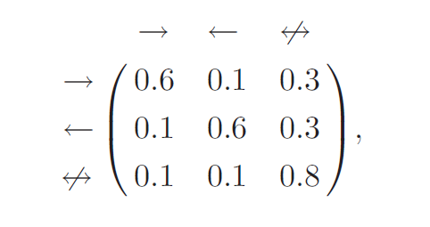

## problem setting 

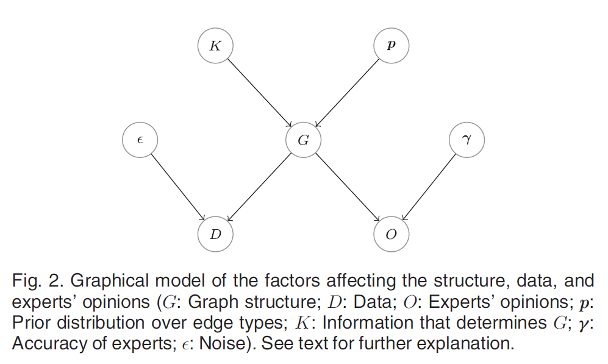

multi experts' abstract model：

single expert's abstract model：

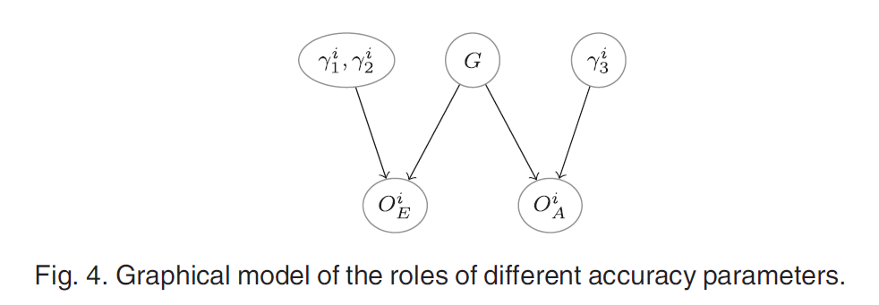

use d-separation to identify independence relationships:

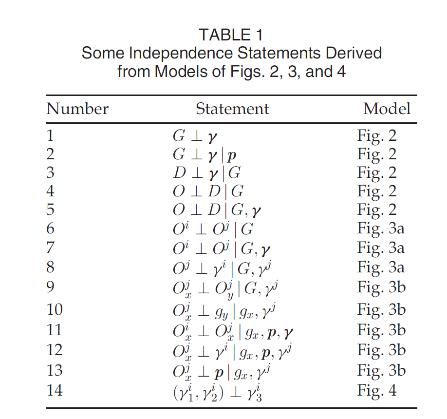

## Score derivation 

get the explicit accuracy based score function

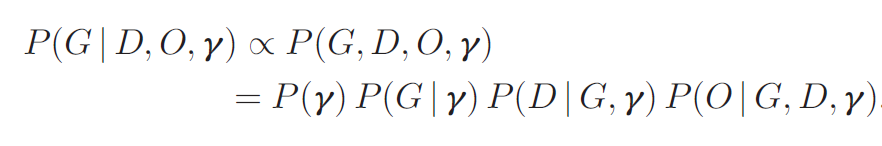

above it is since Bayesian theory and law of probability, then log it 

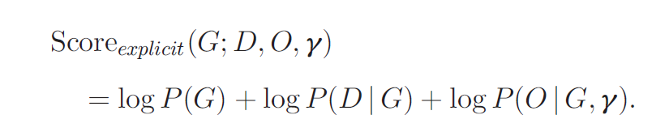

the first two parts of this score have been researched. Now we focus on the last part:

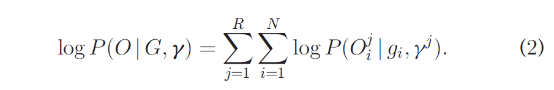

start from left:

$logP(O|g,\gamma)$ is computed as :

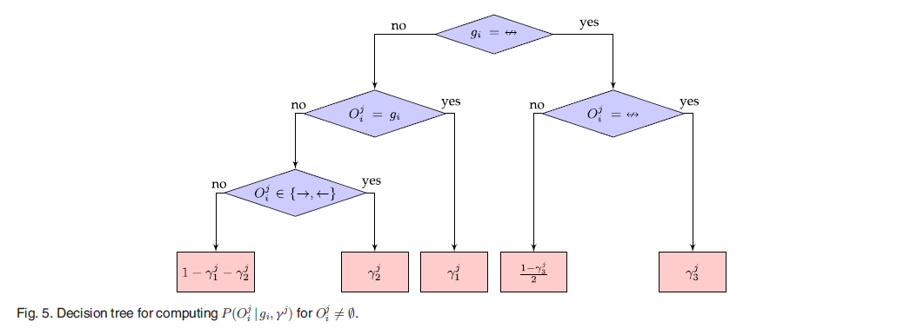

then, $N$ is the number of node pairs. $R$ is the number of expert. 

> this paper does not mention the decomposability of the score function, which is critical in the heuristics. 

## EM based Accuracy estimation 

here, use EM algorithm to estimate the accuracy of experts. 

optimal problem:   

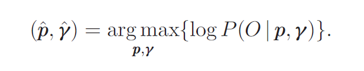

$p$ is the prior distribution, and $\gamma$ is the accuracy parameters.  Such conditional probability is obtained from .

Given prior distribution and the accuracy parameters, the probability of expert opinions. find when the probability reach max, what the $p$, $\gamma$ is?

**in other word, what  $p$, $\gamma$ can make the biggest likelihood.** 

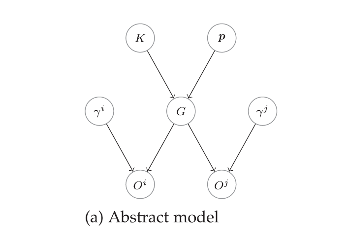

solve this optimize problem with EM algorithm. 

## MARGINALIZATION-BASED SCORE 

Marginalization based score does not need the accuracy of experts, and does not expilitly estimate it. 

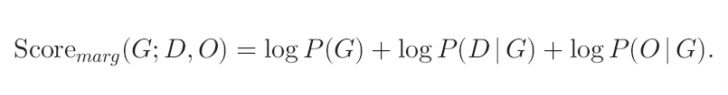

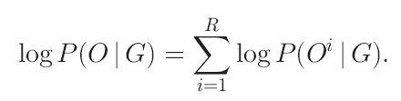

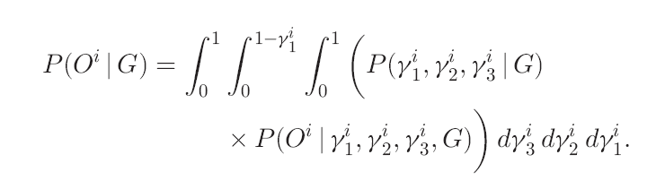

Marginalization based score uses integration to eliminate expert accuracy $\gamma$.

after deriving...

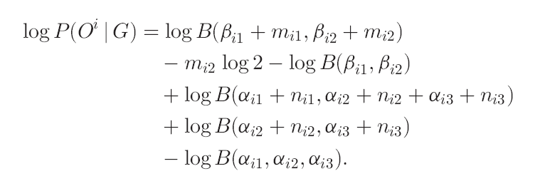

where $\beta,\alpha$ are hyper parameters.

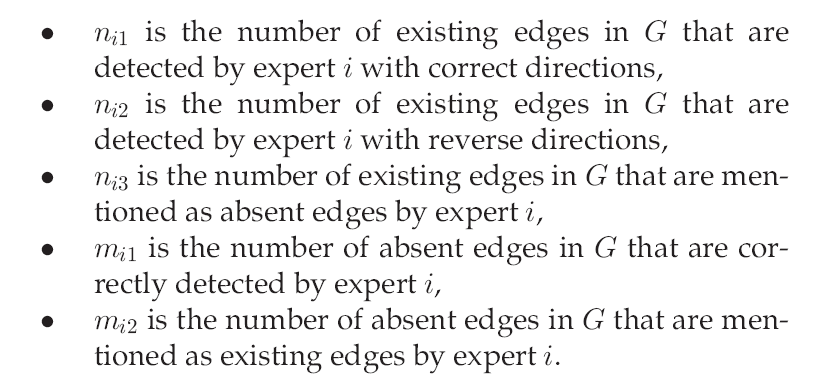

## experiments 

datasets:

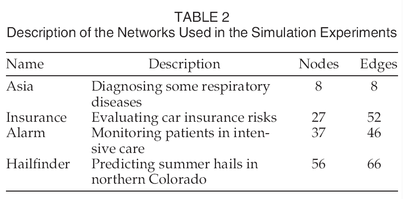

there are small, medium, big, very big 4 different datasets. 

experts:

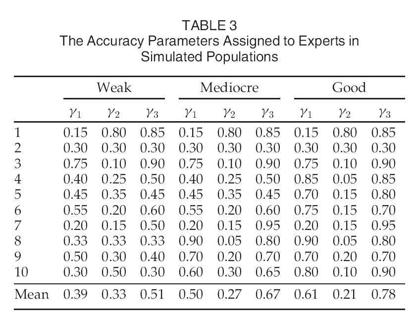

five different methods:

* BDeu score
* totally expert
* perfect experts, it means explicit accuaracy based score
* mean, every expert has the same accuracy 
* EM
* marginalization-based score

### asia network 

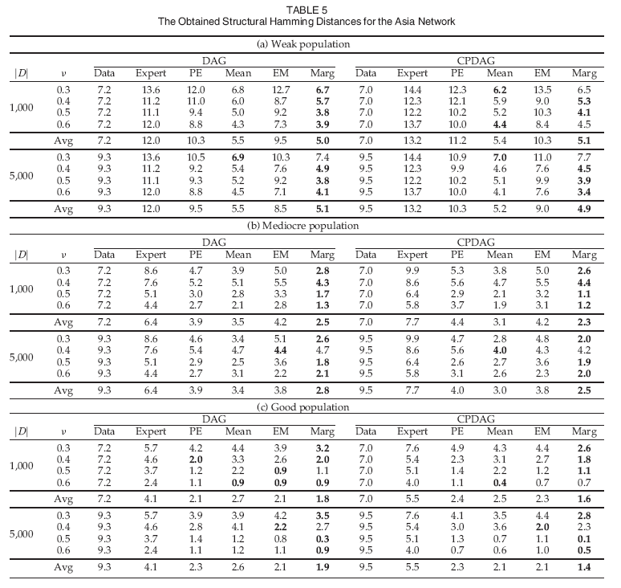

experts are weak, marginalization score performs best.

experts are mediocre, marginalization score performs best

experts are good, marginalization score performs best, 3/4. and perfect-expert algorithm 1/4 performs best. 

### insurance network

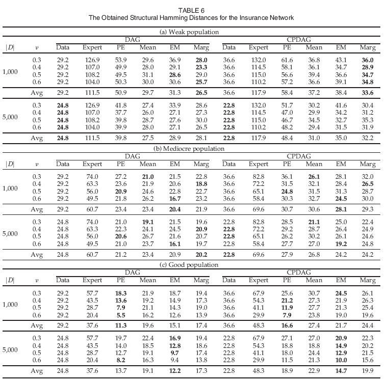

### alarm network

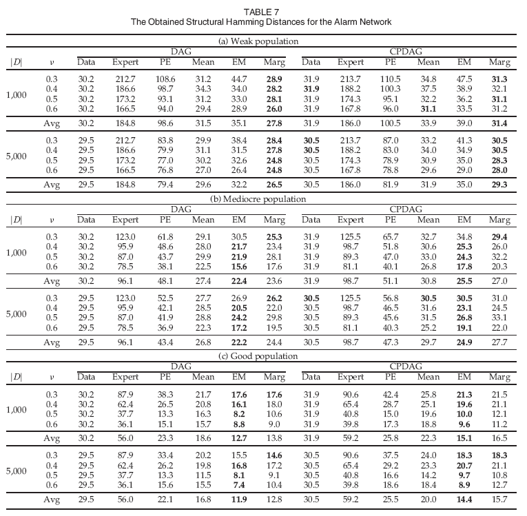

### Halifinder network

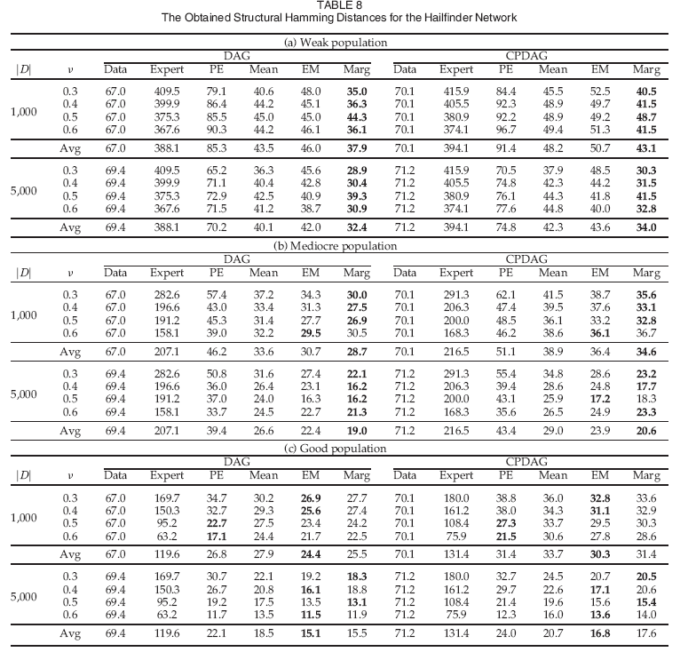

### real world experiments

breast cancer diagnosis 

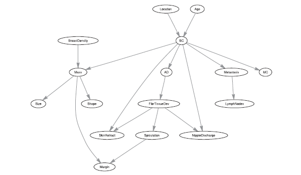

