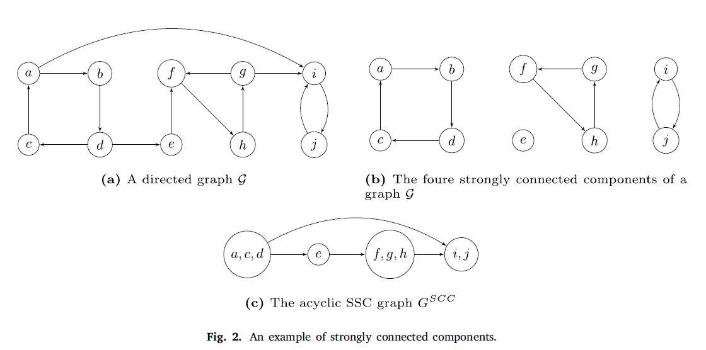
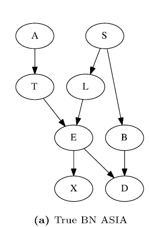
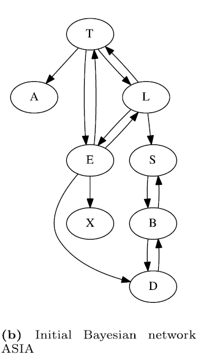
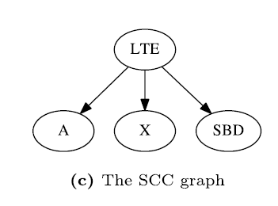
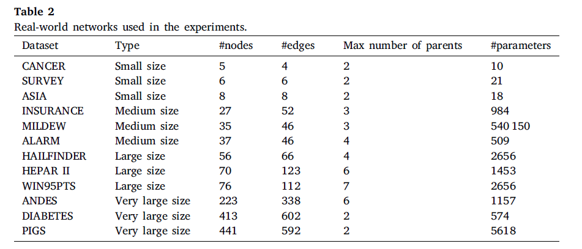
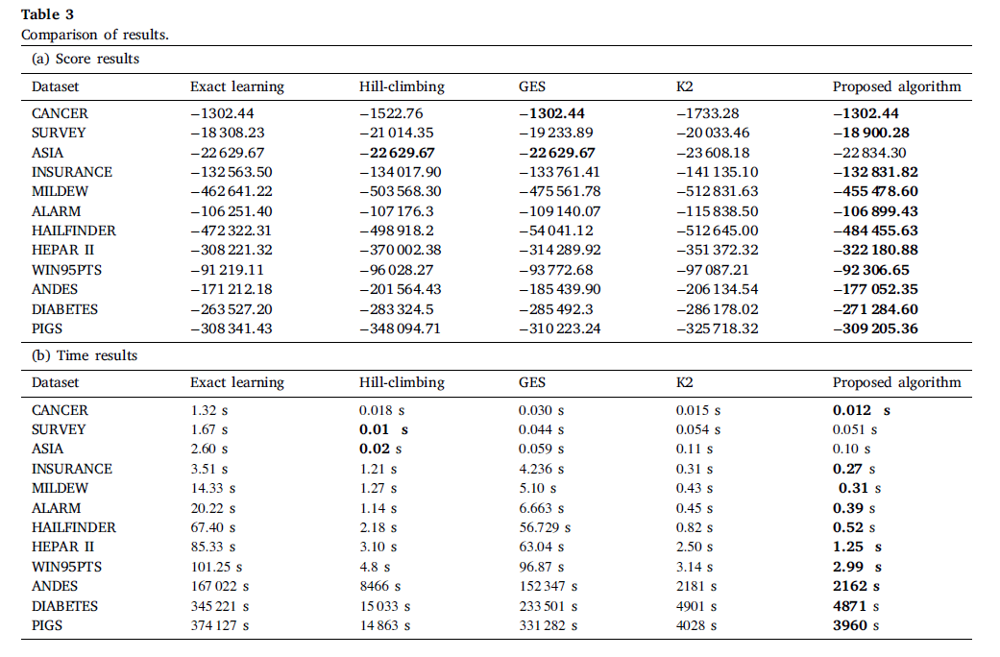

# 《Improved K2 algorithm for Bayesian network structure learning》阅读笔记

## abstract

K2算法是一个基于评分的算法，将随机输入的变量顺序作为输入，它的效率受变量顺序的影响。不正确的变量顺序会导致错误的网络结构。

对于K2算法，主要挑战是：从数据集中获得一个有意义的顺序。

本文提出了一种新的快速而直接的算法。该算法基于从数据构建的图中提取强连通分量的排序。我们将结构的超指数搜索空间缩减为较小的节点排序空间。我们使用一些标准的基准数据集对该算法进行了评估，并将结果与一些最新算法的结果进行了比较。最后，我们证明了该算法与一些结构学习算法是有竞争力的。

## intro

人工智能

BN

三种结构学习方法

提出了一种改进的K2算法，先从数据中构建一个strongly connected components，使用这个SCC来生成节点的初始顺序，这个顺序用于K2 算法的结构学习。

## structure learning

BIC score

$$  B I C(B \mid \mathcal{D}) =\sum_{i=1}^{n} \sum_{j=1}^{q_{i}} \sum_{k=1}^{r_{i}} N_{i j k} \log _{2}\left(\frac{N_{i j k}}{N_{i j}}\right) \\ -\frac{\log _{2} N}{2} \sum_{i=1}^{n} q_{i}\left(r_{i}-1\right) $$

分解：
$$
\operatorname{score}(G)=\sum_{i=1}^{n} \operatorname{score}\left(X_{i} \mid \Pi_{i}\right)
$$

## ordering-based search algorithm

给定ordering $\prec$ ，来找到最佳的网络结构，这不是一个NP难问题，如果说将 入度，设定一个上界$k$，那么算法复杂度为：$O\left(n^{k+1}\right)$ 

### search on space of ordering

Teyssier和Koller（2005）给出了一种解决排序空间搜索的简单方法。搜索是通过考虑所有(𝑛 − 1） 当前排序的候选继任者。然后，该算法比较通过这些交换获得的后续排序的增量分数，即它们的分数与当前分数之间的差异，并取给出最高增量分数的那一个。禁忌列表用于防止算法反转搜索中执行的交换。继续该过程，直到达到局部最大值。此搜索使用贪婪爬山、随机重启和禁忌列表来执行。

对于一个给定的ordering $\prec$，$X_i$ 的possible parent set可以写为：
$$
\mathcal{V}_{i,\prec}=\left\{U: U \prec X_{i},|U| \leq k\right\}
$$
U 是在ordering 中先于 $X_i$的，并且U 的个数不超过 k

 对于$X_i$，最佳 parent set 定义为：
$$
\Pi_{i,\prec}=\arg \max _{U \in \mathcal{V}_{i,\prec}} \operatorname{score}\left(X_{i}, U\right)
$$
对于一个顺序来说，得到所有的 possible parent set 的复杂度为：$O\left(n^{k+1}\right)$

### search using a given ordering of variables

Behjati and Beigy (2018) have proposed a new hybrid algorithm that is based on a ordering learned from data. 

### K2 algorithm 

输入一个ordering 和一个入度的上界 k

第一步，初始化，对于每一个 $X_i$ , 候选 parents $\Pi_{i}$ 设为空集。

第二步，对每一个节点，在$\Pi_{i}$中依次添加节点，指导以下情况停止：

- 节点数到达k
- 没有节点可以添加
- 增加节点无法提高评分

K2算法的效率很大程度上取决于ordering。

## learning structure via learning the order of nodes

概念：

SCC strongly connected components

SCC graph

topological sorting 

strongly connected：有向图中，有一条路可以从任意节点到达任意节点，则这个图为 strongly connected。

一个有向图可以分解成多个strongly connected component

一个有向图是无环的 <--> 有向无环图没有大于一个节点的strongly connected component 

一个有向图，可以简化为一个$G^{SCC}$（见图c）

## 算法过程：

1. 对每个结点计算 best parent set
2. 生成initial graph，不考虑无环性。

3. 将上图分解为$G^{SCC}$

4. 对每个结点，递归地进行上面的操作。比如：LTE。最终得到一个最后的顺序。

## 评价

使用了12个基准数据集：

敏感性分析：

1. sample size：100，500，1000，2000，4000，6000，8000，10000，15000，100000
2. 超参数k的取值

与其他算法对比：

比了两个方面，时间和评分

