# 《Learning to Optimize》阅读笔记

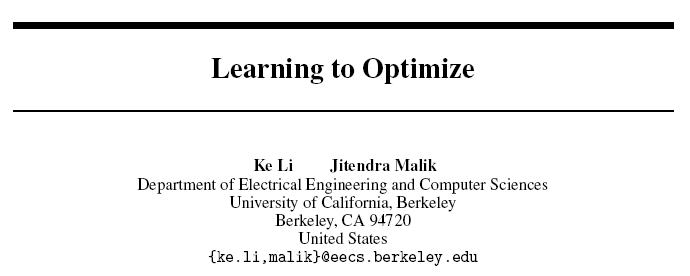

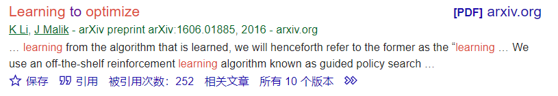

一篇预印本，使用强化学习的视角来解决最优化问题。

# abstract

Algorithm design is a laborious process, need many attempts and validations.

This paper proposes a method to learn a optimization algorithm from reinforcement perspective.

# introduction 

This paper focuses on the automating the design of unconstrained continuous optimization algorithm. 

There are extensive work over the unconstrained continuous optimization algorithm, like gradient descent, momentum conjugate gradient and L-BFGS. 

This paper formulates the problem as a reinforcement learning problem, regarding optimization algorithm as a policy.

# Method

## Preliminaries

Learner is given a choice of actions to take in each time step. 

A reinforcement learning problem is typically formally represented as an Markov decision process.
$$
\left(\mathcal{S}, \mathcal{A}, p_{0}, p, c, \gamma\right)
$$
$\mathcal{S}$ is the set of states

A is the action space

$p_0$ is the probability of initial states

p is the transition probability density

c is a function maps state to cost

$ \gamma$ is the discount factor

goal is to find a stochastic policy $\pi$ to get a minimal expected cumulative cost.
$$
\pi^{*}=\arg \min _{\pi} \mathbb{E}_{s_{0}, a_{0}, s_{1}, \ldots, s_{T}}\left[\sum_{t=0}^{T} \gamma^{t} c\left(s_{t}\right)\right]
$$
this problem is known as **policy search problem**. 

if we known the p (transition probability density), it can be formulated as a dynamic planning problem. However, we usually do not know the p in practice. 

**Guided policy search** is a method for performing policy search in continuous state and action space under possibly unknown dynamics. 

## Formulation 

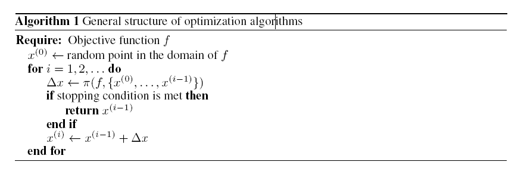

a general structure of an algorithm. 

starting from a random location,

use $\pi$ to select a step vector,

move the step iteratively until meeting stopping conditions. 

Different optimization algorithm differ in the choice of $\pi$. Some $\pi$ depends on the gradient of the objective function, e.g. 
$$
\pi\left(f,\left\{x^{(0)}, \ldots, x^{(i-1)}\right\}\right)=-\gamma \nabla f\left(x^{(i-1)}\right)
$$
therefore, if we can learn a $\pi$, we will be able to devise an algorithm. $\pi$ takes objective values and gradients as inputs. 

Formulate the optimization algorithm into MDP:

state is the current location,

action is the step to update,

cost is designed by our to penalize the policies that converge slowly and minimize the objective function. 

## implementation 

current location, previous gradients, previous improvements in objective value are stored for policy.

state space:

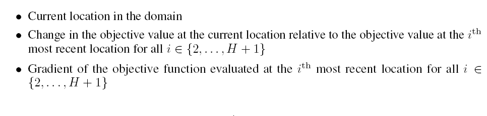

normally H is 25, thus on state space has 1+25+25 vectors.

A small network is used to model the policy, it consist of one single hidden layer with 50 units.

# Experiments 

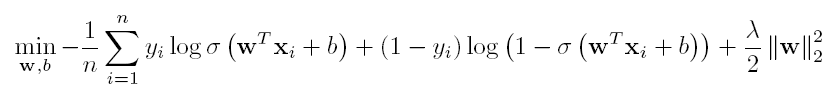

training set:

randomly generated 100 objective function.

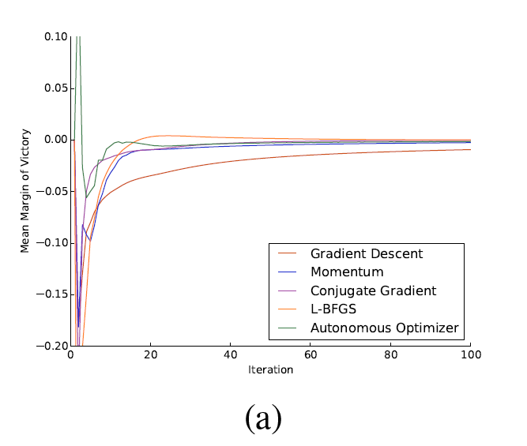

The margin of victory is positive when the current algorithm is better than all other algorithms and negative otherwise

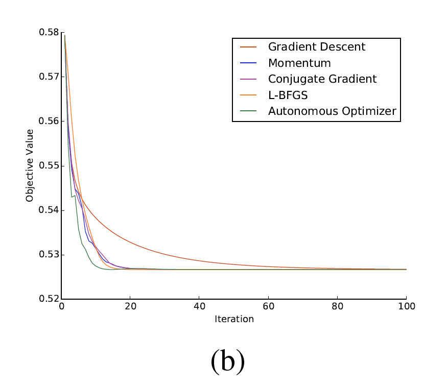

## Guided Policy Search

The paper regards this method as a well-known method. 

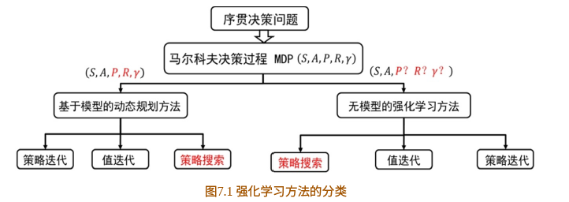

在此只介绍**策略搜索**的基础部分，并不是Guided Police Search。

假设$\tau$ 是一组状态-行为序列：$s_0,u_0,...,s_H,u_H$

$R(\tau)=\sum_{t=0}^{H} R\left(s_{t}, u_{t}\right)$ 是该行为状态序列的回报

$P(\tau ; \theta)$ 是该序列出现的概率

目标函数：

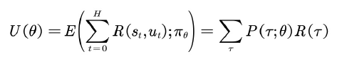

为了使目标函数达到最大，采用策略梯度法：

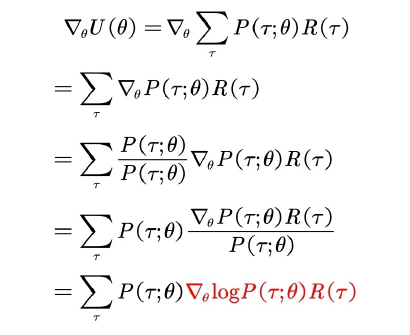

这可以重新写为$E(\nabla_{\theta} \log P(\tau ; \theta) R(\tau))$ ,使用蒙特卡洛采样

所以可以使用平均值对期望进行一个近似：

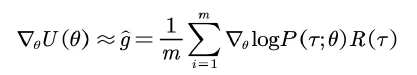

对于当前$\theta$, 采样m条序列，就可以得到 $\log P(\tau ; \theta)$ ,以此就可以计算出梯度，进行优化。

