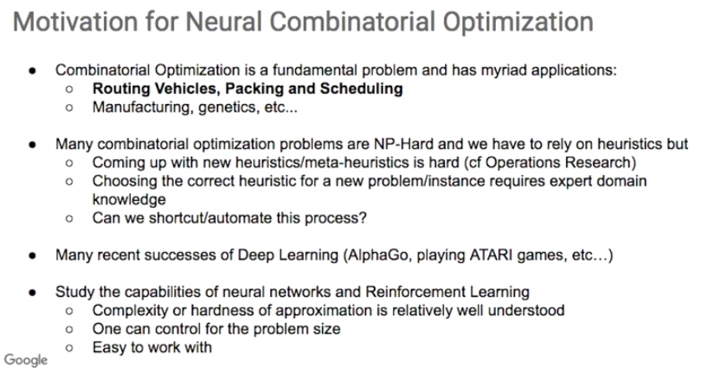
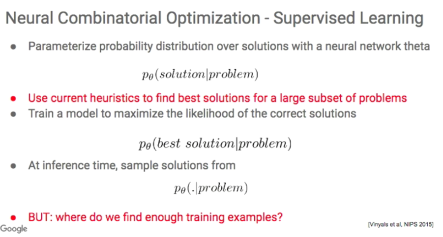
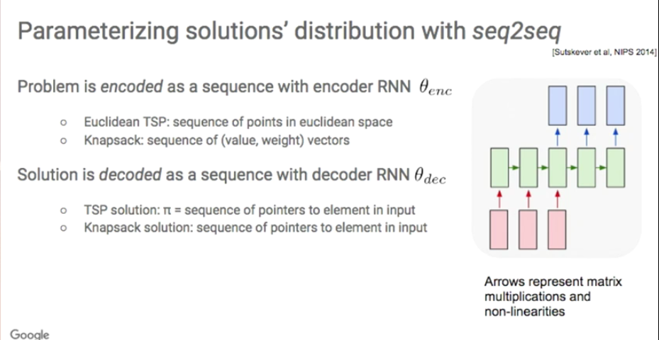
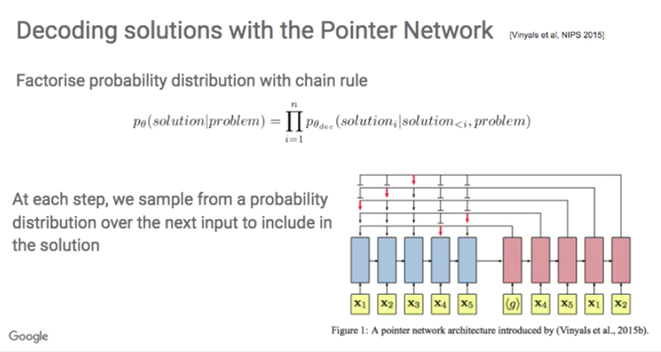
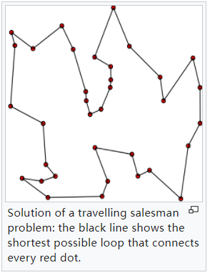
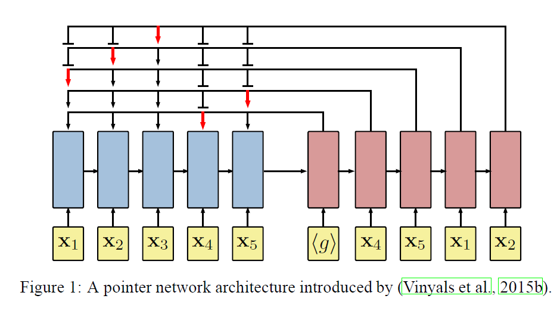
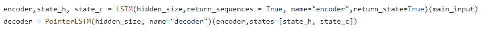
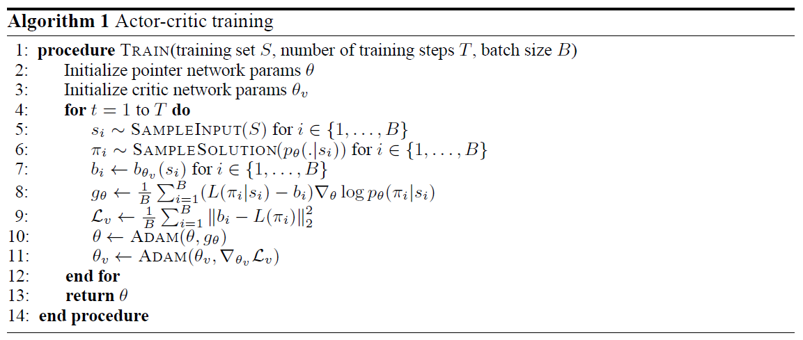

# 《NEURAL COMBINATORIAL OPTIMIZATION WITH REINFORCEMENT LEARNING》读书笔记

谷歌大脑出品。

https://www.bilibili.com/video/av66411702/

https://www.bilibili.com/video/BV1FV41177dR?from=search&seid=437844097357445861&spm_id_from=333.337.0.0

## 视频解读

combinatorial optimization  

神经网络：输入problem，输出solution。

Euclidean space 欧几里得空间。

## abstract

本文提出了一个框架用于解决组合优化问题，使用NN和RL。

本文专注于TSP问题，训练了一个RNN，给定城市的坐标，预测每个city permutations 的概率。

用negative tour length 为奖励，使用policy gradient method优化参数

## intro

组合优化是计算机领域的基础问题，经典案例：TSP。

> The **travelling salesman problem** (also called the **traveling salesperson problem**[[1\]](https://en.wikipedia.org/wiki/Travelling_salesman_problem#cite_note-1) or **TSP**) asks the following question: "Given a list of cities and the distances between each pair of cities, what is the shortest possible route that visits each city exactly once and returns to the origin city?" It is an [NP-hard](https://en.wikipedia.org/wiki/NP-hardness) problem in [combinatorial optimization](https://en.wikipedia.org/wiki/Combinatorial_optimization), important in [theoretical computer science](https://en.wikipedia.org/wiki/Theoretical_computer_science) and [operations research](https://en.wikipedia.org/wiki/Operations_research).

寻找最优的TSP路径是NP难，即使在2d空间内。

我们使用RL来解决组合优化问题，作为对比，我们使用已知最优解的监督学习方法与本方法进行对比。

基于policy gradient，提出两种方法：

1. RL pretrain，使用一个训练集训练RNN that parameterizes a stochastic policy ，使用 expected reward作为目标。测试期间，policy的参数固定，并且执行推断，通过贪婪的解码或采样。
2. active search，没有pretrain。首先给一个随机的policy。在一个测试案例上反复迭代，以更新这个RNN参数（也就是policy），使用期望奖励，同时跟踪当前搜索过程的最优解。（感觉没说清楚）

> 原文：It starts from a randompolicy and iteratively optimizes the RNN parameters on a single test instance, again using the expected reward objective, while keeping track of the best solution sampled during the search. We find that combining RL pretraining and active search works best in practice.

## previous work

TODO

## neural network architecture for TSP

问题建模：

$n$ 个城市

地点坐标：$\{x_i\}^n_{i=1}$

$x_i \in R^2$ 坐标是2维的

对于$x_i$的一个排序，记录为 $\pi$，也就是一个解。

那么，旅途长度写为：
$$
L(\pi \mid s)=\left\|\mathbf{x}_{\pi(n)}-\mathbf{x}_{\pi(1)}\right\|_{2}+\sum_{\pi(i)}^{n-1}\left\|\mathbf{x}_{\pi(i+1)}\right\|_{2}
$$
policy function 写为：
$$
p(\pi \mid s)\\
p(\pi \mid s)=\prod_{i=1}^{n} p(\pi(i) \mid \pi(<i), s)
$$
这个函数的输入是一个sequence，输出也是个sequence。

但是，这有两个问题：

1. 训练完了以后，限制了输入n
2. sequence2sequence模型需要ground truth来优化参数。

本文就要解决这两个issue。

###  pointer network 结构细节

pointer network 包含了两个RNN，一个为encoder，另一个为decoder。并且都包含了LSTM。

前半部分用RNN（LSTM）结构，得到一个上下文向量 $<g>$

后半部分使用pointer network来解码，得到一个排序，这个输出的长度由输入的长度决定。

> https://github.com/keon/pointer-networks

## 使用policy gradient进行优化

2015年Vinyals等人使用的是监督学习进行训练pointer network，这个情况在解决TSP问题时，并不适用：

1. 模型的质量很大程度取决于label。
2. 很难得到高质量的label，并且infeasible for new problem statements。
3. TSP更注重competitive的结果，而并不是能够拟合重现其他算法的结果。

使用强化学习来优化指针函数的参数（实际上就是训练policy function）

记 pinter network的参数为$\theta$, 输入坐标的序列为 $s$ , 目标函数写为（将其最小化）：
$$
J(\boldsymbol{\theta} \mid s)=\mathbb{E}_{\pi \sim p_{\theta}(. \mid s)} L(\pi \mid s)
$$
specify： $\pi \sim p_{\theta}(. \mid s)$ 即使用pointer network 计算出的 solution的概率分布；$L(\pi \mid s)$ 给定s，该动作的loss或cost，全部相乘求和则得到期望。

目标函数给定后，需要目标函数对参数求导，以得到梯度下降的方向：
$$
\nabla_{\theta} J(\theta \mid s)=\mathbb{E}_{\pi \sim p_{\theta}(. \mid s)}\left[(L(\pi \mid s)-b(s)) \nabla_{\theta} \log p_{\theta}(\pi \mid s)\right]
$$
其中$b(s)$是一个函数，给定$s$时，估计L，他是一个不准确的估计。

> 根据大数定律，样本均值[依概率收敛](https://zh.wikipedia.org/wiki/依概率收敛)于期望值。

所以可以使用蒙特卡洛采样计算这个梯度：

采样：
$$
s_{1}, s_{2}, \ldots, s_{B} \sim \mathcal{S}\\
\pi_{i} \sim p_{\theta}\left(. \mid s_{i}\right)
$$
近似计算：
$$
\nabla_{\theta} J(\theta) \approx \frac{1}{B} \sum_{i=1}^{B}\left(L\left(\pi_{i} \mid s_{i}\right)-b\left(s_{i}\right)\right) \nabla_{\theta} \log p_{\theta}\left(\pi_{i} \mid s_{i}\right)
$$
对于$b(s)$函数的选择，一般是最近一段时间内获得reward的滑动平均值。但是也可以使用带参数的$b(s)$函数，可以提高performance。本文使用一个auxiliary network，称为critic，参数记录为$\theta_v$

这个critic的作用：

对于当前的$p_{\theta}$ 以及 $s$，估计一个 期望的 路径长度。

所以critic的损失函数写为：
$$
\mathcal{L}\left(\theta_{v}\right)=\frac{1}{B} \sum_{i=1}^{B}\left\|b_{\theta_{v}}\left(s_{i}\right)-L\left(\pi_{i} \mid s_{i}\right)\right\|_{2}^{2}
$$
综上，actor-critic training 算法：

为了方便理解，把B看成1，所以算法步骤为：

1. t = 1
2. 采样抽取一个s
3. 根据pointer network(actor), 得到一个 $\pi$ 答案
4. 根据critic，得到一个 $b$ 预估路径长度
5. 求pointer network(actor)的梯度，
6. 求critic的梯度
7. 更新pointer network(actor)的参数
8. 更新critic的参数
9.  下一次迭代

obviously，刚开始actor和critic都是不准确的，但是在第7步中，第一次更新了critic的参数，这一次更新使得critic准确了一些，然后再用它来指导actor的更新。

抽象理解，一个体操运动员和一个教练，两人都是一无所知。

1. 运动员表演
2. 教练打分
3. 运动员根据教练打分，修改动作
4. 教练根据ground truth，修改打分策略
5. 继续重复，最终得到了一个优秀运动员以及优秀的裁判

> ps: 
>
> 1. 既然ground truth 如此好获得，何必还要找个裁判呢？直接体操运动员自己看ground truth修改动作不就好了。
> 2. critic机制适用于ground truth难以获得的时候，例如5次表演只能获得一次ground truth。或者说critic机制为了避免每次都去花费算力计算ground truth，而采取的一种加速策略

