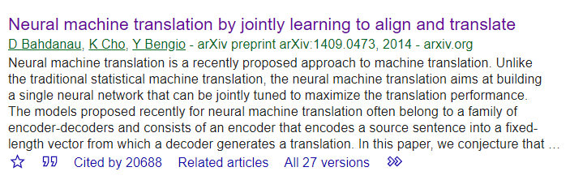
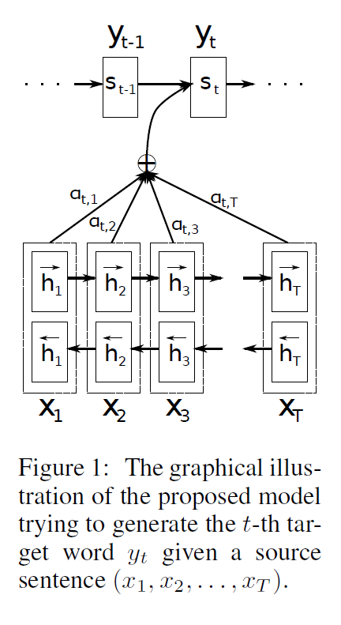

# 《Neural Machine Translation By Jointly Learning To Align And Translate》阅读笔记

ICLR 2015上首次提出了attention机制。

## abstract

常见的神经机器翻译使用的是encoder-decoder结构。encoder将原序列映射到一个固定长度的向量，decoder执行翻译。

本文认为一个固定长度的向量是神经机器翻译的瓶颈，本文扩展了这方面，允许模型自动搜索与预测目标相关联的源序列部分。

本文在英语翻译法语上取得了好的成果。

## intro

略

## background: neural machine translation

从概率的角度出发，翻译就是找到一个target sentence $y$，它有最大的条件概率：
$$
\arg \max _{\mathbf{y}} p(\mathbf{y} \mid \mathbf{x})
$$

### RNN encoder-decoder

RNN模型：
$$
h_{t}=f\left(x_{t}, h_{t-1}\right)
$$
最后将$h_t$编码为一个固定长度的向量$c$
$$
c=q\left(\left\{h_{1}, \cdots, h_{T_{x}}\right\}\right)
$$
解码器：
$$
p(\mathbf{y})=\prod_{t=1}^{T} p\left(y_{t} \mid\left\{y_{1}, \cdots, y_{t-1}\right\}, c\right)=\\p(y_1|c)p(y_2|y_1,c)p(y_3|y_2,y_1,c)...p\left(y_{t} \mid\left\{y_{1}, \cdots, y_{t-1}\right\}, c\right)
$$
对于RNN 解码器来说:
$$
p\left(y_{t} \mid\left\{y_{1}, \cdots, y_{t-1}\right\}, c\right)=g\left(y_{t-1}, s_{t}, c\right)
$$
其中g可以是一个多层感知机，$y_{t-1}$是上一次输出的概率，$s_{t}$是RNN的隐状态，$c$是上下文向量。

## Learn to align and translate

本文提出一种新的结构，由一个双向RNN作为encoder，decoder 模仿搜索过程。

### decoder: general description 

原来：
$$
 p\left(y_{t} \mid\left\{y_{1}, \cdots, y_{t-1}\right\}, c\right)=g\left(y_{t-1}, s_{t}, c\right)
$$
新结构为：
$$
p\left(y_{i} \mid y_{1}, \ldots, y_{i-1}, \mathbf{x}\right)=g\left(y_{i-1}, s_{i}, c_{i}\right)
$$
$$
s_{i}=f\left(s_{i-1}, y_{i-1}, c_{i}\right)
$$

也就是每一次解码都会得到对应的上下文向量$c_i$

$c_i$取决于一系列的annotations $\left(h_{1}, \cdots, h_{T_{x}}\right)$
$$
c_{i}=\sum_{j=1}^{T_{x}} \alpha_{i j} h_{j}
$$
其中每一个$h_j$的权重为：
$$
\alpha_{i j}=\frac{\exp \left(e_{i j}\right)}{\sum_{k=1}^{T_{x}} \exp \left(e_{i k}\right)}
$$
$e_{ij}$是：
$$
e_{i j}=a\left(s_{i-1}, h_{j}\right)
$$
$a()$是一个辅助模型，用于评价输入位置j，与输出位置i的匹配程度。

### encoder: Bidirectional RNN for annotating sequences

也就是正反两次循环，分别得到两个$h_j$ 
$$
h_{j}=\left[\vec{h}_{j}^{\top} ; \overleftarrow{h}_{j}^{\top}\right]^{\top}
$$
