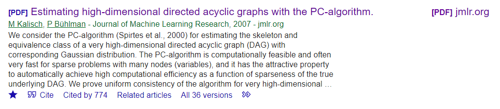

# 《PC algorithm》学习

《Estimating High-Dimensional Directed Acyclic Graphs with the PC-Algorithm》

## abstract

PC算法用于高纬度数据，做了一个稀疏性的假设：the neighborhoods in the DAG are of lower order than sample size n。

## intro

从数据中学习结构是非常困难的，因为DAG的搜索空间太大了。

search-and-score 方法在节点数较少，或中等的时候比较成功。

greedy DAG 搜素可以通过探索概率等价关系进行提升，搜索空间会被减小，称为GES（Greedy Equivalent Search, see Chickering, 2002a.）。

PC算法从一个complete，undirected 图开始，

递归地删除edges，基于条件性独立检验，最后得到部分有向图。如果DAG是稀疏的，那么可以缩减到多项式运行时间。

## finding the Equivalence class of a DAG

### definitions and preliminaries

如果说一个概率分布$P$,和与之对应的图$G$是faithful的，它需要满足以下条件：

对于任意的 $i, j \in V$ with $i \neq j$ and any set $\mathrm{s} \subseteq V$，满足：
$$
\begin{aligned}
& \mathbf{X}^{(i)} \text { and } \mathbf{X}^{(j)} \text { are conditionally independent given }\left\{\mathbf{X}^{(r)} ; r \in \mathrm{s}\right\} \\
\Leftrightarrow & \text { node } i \text { and node } j \text { are d-separated by the set } \mathrm{s}
\end{aligned}
$$
对于一个概率分布P，有一系列的等价DAG，即使有无限的观测数据，依然无法区分不同的DAG。对于这种等价DAG，Pearl提出:等价图具有相同的skeleton和v结构。

PDAG：部分有向图，其中包含一些无限边，当然它也是无环的。

CPDAG：完全PDAG满足以下条件：

1. every directed edge exists also in every DAG belonging to the equivalence class of the DAG
2. every undirected edge $i-j$ there exists a DAG with $i \rightarrow j$ and a DAG with $i \leftarrow j$ in the equivalence class

估计CPDAG有两个部分组成：1. 估计skeleton。2. partial orientation of edges

### PC算法寻找skeleton

