# 《The max-min hill-climbing Bayesian network structure learning algorithm》阅读笔记

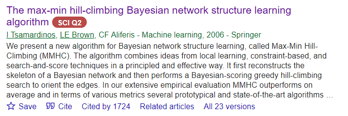

引用了1724次的混合型贝叶斯网络结构学习算法。

## abstract

MMHC算法融合了local learning， constraint based， search and score techniques。首先算法重建出BN的骨架，然后用爬山算法来确定边的方向。

## introduction

贝叶斯网络用于代表一个联合概率分布。

贝叶斯网络结构学习被广泛使用，网络结构的边具有因果语义。引用文献

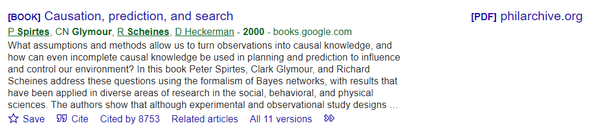

卡耐基梅隆大学的哲学与人文社科系。

---

目前贝叶斯网络结构学习无法 reliably scale up to thousands of variables in reasonable time。

本文提出MMHC，他能克服感知局限性。该算法能扩展到数千个变量。

结构学习方法有评分搜索算法。

结构学习方法有基于约束的算法。

介绍MMHC算法：首先学习骨架，使用max min parents and children；第二部使用贪婪的贝叶斯爬山搜索来确定骨架的方向。

MMHC算法可以视为Sparse Candidate algorithm 的一个实例。SC算法是第一个可以处理几百个变量的学习算法。SC算法首先，启发式地为每个变量估计一个candidate parent set，然后使用爬山算法来最大化评分。然后重新为每个变量估计candidate parent set，再次使用爬山算法来最大化评分。candidate set re estimate 接着 hill climb就是一次迭代过程。Sparese candidate 迭代，直到候选集没有变化，或者其他终止条件满足。

SC算法存在三个主要问题：

1. candidate parents不可靠
2. 需要指定最大的入度k
3. 参数k是一种一致性的稀疏约束

MMHC alleviates three problems above:

1. remove super parameter k
2. only one iteration can gurantee the accuracy of candidate set

---

## background

定义一：

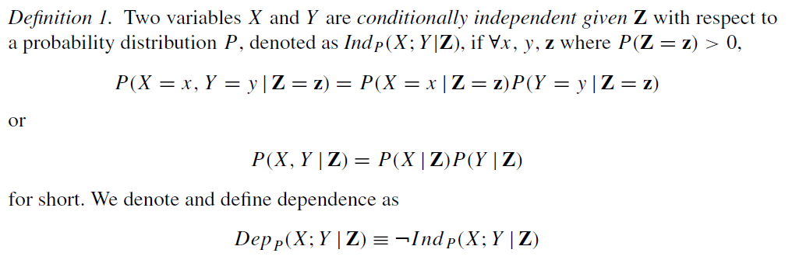

定义二：

定义三、四、五都是关于d-separation的

Verma和 Pearl 证明了：

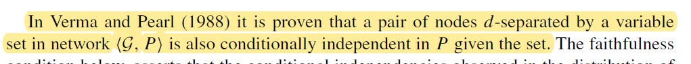

定义六：

a distribution is faithful

定义七：

a faithful Bayesian network

----

定理一：

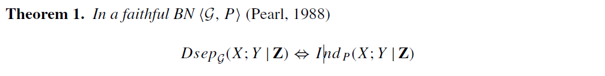

faithfulness 是本文的基本假设，用d-seperation 与 条件独立 连接起来。

定理二：

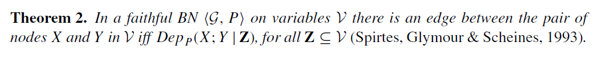

## the max min parents and children algorithm （MMPC算法）

使用MMPC算法来得到一个 假阳性的结构：

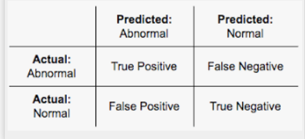

在算法中可能会使用到两个函数

$\operatorname{Ind}(X ; T \mid \mathbf{Z})$

$\operatorname{Assoc}(X ; T \mid \mathbf{Z})$

分别用来评价条件独立与依赖关系，这是可以自定义的，在后续章节中也有详细描述。

定义 $\operatorname{MinAssoc}(X ; T \mid \mathbf{Z})$为：

通过改变**S**（**S**是**Z**的子集），使得association最小：

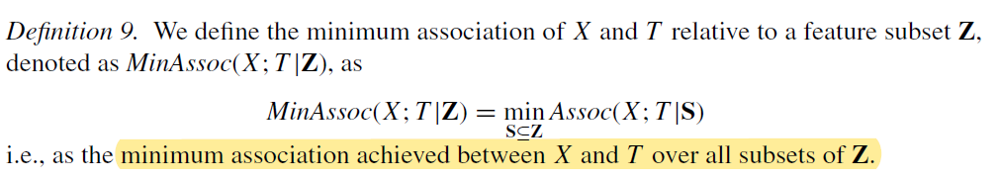

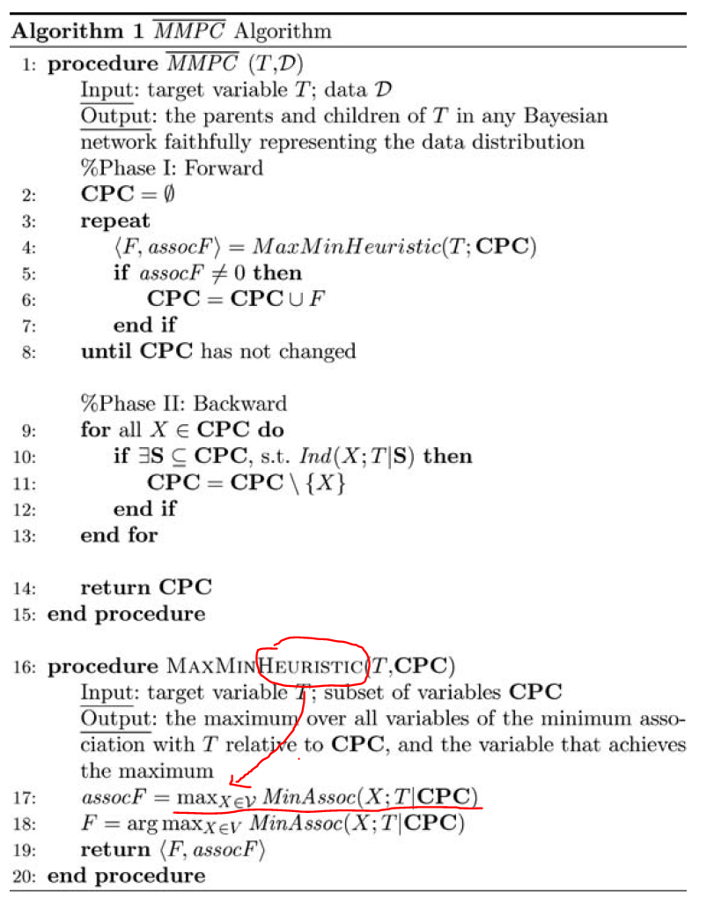

几个点需要注意：

因为：$\mathbf{S}_{1} \subseteq \mathbf{S}_{2} \Rightarrow \operatorname{Min} \operatorname{Assoc}\left(X ; Y \mid \mathbf{S}_{1}\right) \geq \operatorname{Min} \operatorname{Assoc}\left(X ; Y \mid \mathbf{S}_{2}\right)$，所以：随着CPC的增加，MinAssoc只会不变或者减小。如果某个变量与T的association为0，它不应该被加入到CPC，并且之后不再考虑，以保证：**随着CPC的增加，the min association 减小**。

### 案例：

对于节点T, 数据D，数据是从该网络生成的：

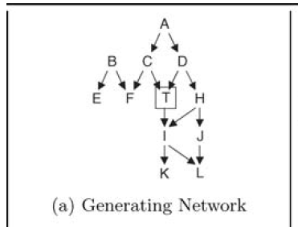

节点输入为T，进入到MMPC算法的Forward环节中去：

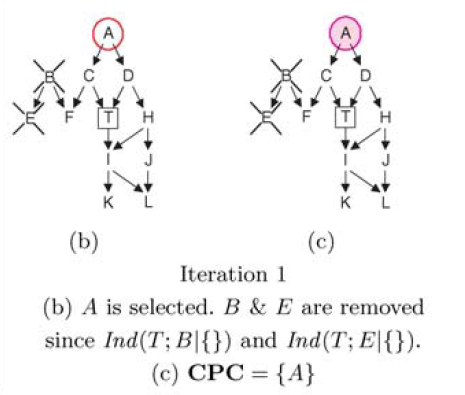

第一次迭代，CPC是$\varnothing$ 

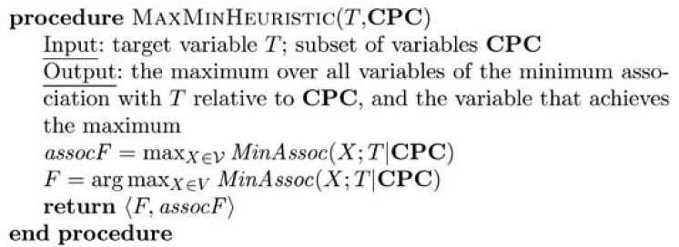

在MaxMinHeuristic中，不断地改变X，计算MinAssoc，发现X=A的时候，MinAssoc最大。在此时因为CPC是$\varnothing$ ，所以就是A与T的相关系数最大，同时计算到B, E的相关系数为0, 标记下来，不再考虑。

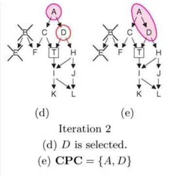

继续，慢慢增加CPC集合

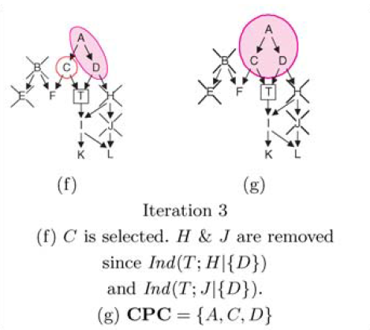

继续增加CPC，同时因为A,D进入了CPC，由于A,D 的条件，会导致H,T的独立，继而删除 H, J

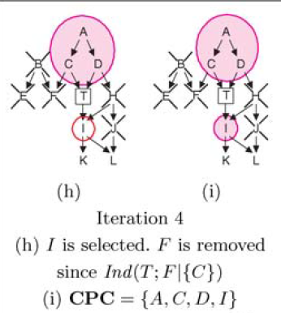

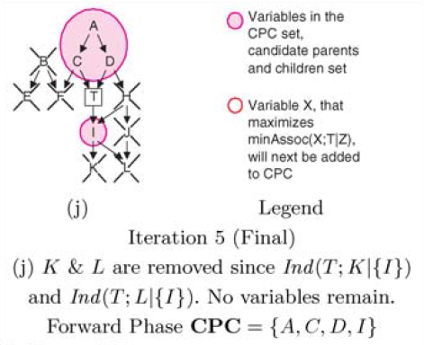

第二阶段：进入到 backward 过程，

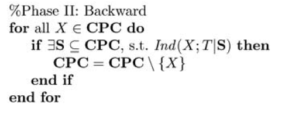

这个"存在 $\exists$"标记，代表着一种permutation。

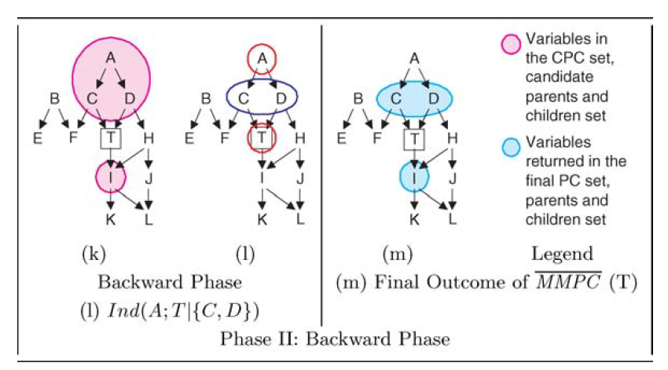

当permutation到 {C,D}时候，发现A,T独立，所以要删除A，最终输出 Parents and children 为 C、D、I 与事实相符合。

3.3 MMPC 算法修正

某个特殊情况下，前面描述的算法会出现假阳性：

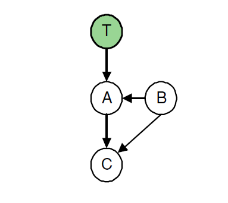

这样的结构下，前面描述的算法会输出PC={A, B, C}

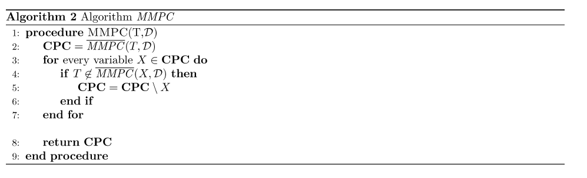

进行一次修正，再一次修改CPC

## Tests of conditional independence and measures of association

对于$\operatorname{Ind}\left(X_{i} ; X_{j} \mid \mathbf{X}_{k}\right)$：

计算统计量 $G^2$ , 类似于卡方检验

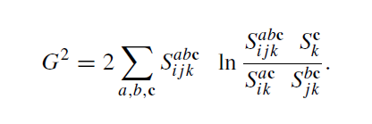

g检验返回一个p-value，如果小于阈值则拒绝原假设。

## MMHC

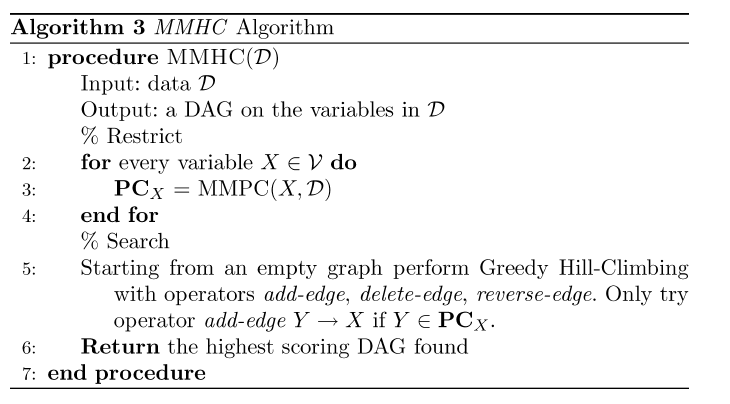

## optimizing the computational performance

略

## empirical evaluation

实验设计：

**选择比较算法**

1. SC算法
2. PC
3. GHC
4. GES
5. MMHC

在具体实现方面，遵循以下协议：

（1）更喜欢作者的实现，只要可用，只要它满足我们的实验需求，即可以在我们的实验平台上运行，对输入没有可变大小限制，并输出评估所需的最少一组统计数据。
（2） 如果不满足上述条件，将使用满足这些条件的算法的最佳公开实现。
（3） 否则，将重新实现该算法并使用我们的版本。

**选择公共数据集，网络**

1. 数据集描述

2. 数据描述

3. 评价指标

   1. 时间
   2. statistical call
   3. 评分
   4. SHD
   5. 同时比较时间与质量

   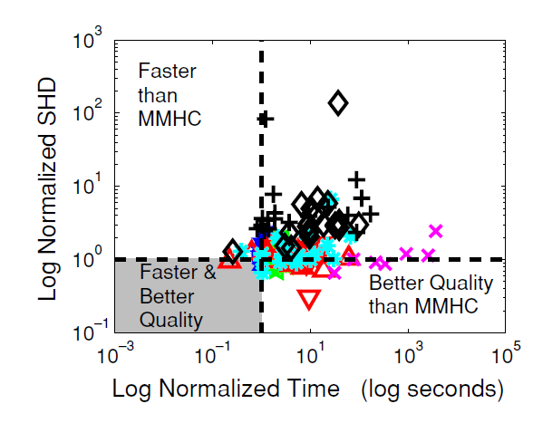

