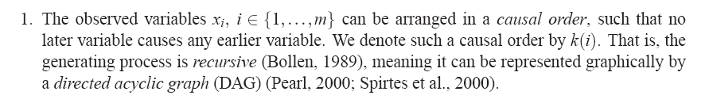
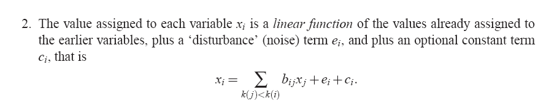
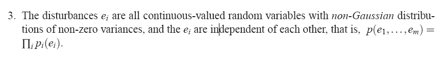
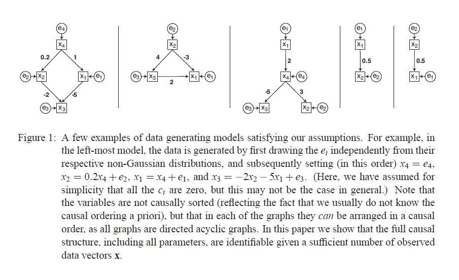
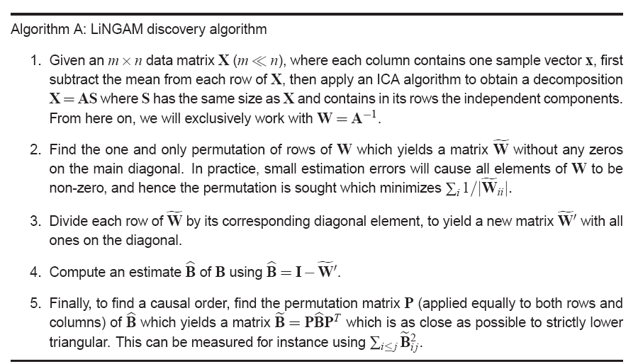
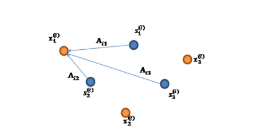
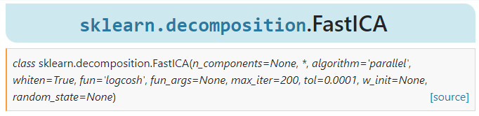
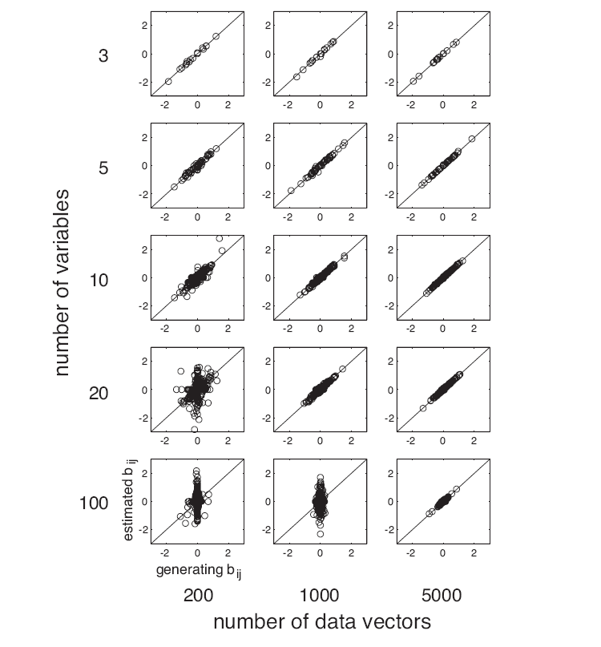

# 《A Linear Non-Gaussian Acyclic Model for Causal Discovery》读书笔记

## 前言

*《A Survey of Learning Causality with Data: Problems and Methods》*对因果推断有一个全面的概括

用**非实验数据**画因果网络图的方法可以分为三类：                                                                                                                                                                                                                                                                                                                                                                                                                                                                                                                                                               

- Constraint-based Algorithms，例如PC算法
- Score-based 
- Algorithms based on functional causal models，例如 LiNGAM和no tears

## abstract

non-experimental data 非实验数据指的是不是人为进行控制变量的数据。一般是观测数据，observational data。已有很多方法用于从非实验数据发掘因果关系，一般都会进行一些假设。沿着这些量研究，本文提出一下假设：

1. 数据的生成过程是线性的。
2. 没有未观测到的变量。（比如说a->b->c，如果说b未被观测到，那么就会出现 a->c 的错误结论）
3. distrubance variable 是非高斯分布且方差不为0。

## introducation

Pearl formualized concepts related to causality using probability distribution defined on DAG. 

it is impossible or too expensive to perform controlled experiments, hence causal discover with uncontrolled data would be very valuable. 

Existing discovery algorithms work in one of two settings. In the case of discrete data, no functional form for the dependencies is usually assumed. In the case of continuous variables, a linear-Gaussian approach is almost taken. 

本文提出的方法适用于连续变量，不需要使用高斯假设。

##  Linear Casual Network

assume: 

这三个特征分别为 Linear，Non-Gaussian, Acyclic Model 称之为 LiNGAM。

> https://zhuanlan.zhihu.com/p/369720949

assumption:

观察变量按照一定的因果顺序产生，对于$x_i$，它的排序为$k(i)$。

数据的生成过程是线性的。

数据是从DAG中生成出来的，DAG由$m \times m$的邻接矩阵表示：
$$
B={b_{ij}}
$$
记：$k(i)$是一个causal order for $x_i$
$$
x_{i}=\sum_{k(j)<k(i)} b_{i j} x_{j}+e_{i}
$$
$e$是外部影响，是一个非高斯的分布，均值为0，方差不为0，$e_i$是相互独立的，所以这里没有任何隐变量（added another assumption）

## model identification using independent component analysis 

模型可以写为：
$$
\mathbf{x}=\mathbf{B} \mathbf{x}+\mathbf{e}
$$
此处的$\mathbf{B}$ 可以按照causal order 进行行变换，得到一个下三角矩阵。

继续改写：
$$
\mathbf{A}=(\mathbf{I}-\mathbf{B})^{-1}
\\
\mathbf{x}=\mathbf{A} \mathbf{e}
$$
ICA方法就是专门用于进行求解这样的不等式，它假设：

x是我们得到的信号

A是一个混淆矩阵，线性映射

我们用x去估计A和e。

所以通过ICA方法可以得到A，但是因果顺序没有得到满足。

计算出$A^{-1} = \mathbf{I}-\mathbf{B}$

进行行列变换，以得到一个下三角举证用于推断 causal order。

## LiNGAM Discovery algorithm

1. 对于 X = AS 执行 ICA算法，然后对于 A 求逆矩阵，记为 W
2. 进行行变换，使得对角元素不为0，minimize $\sum_{i} 1 /\left|\mathbb{\mathbf { W }}_{i i}\right|$
3. 对每行元素都除以其对角元素，使得对角元素均为1
4. B = I - W
5. 将B进行行变换，使得其变为严格的下三角矩阵

## ICA算法详解

经典的鸡尾酒宴会问题：

房间各个位置放置了 n 个麦克风$\{x_1,x_2,x_3,...,x_n\}$

每个麦克风采集了m次，那么 $X_{m*n}$ 

由于位置的原因，声源是线性叠加的：

$$
X = AS
$$
如何根据已知的X，分离出各个S呢？

(m,n)=(m,m)(m,n)

目前比较常见的有 FastICA算法：

## simulation 

