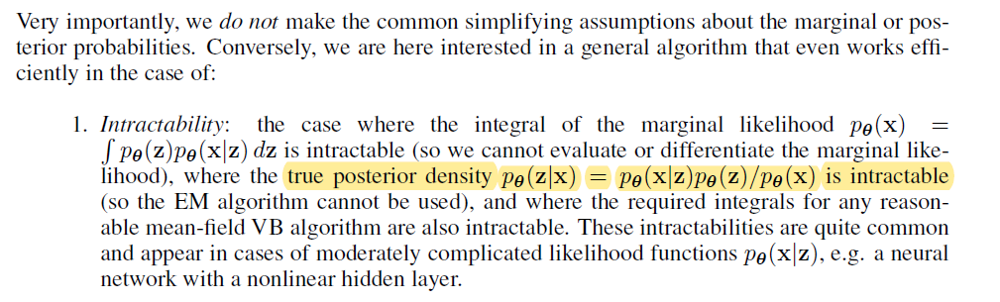

# 频率统计学VS贝叶斯统计学

假设：
$$
X: data\\
\theta: parameter
$$

## 频率统计学认为：

$\theta$ 是一个未知的常量，需要我们从数据$X$中估计它。

通常会使用最大似然估计MLE：
$$
\hat \theta = \arg \max _\theta p(x;\theta)
$$

## 贝叶斯统计学认为：

$ \theta $是一个随机变量，而$X$是已知的，固定的知识。使用贝叶斯定理将两者连接起来：
$$
p(\theta|X) = \frac{p(X|\theta)p(\theta)}{p(X)}
$$
通常使用最大后验估计MAP来估计 $\theta $，在贝叶斯统计学家眼中， $\theta $ 服从一个概率分布，找到众数最大的那个点作为 $\theta $ 的估计。
$$
\theta_{MAP} =\arg \max _\theta p(\theta|X)\propto p(X|\theta)p(\theta)
$$
要注意的是$\theta_{MAP}$ 并不是一个特别纯正血统的贝叶斯统计估计方法，真正的贝叶斯统计学家就是要求**后验概率**！

## 总结

频率学派与贝叶斯学派是整个世界观的不同，对模型的建立完全出自不同的角度。但是在实际运用中，会发现两者相互交融。

频率角度出发，模型最后一般都转化为**最优化问题**。

贝叶斯角度出发，模型最后一般都会被转化为**积分问题**。

## 例子

频率学派的案例较为常见，比如常见的线性回归，我们要去优化：
$$
\hat \theta =\arg \min _\theta Loss(y-y_{predict})
$$
贝叶斯派的案例：

《Auto-Encoding Variational Bayes》模型中的一段话：

该模型遇到了所有贝叶斯统计学者们都会遇到的问题，积分难求！