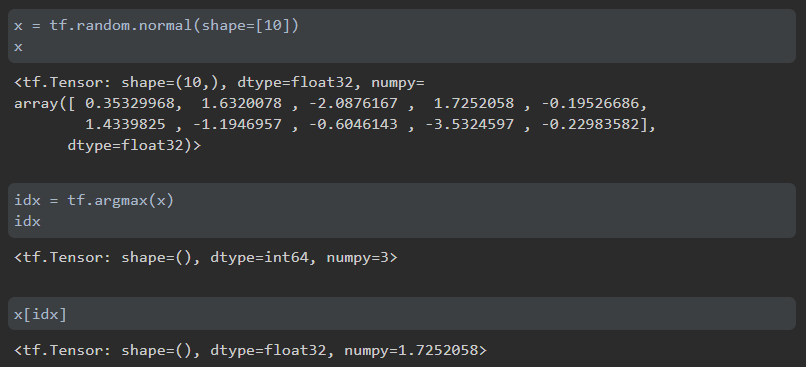
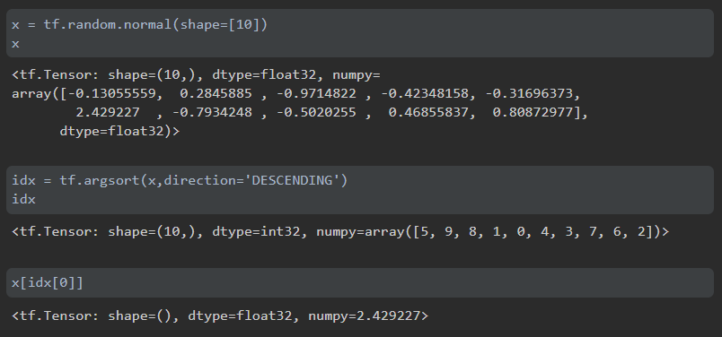
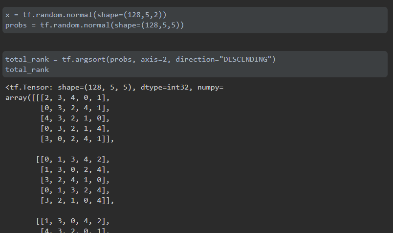
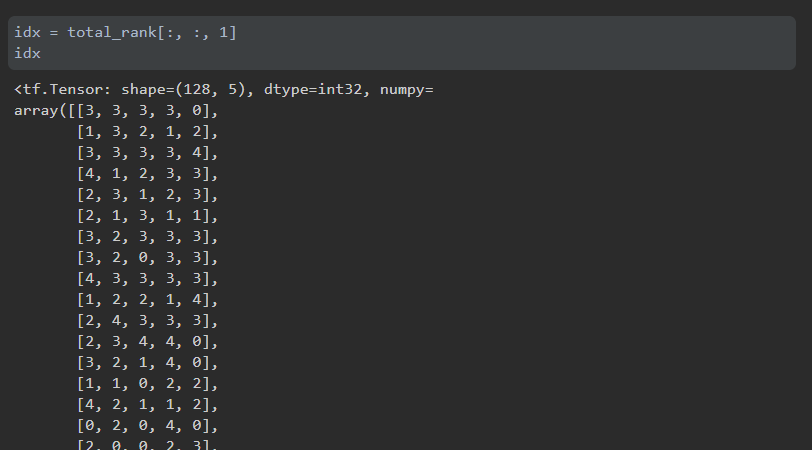
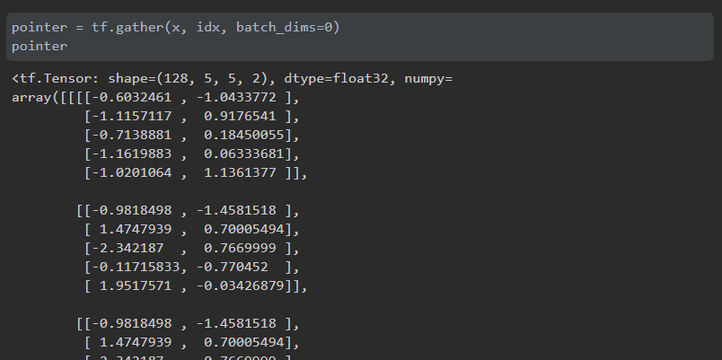

# argmax，argsort的使用

在使用tensorflow以及numpy的时候，操作数组时，常常面临这样一个问题：

**在数组中找某一维度下最大的值，或者在数组的某一维度下第二大的值。**

可以使用argmax或者argsort进行寻找：

## argmax

要首先理解，argmax返回的是**索引**。

1. 用argmax找到最大值的索引
2. 用该索引找到最大值

在实际使用中，常常是在张量A中寻找索引，然后用该索引在张量B中找值、或修改值。

## argsort

argsort返回的索引包含的信息更加全面。

idx[0]为最大值的索引。

idx[-1]为最小值的索引。

> 第一次理解时，把 idx 理解为了每个位置对应的名次，这样的理解不利于之后的取值操作。

## 实际程序使用

在Pointer network实际编程中，需要找到第二大小的指针，在城市坐标中进行索引：

x = [batch, 城市数目, 2维坐标] 

probs = [batch, 城市数目, 城市数目]，第三维是每个城市对应的概率

1. total rank 在 probs 的第三维上建立索引。所以它的维度和probs保持一致

2. 在第三维的第1个就是第二名的索引，所以idx

用tf.gather来依据索引取值。