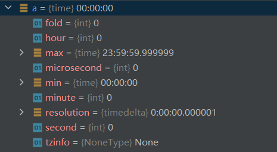
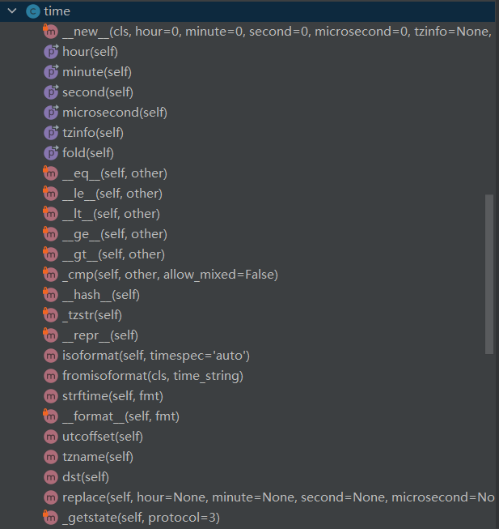
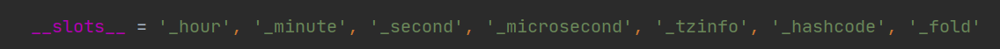
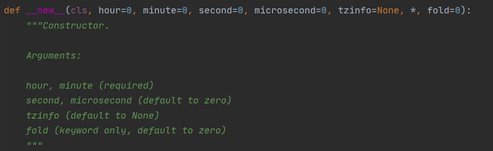
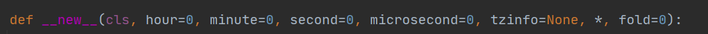
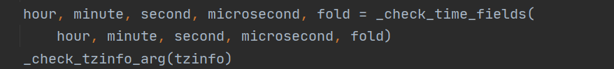
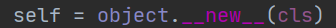
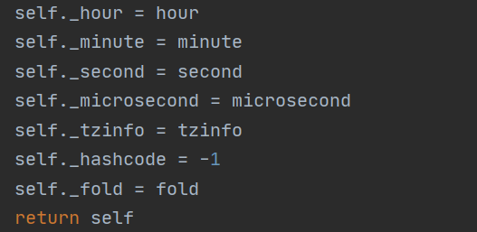
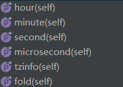
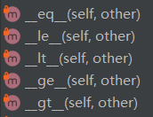

# datetime 模块

**感知型**

一个 **感知型** 对象就能相对于其他感知型对象来精确定位自身时间点。

**简单型**

对象没有包含足够多的信息来无歧义地相对于其他 date/time 对象来定位自身时间点。 不论一个简单型对象所代表的是世界标准时间（UTC）、当地时间还是某个其他时区的时间完全取决于具体程序，就像一个特定数字所代表的是米、英里还是质量完全取决于具体程序一样。 简单型对象更易于理解和使用，代价则是忽略了某些现实性考量。

-----

**常量**

datetime.MINYEAR

datetime.MAXYEAR

**有效类型**

*class* `datetime.``date`

*class* `datetime.``time`

*class* `datetime.``datetime`

*class* `datetime.``timedelta`

*class* `datetime.``tzinfo`

*class* `datetime.``timezone`

## 模块阅读

time 类：用于储存时间

时间有两种表达方式：

*  从epoch开始算起，第多少秒数。unix上1970年的1月1号为epoch。

* tuple   (九个int分别表示年月日时分秒，weekday，julian day,  DST)

time类的实例化a，查看下他的属性。



查看datetime模块中的time类



查看代码注释也可以得到相应的答案：

```
    """Time with time zone.

    Constructors:

    __new__()

    Operators:

    __repr__, __str__
    __eq__, __le__, __lt__, __ge__, __gt__, __hash__

    Methods:

    strftime()
    isoformat()
    utcoffset()
    tzname()
    dst()

    Properties (readonly):
    hour, minute, second, microsecond, tzinfo, fold
```

继续往下看~



使用了插槽限制__slots__ 也就是说，time类不允许添加其他属性，只能由这些属性



使用了new方法进行构造

个人理解（不一定准确）：

new函数是一个类方法，用于生成我们所需的实例对象，将其赋值给对象名。

a = datetime.time()

* 首先进入new函数



* 做个检查



* 生成一个object，也就是对象

  

* 定义一系列属性，然后返回该对象



然后定义了它的属性



都使用了property修饰器

给时间增添了比较的功能：



equal to

less than or equal to

less than

greater than or equal to

greater than

五种比较符号，带了个锁：一般情况下外部不访问


comparison比较

用于返回时间的关系，前面的比较符号都调用了_cmp函数


__hash__函数

使得该类的对象可哈希，通俗的说，可哈希对象可以作为字典的键，不可哈希对象无法作为字典的键。有时候，我们使用列表或者自定义对象作为字典的键，或者使用`set`进行元素去重的时候，会遇到`unhashable type: xxx`之类的问题，这类问题出现的原因就是字典的键或者集合中的元素类型为不可哈希类型。

An object is hashable if it has a hash value which never changes during its lifetime (it needs a hash() method), and can be compared to other objects (it needs an eq() method). Hashable objects which compare equal must have the same hash value.

* 第一，hash需要eq方法
* 第二，可哈希的对象在他的生命周期里，它的哈希码不变
* 第三，哈希码可以与其他对象的哈希码对比
* 第四，equal的对象要有相同的哈希码。


函数名字前只有一个_ 说明该函数供内部使用，这个用于将时区转化为string

