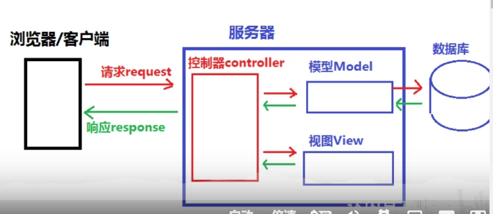

# django

 ## 设计理念

M V C 

降低模型间的耦合度



## 创建项目 

```
django-admin startproject mysite
```

开始工作：它可以自动创建好项目骨架

### 项目基本构架 

```
mysite/
    manage.py
    mysite/     
        __init__.py
        settings.py
        urls.py
        asgi.py
        wsgi.py
```

这些目录和文件的用处是：

- 最外层的 `mysite/` 根目录只是你项目的容器， 根目录名称对 Django 没有影响，你可以将它重命名为任何你喜欢的名称。
- `manage.py`: 一个让你用各种方式管理 Django 项目的命令行工具。你可以阅读 [django-admin 和 manage.py](https://docs.djangoproject.com/zh-hans/3.2/ref/django-admin/) 获取所有 `manage.py` 的细节。
- 里面一层的 `mysite/` 目录包含你的项目，它是一个纯 Python 包。它的名字就是当你引用它内部任何东西时需要用到的 Python 包名。 (比如 `mysite.urls`).
- `mysite/__init__.py`：一个空文件，告诉 Python 这个目录应该被认为是一个 Python 包。如果你是 Python 初学者，阅读官方文档中的 [更多关于包的知识](https://docs.python.org/3/tutorial/modules.html#tut-packages)。
- `mysite/settings.py`：Django 项目的配置文件。如果你想知道这个文件是如何工作的，请查看 [Django 配置](https://docs.djangoproject.com/zh-hans/3.2/topics/settings/) 了解细节。
- `mysite/urls.py`：Django 项目的 URL 声明，就像你网站的“目录”。阅读 [URL调度器](https://docs.djangoproject.com/zh-hans/3.2/topics/http/urls/) 文档来获取更多关于 URL 的内容。
- `mysite/asgi.py`：作为你的项目的运行在 ASGI 兼容的 Web 服务器上的入口。阅读 [如何使用 ASGI 来部署](https://docs.djangoproject.com/zh-hans/3.2/howto/deployment/asgi/) 了解更多细节。
- `mysite/wsgi.py`：作为你的项目的运行在 WSGI 兼容的Web服务器上的入口。阅读 [如何使用 WSGI 进行部署](https://docs.djangoproject.com/zh-hans/3.2/howto/deployment/wsgi/) 了解更多细节。

**项目骨架包括了一个项目名的根目录以及一个与项目同名的目录，这个目录包含了项目的基础设置**


## 创建APP（应用）

项目 VS 应用

项目和应用有什么区别？应用是一个专门做某件事的网络应用程序——比如博客系统，或者公共记录的数据库，或者小型的投票程序。项目则是一个网站使用的配置和应用的集合。项目可以包含很多个应用。应用可以被很多个项目使用。

```
mysite/
    manage.py # 项目管理
    mysite/     
        __init__.py
        settings.py # 项目设置
        urls.py
        asgi.py
        wsgi.py
    # 与manage.py同级
	app1/
	app2/
```

```
polls/
    __init__.py
    admin.py
    apps.py
    migrations/
        __init__.py
    models.py 0. 定义模型
    tests.py
    urls.py # 1. 指定url的映射
    views.py  # 2. 返回视图函数 
    templates/
    	index.html # 3. 响应模板
    static/
    	style.css
    	pic.jpeg
    setting.py # 0. 项目设置
```


**官方标准结构:一个投票网页polls **

```
mysite/
    manage.py
    mysite/
        __init__.py
        settings.py
        urls.py
        asgi.py
        wsgi.py
    polls/
        __init__.py
        admin.py
        apps.py
        migrations/
            __init__.py
            0001_initial.py
        models.py
        static/
            polls/
                images/
                    background.gif
                style.css
        templates/
            polls/
                detail.html
                index.html
                results.html
        tests.py
        urls.py
        views.py
    templates/
        admin/
            base_site.html
```

## 视图 

视图是应用的一部分

views.py

视图函数需要到url里进行注册。

## 项目管理

### manage.py

包含项目管理的子命令

runserver 启动服务

startapp

migrate 数据库迁移

```python
Available subcommands:

[auth]
    changepassword
    createsuperuser

[contenttypes]
    remove_stale_contenttypes

[django]
    check
    compilemessages
    createcachetable
    dbshell
    diffsettings
    dumpdata
    flush
    inspectdb
    loaddata
    makemessages
    makemigrations
    migrate
    sendtestemail
    shell
    showmigrations
    sqlflush
    sqlmigrate
    sqlsequencereset
    squashmigrations
    startapp
    startproject
    test
    testserver

[sessions]
    clearsessions

[staticfiles]
    collectstatic
    findstatic
    runserver
```

### setting.py

包括django所有的配置项

分为公有配置，自定义配置

https://docs.djangoproject.com/zh-hans/3.2/ref/settings/

配置包括：

- 数据库配置

- 时区
- 安装的自带app，例如 django.contrib.admin等 


### urls.py

uniform resource locator

协议://hostname[:port]/path[?query]\[#fragment]


----


## APP详解：django.contrib.admin

只需要安装这个app，django就能直接给你提供一个管理页面

1. 创建管理员账号

```
python manage.py createsuperuser
```

2. 将模型加入到管理页面中去

```
#polls/admin.py

from django.contrib import admin

from .models import Question

admin.site.register(Question)
```

## 表单的处理


```html
<form action="" method="post">

<input type="submit" value="Vote">
</form>
```


urls是这样分配的

```python
path('<int:question_id>/vote/', views.vote, name='vote')
```

## 自动化测试

（略）

## 静态文件的管理 django.contrib.staticfiles

如果每个app都带有自己的static，那么放到一个项目中就不方便管理了，这就是这个app的功能，它将各个应用的静态文件（和一些你指明的目录里的文件）统一收集起来，这样一来，在生产环境中，这些文件就会集中在一个便于分发的地方。

配置

```
# 指定 请求static 的 url
STATIC_URL = '/static/'

# 指定与app无关联的static文件位置
STATICFILES_DIRS = [
    BASE_DIR / "static",
    '/var/www/static/',
]

# 静态文件的部署位置
STATIC_ROOT = /home/static
# bash django-admin collectstatic
# 将所有的static 文件收集到static— root目录
# 配置nginx服务器 /static 指向 static root 目录
# （这样做的目的就是为了方便部署，以免每个app的静态文件都分散开了）
```


## 密码加密

哈希算法

给出明文---》计算出定长的，不可逆的值

md5-32位16进制，sha-256

## django的认证系统

django已经提供了很好地User 模型，可以解决绝大多数时候的用户认证情况

```
from django.contrib.auth.models import User
```

同时，你也可以根据自己的需求对User进行定制化：

```
from django.contrib.auth.models import User

class Employee(models.Model):
    user = models.OneToOneField(User, on_delete=models.CASCADE)
    department = models.CharField(max_length=100)
```

使用OneToOneField

https://docs.djangoproject.com/en/3.2/topics/auth/customizing/


自带的User所拥有的字段。

对于User对象，可以使用现有的函数进行**增删改查**以及**登陆验证**：

https://docs.djangoproject.com/en/3.2/topics/auth/default/

## 管理静态文件

https://docs.djangoproject.com/zh-hans/3.2/howto/static-files/

1. 确保 [`INSTALLED_APPS`](https://docs.djangoproject.com/zh-hans/3.2/ref/settings/#std:setting-INSTALLED_APPS) 包含了 `django.contrib.staticfiles`

2. 在配置文件中，定义 [`STATIC_URL`](https://docs.djangoproject.com/zh-hans/3.2/ref/settings/#std:setting-STATIC_URL)，例子:

   ```
   STATIC_URL = '/static/'
   ```


## 表单 Form

### HTML 表单

在HTML中，表单是在 `<form>...</form>` 中的一些元素，它允许访客做一些类似输入文本、选择选项、操作对象或空间等动作，然后发送这些信息到服务端。

### django 处理表单

1. 准备并重组数据，以便下一次的渲染
2. 为数据创建HTML表单
3. 接收并处理客户端提交的表单

### django表单

 核心：Form 类

###  例子

前端代码，提交yourname字段

```html
<form action="/your-name/" method="post">
    <label for="your_name">Your name: </label>
    <input id="your_name" type="text" name="your_name" value="{{ current_name }}">
    <input type="submit" value="OK">
</form>
```

**django的处理方法**

考虑到一次提交的表单可能非常庞大，所以django使用另一种方式：

```python
#forms.py
from django import forms

class NameForm(forms.Form):
    your_name = forms.CharField(label='Your name', max_length=100)
```

这是一个表单模型，可以直接传到模板中进行渲染，它对应的html是：

```html
<label for="your_name">Your name: </label>
<input id="your_name" type="text" name="your_name" maxlength="100" required>
```

表单可以直接渲染成html，所以我们的前端就可以省略input部分

```html
<form action="/your-name/" method="post">
    
    {{ form }}
    <input type="submit" value="Submit">
</form>
```

视图函数的写法：

```python
from django.http import HttpResponseRedirect
from django.shortcuts import render

from .forms import NameForm

def get_name(request):
    # if this is a POST request we need to process the form data
    if request.method == 'POST':
        # create a form instance and populate it with data from the request:
        form = NameForm(request.POST)
        # check whether it's valid:
        if form.is_valid():
            # process the data in form.cleaned_data as required
            # ...
            # redirect to a new URL:
            return HttpResponseRedirect('/thanks/')

    # if a GET (or any other method) we'll create a blank form
    else:
        form = NameForm()

    return render(request, 'name.html', {'form': form})
```

form--生成input标签等--->----渲染--->template

post----实例化--->form

### 个性化表单模板

**form渲染是不带<form>和<submit>标签**，它只包括了<label>和<input>标签。

使用   {{form.name_of_field}} 进行分别渲染也可以

### 使用widget 

Form.Field.widget用于指定一个Widget类，使得在渲染该Field的时候，使用该部件。

```python
from django import forms

class CommentForm(forms.Form):
    name = forms.CharField()
    url = forms.URLField()
    comment = forms.CharField(widget=forms.Textarea)
```

例子：使用markdownx部件时,

```python
from django.forms import forms
from markdownx.fields import MarkdownxFormField


class mdForm(forms.Form):
    md = MarkdownxFormField()

```

对于这个字段，在markdownx中已经定义好了它的widget

```python
class MarkdownxFormField(forms.CharField):
    """
    Used in FormFields as a Markdown enabled replacement for ``CharField``.
    """

    def __init__(self, *args, **kwargs):
        """
        Arguments are similar to Django's default ``CharField``. 
        
        See Django's `documentations on CharField`_ for additional information. 
        
        .. _docs on Charfield: https://docs.djangoproject.com/en/dev/ref/models/fields/#django.db.models.CharField
        """
        super(MarkdownxFormField, self).__init__(*args, **kwargs)

        if issubclass(self.widget.__class__, forms.widgets.MultiWidget):
            is_markdownx_widget = any(
                issubclass(item.__class__, MarkdownxWidget)
                for item in getattr(self.widget, 'widgets', list())
            )

            if not is_markdownx_widget:
                self.widget = MarkdownxWidget()

        elif not issubclass(self.widget.__class__, MarkdownxWidget):
            self.widget = MarkdownxWidget()
```

