# keras.backend.rnn学习

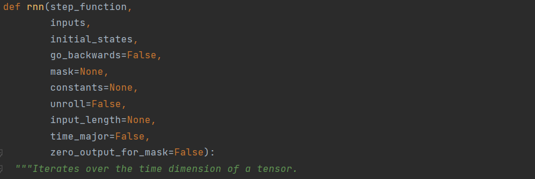

1. step 需要定义的步函数

```python
step(input,states):
	"""
	内容
	"""
	return output new_states
```

2. inputs

   [samples, time, features]

   转化为input是[samples,features]

3. initial_states

   Tensor with shape `(samples, state_size)`

4. 后面的参数包括：反向遍历，mask，常量，展开等

## 源码分析

1. 定义了一个swap函数，用于交换batch维和time_step维

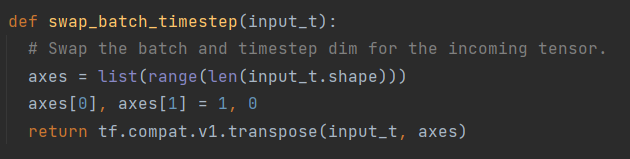

2. (默认情况下，time_major = False), 对inputs执行交换维度

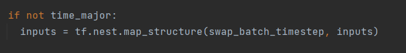

得到的是 inputs [time steps, batch, features]

3. 获取一些属性

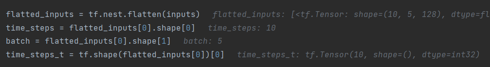

4. 检查维度最少为3

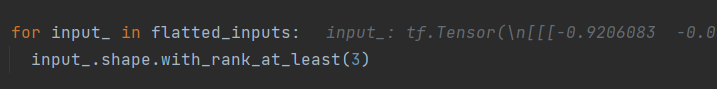

5. 检查mask，初始化常量

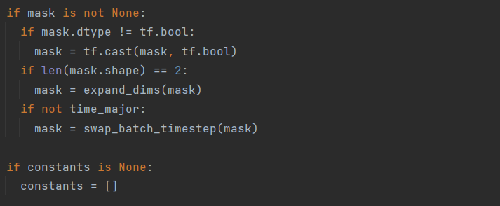

6. 如果不按时间步展开（默认Unroll == False），进入到一个else中

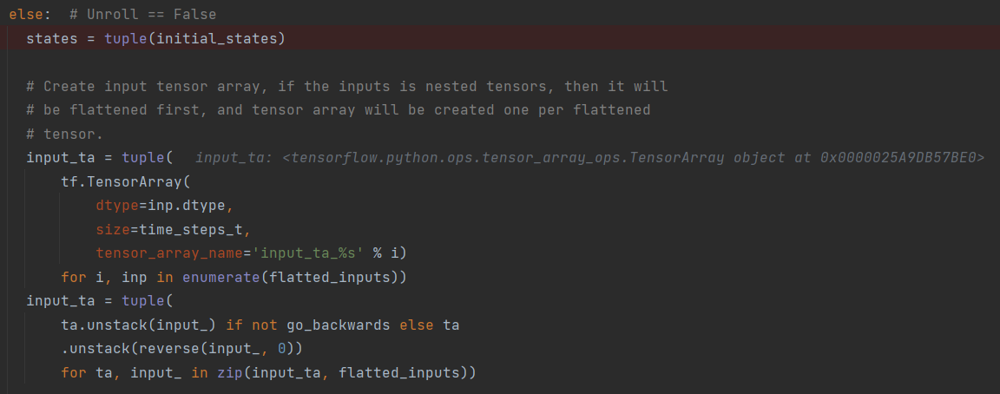

states是一个List

input_ta是一个TensorArray，

TensorArray可以看做是具有动态size功能的Tensor数组。通常都是跟while_loop或map_fn结合使用。

7. 实验性地送入input[0]到step_function中，得到out_put的形状以及属性等参数

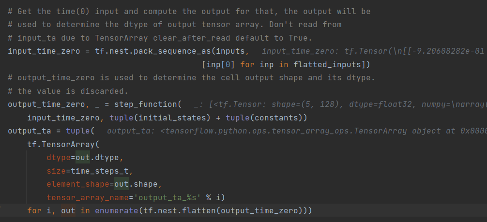

所以现在得到了

input_ta，output_ta

8. 经过一系列检查后，定义_step函数（这里面包含了自定义的step_function）

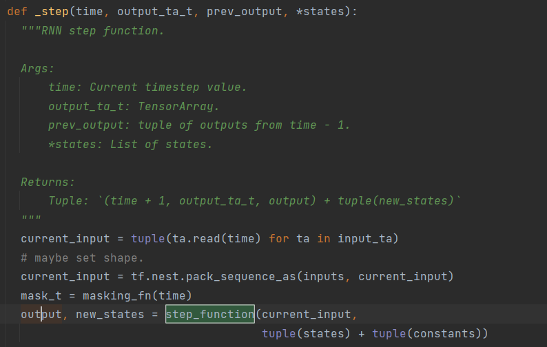

这个大的_step函数返回(time + 1, output_ta_t) + tuple(new_states)

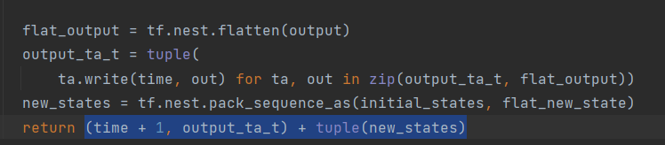

9. 进入 while loop 循环体:

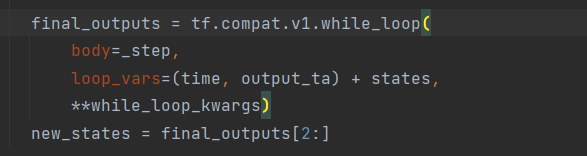

10. 经过一系列处理后输出到结果

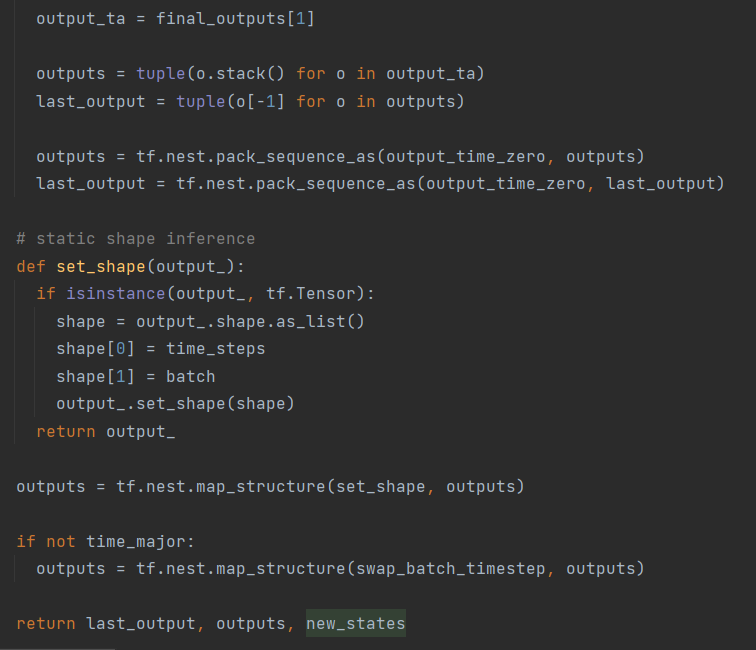

## 难点

TensorArray以及while loop