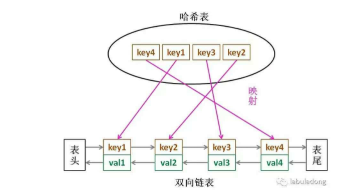

# lru_cache 装饰器

least recently used cache “最少最近使用”高速缓冲储存器

## 初识cache

首先创建cache 缓存的目的是为了提升计算机性能的，其核心操作是：keep recent or often-used data items in memory locations that are faster or compuationally cheaper to access than normal memory stores. When the cache is full, the algorithm must choose wich items to discard to make room for the new ones. 就是把常用的数据放在高速内存空间上，一旦放满了以后就要用一种策略选择数据进行丢弃。所以各种cache算法就是各种discard policies。

## LRU cache

顾名思义就是找到最少，最近使用的那个数据，把它丢掉以挪出空间供新数据使用。

## 算法描述

如果访问顺序为ABCDEDF


可以发现，先由ABCD填满了cache；

接着访问E，cache没储存空间了，决定把A丢了

访问D，它本来就存在于cache中，不需要丢任何数据

访问F，此时丢掉了B。

## python内置函数中的LRU cache 装饰器：

```
def lru_cache(maxsize=128, typed=False):
    """Least-recently-used cache decorator.

    If *maxsize* is set to None, the LRU features are disabled and the cache
    can grow without bound.

    If *typed* is True, arguments of different types will be cached separately.
    For example, f(3.0) and f(3) will be treated as distinct calls with
    distinct results.

    Arguments to the cached function must be hashable.

    View the cache statistics named tuple (hits, misses, maxsize, currsize)
    with f.cache_info().  Clear the cache and statistics with f.cache_clear().
    Access the underlying function with f.__wrapped__.

    See:  http://en.wikipedia.org/wiki/Cache_algorithms#Least_Recently_Used

    """

    # Users should only access the lru_cache through its public API:
    #       cache_info, cache_clear, and f.__wrapped__
    # The internals of the lru_cache are encapsulated for thread safety and
    # to allow the implementation to change (including a possible C version).

    # Early detection of an erroneous call to @lru_cache without any arguments
    # resulting in the inner function being passed to maxsize instead of an
    # integer or None.
    if maxsize is not None and not isinstance(maxsize, int):
        raise TypeError('Expected maxsize to be an integer or None')

    def decorating_function(user_function):
        wrapper = _lru_cache_wrapper(user_function, maxsize, typed, _CacheInfo)
        return update_wrapper(wrapper, user_function)

    return decorating_function

def _lru_cache_wrapper(user_function, maxsize, typed, _CacheInfo):
    # Constants shared by all lru cache instances:
    sentinel = object()          # unique object used to signal cache misses
    make_key = _make_key         # build a key from the function arguments
    PREV, NEXT, KEY, RESULT = 0, 1, 2, 3   # names for the link fields

    cache = {}
    hits = misses = 0
    full = False
    cache_get = cache.get    # bound method to lookup a key or return None
    cache_len = cache.__len__  # get cache size without calling len()
    lock = RLock()           # because linkedlist updates aren't threadsafe
    root = []                # root of the circular doubly linked list
    root[:] = [root, root, None, None]     # initialize by pointing to self

    if maxsize == 0:

        def wrapper(*args, **kwds):
            # No caching -- just a statistics update after a successful call
            nonlocal misses
            result = user_function(*args, **kwds)
            misses += 1
            return result

    elif maxsize is None:

        def wrapper(*args, **kwds):
            # Simple caching without ordering or size limit
            nonlocal hits, misses
            key = make_key(args, kwds, typed)
            result = cache_get(key, sentinel)
            if result is not sentinel:
                hits += 1
                return result
            result = user_function(*args, **kwds)
            cache[key] = result
            misses += 1
            return result

    else:

        def wrapper(*args, **kwds):
            # Size limited caching that tracks accesses by recency
            nonlocal root, hits, misses, full
            key = make_key(args, kwds, typed)
            with lock:
                link = cache_get(key)
                if link is not None:
                    # Move the link to the front of the circular queue
                    link_prev, link_next, _key, result = link
                    link_prev[NEXT] = link_next
                    link_next[PREV] = link_prev
                    last = root[PREV]
                    last[NEXT] = root[PREV] = link
                    link[PREV] = last
                    link[NEXT] = root
                    hits += 1
                    return result
            result = user_function(*args, **kwds)
            with lock:
                if key in cache:
                    # Getting here means that this same key was added to the
                    # cache while the lock was released.  Since the link
                    # update is already done, we need only return the
                    # computed result and update the count of misses.
                    pass
                elif full:
                    # Use the old root to store the new key and result.
                    oldroot = root
                    oldroot[KEY] = key
                    oldroot[RESULT] = result
                    # Empty the oldest link and make it the new root.
                    # Keep a reference to the old key and old result to
                    # prevent their ref counts from going to zero during the
                    # update. That will prevent potentially arbitrary object
                    # clean-up code (i.e. __del__) from running while we're
                    # still adjusting the links.
                    root = oldroot[NEXT]
                    oldkey = root[KEY]
                    oldresult = root[RESULT]
                    root[KEY] = root[RESULT] = None
                    # Now update the cache dictionary.
                    del cache[oldkey]
                    # Save the potentially reentrant cache[key] assignment
                    # for last, after the root and links have been put in
                    # a consistent state.
                    cache[key] = oldroot
                else:
                    # Put result in a new link at the front of the queue.
                    last = root[PREV]
                    link = [last, root, key, result]
                    last[NEXT] = root[PREV] = cache[key] = link
                    # Use the cache_len bound method instead of the len() function
                    # which could potentially be wrapped in an lru_cache itself.
                    full = (cache_len() >= maxsize)
                misses += 1
            return result

    def cache_info():
        """Report cache statistics"""
        with lock:
            return _CacheInfo(hits, misses, maxsize, cache_len())

    def cache_clear():
        """Clear the cache and cache statistics"""
        nonlocal hits, misses, full
        with lock:
            cache.clear()
            root[:] = [root, root, None, None]
            hits = misses = 0
            full = False

    wrapper.cache_info = cache_info
    wrapper.cache_clear = cache_clear
    return wrapper

try:
    from _functools import _lru_cache_wrapper
except ImportError:
    pass


################################################################################
### singledispatch() - single-dispatch generic function decorator
################################################################################

def _c3_merge(sequences):
    """Merges MROs in *sequences* to a single MRO using the C3 algorithm.

    Adapted from http://www.python.org/download/releases/2.3/mro/.

    """
    result = []
    while True:
        sequences = [s for s in sequences if s]   # purge empty sequences
        if not sequences:
            return result
        for s1 in sequences:   # find merge candidates among seq heads
            candidate = s1[0]
            for s2 in sequences:
                if candidate in s2[1:]:
                    candidate = None
                    break      # reject the current head, it appears later
            else:
                break
        if candidate is None:
            raise RuntimeError("Inconsistent hierarchy")
        result.append(candidate)
        # remove the chosen candidate
        for seq in sequences:
            if seq[0] == candidate:
                del seq[0]
```

## 算法设计

lru的缓存机制可以通过哈希表+双向链表来实现。



LRU为了让put和get方法的时间复杂度为1，所以我们必须要查找快，插入快，删除快，有顺序。

