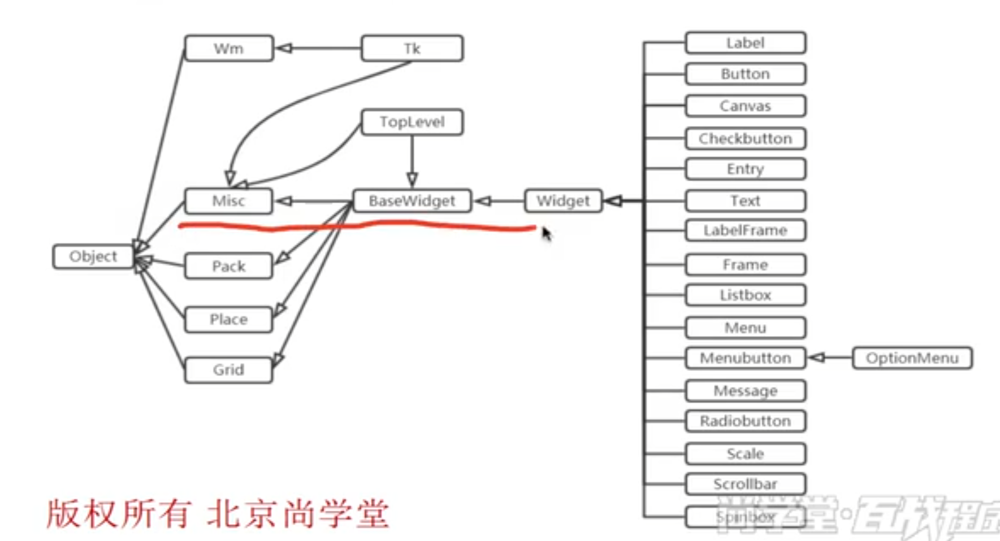
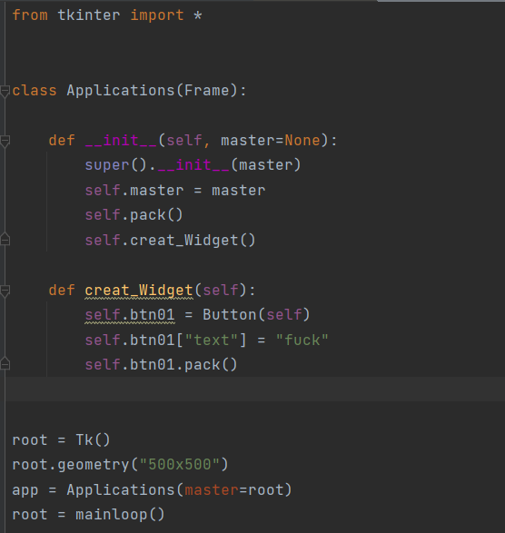
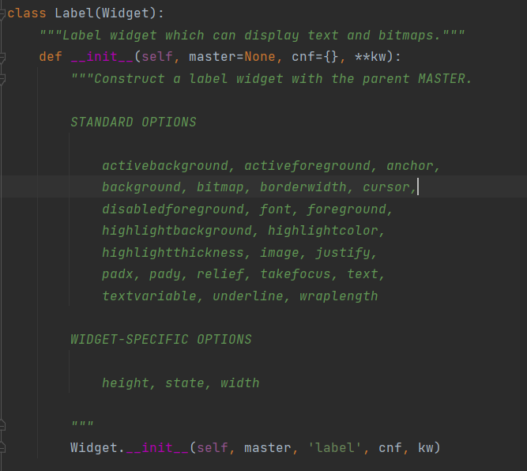
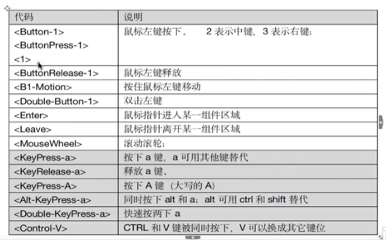
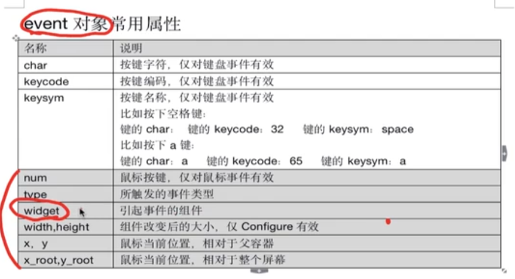

# tkinter 学习

effbot.org/tkinterbook/

主窗口对象

TK()

```python
root=TK()
```

mainloop() 主循环





经典写法：

Frame 组件 用于放置其他组件，实现复杂的布局




# Widget 

每个组件都有自己的参数，包括尺寸，内容等


对于label组件，他的参数（options）



有三种定义方式：

1. 定义组件时传入
2. label.config()
3. 用字典索引，label["options"]=

# 布局管理器

pack 简单，要么竖直排列，要么水平排列

grid 网格排列

place 根据位置排列，像素位置

# 事件



事件发生后会存储到event对象中：



