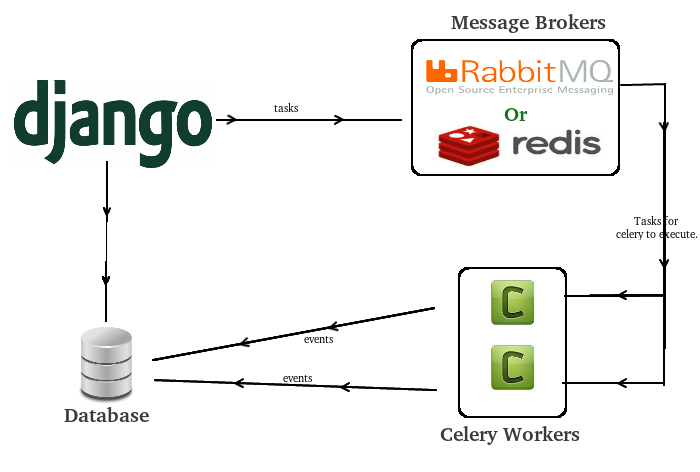

# 《celery》



把celery 理解成一个独立于django的框架。

celery 提供一个app，用于接收django提交的任务，并把它放入到broker里面，并且安排workers去完成任务。

一个celery 框架必备的：

1. 名字
2. broker
3. 任务（生产者）

## 1. 初始化 celery，选择broker

```python
from celery import Celery

app = Celery('hello', broker='amqp://guest@localhost//')
```

## 2. 写任务

```python
@app.task
def add(x, y):
    return x + y
```


## 3. 运行celery 服务

```shell
celery -A tasks worker --loglevel=INFO
```


## 4. optional 存储结果


