# 深度学习

[TOC]

## 数学基础

标量

向量

矩阵

张量

# tensorflow

## 一些基本概念

- keras是tensorflow的高阶api，相当于集成好了一些tensor的操作。

- tensorflow是张量的图计算流

## 张量

张量是一个高维的数组。

张量可以是大于2个axes的：

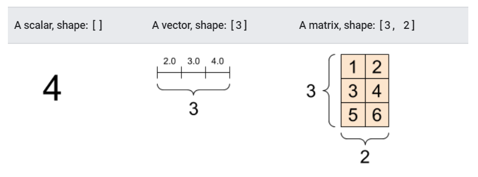

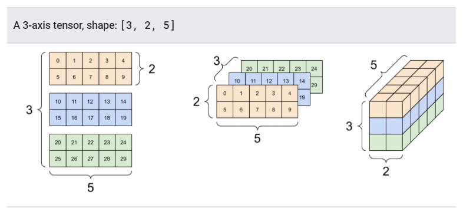

### 如何理解高维张量

(3,2,5) 就是3个2*5的矩阵叠在一起

(5,256,256,3) 就是5张RGB照片叠在一起

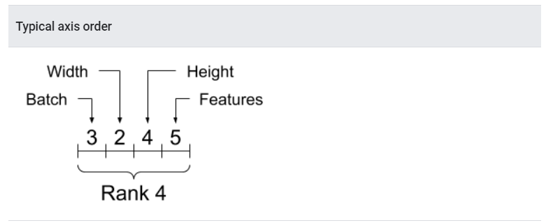

因为常常处理图像数据，所以常用的tensor形状为(B,W,H,C)

### 索引与slicing

索引就如numpy的索引方式，有几个axes就能在几个axes上进行索引。

tensor[axe1,axe2,axe3]

对于高维向量的索引，如果直对一个维度进行索引，切片的样子很难想象出来，这里举例：

```python
# There can be an arbitrary number of
# axes (sometimes called "dimensions")
rank_3_tensor = tf.constant([
  [[0, 1, 2, 3, 4],
   [5, 6, 7, 8, 9]],
  [[10, 11, 12, 13, 14],
   [15, 16, 17, 18, 19]],
  [[20, 21, 22, 23, 24],
   [25, 26, 27, 28, 29]],])

print(rank_3_tensor)
>>>
tf.Tensor(
[[[ 0  1  2  3  4]
  [ 5  6  7  8  9]]

 [[10 11 12 13 14]
  [15 16 17 18 19]]

 [[20 21 22 23 24]
  [25 26 27 28 29]]], shape=(3, 2, 5), dtype=int32)

rank_3_tensor[:, :, 4]
>>>
<tf.Tensor: shape=(3, 2), dtype=int32, numpy=
array([[ 4,  9],
       [14, 19],
       [24, 29]])>
```


### reshape

flatten根据的是张量中元素在内存中的排列。TensorFlow uses C-style "row-major" memory ordering, where incrementing the rightmost index corresponds to a single step in memory.

在reshape时，要考虑到数据之间的关系，因为reshape只要求前后元素数目相同，不保证保留数据关系。


### broadcasting 特征

这一点与numpy中的广播性质一致。

在一个operation当中，如果array与scalar进行运算，那么会发生什么呢？


两个arrays进行operation，要求他们的维度是compatible的：

- 维度相同
- 其中一个为1

https://numpy.org/devdocs/user/basics.broadcasting.html

如：(5,4)可以与(1,)，(4,)进行operation，但不能与(3,)进行operation

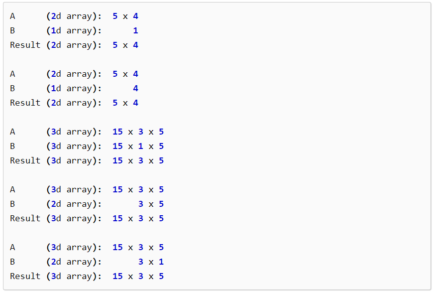

从左侧开始配对，从最内的元素开始。

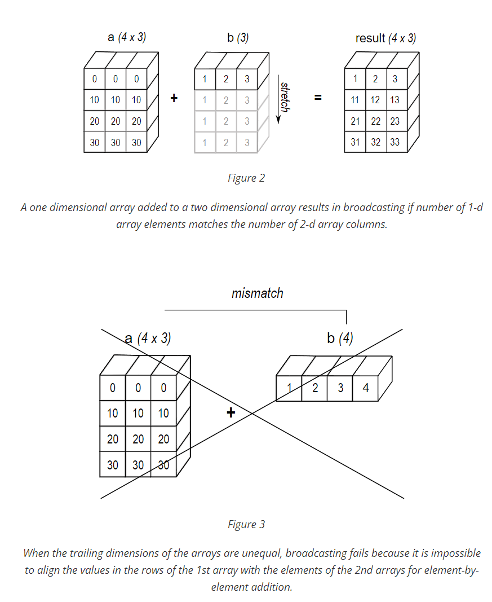

### 矩阵乘法

实际上矩阵乘法就是符合广播特性的：

a = 1 * 3

b = 4 * 1

result = 4 * 3

### 小知识点：

张量在图中流动，所以叫tensorflow

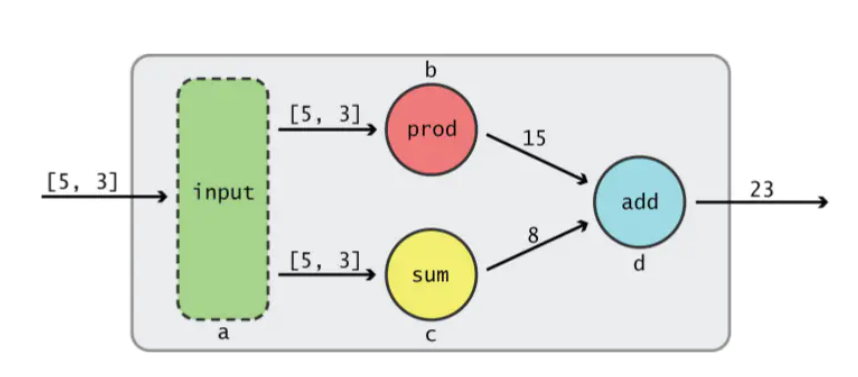

这个一维张量的流动过程

张量可以由numpy构建，以及一些特殊的方法

```python
tf.zeros()
tf.ones()
tf.random.normal()
```

axis:

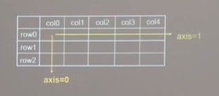

## 常用函数

### tf.Variable

用该函数标记后，该变量就是可训练的了。

```python
w = tf.Variable(tf.random.normal([2,2],mean,stddev=1))
```

### 常用运算函数

tf.add

tf.subtract

tf.multiply

等等

### 输入标签，标签

 tf.data.Dataset.from_tensor_slices

### tf.GradientTape

计算梯度

### tf.one_hot

独热编码

### tf.argmax

返回张量指定维度最大值的索引号。

## model.fit()

```python
fit(x=None, 
    y=None, 
    batch_size=None, 
    epochs=1,               
    verbose='auto',
    callbacks=None,
    validation_split=0.0,
    validation_data=None, 
    shuffle=True,
    class_weight=None,
    sample_weight=None, 
    initial_epoch=0, 
    steps_per_epoch=None, 
    validation_steps=None, 
    validation_batch_size=None, 
    validation_freq=1,
    max_queue_size=10, 
    workers=1, 
    use_multiprocessing=False
)
```

输入数据x,y是最重要的两个参数，一般情况下直接将数据存到内存中，然后传到x就好。但是会出现这样的情况：

**数据太大，内存无法装下，这该怎么办呢？**

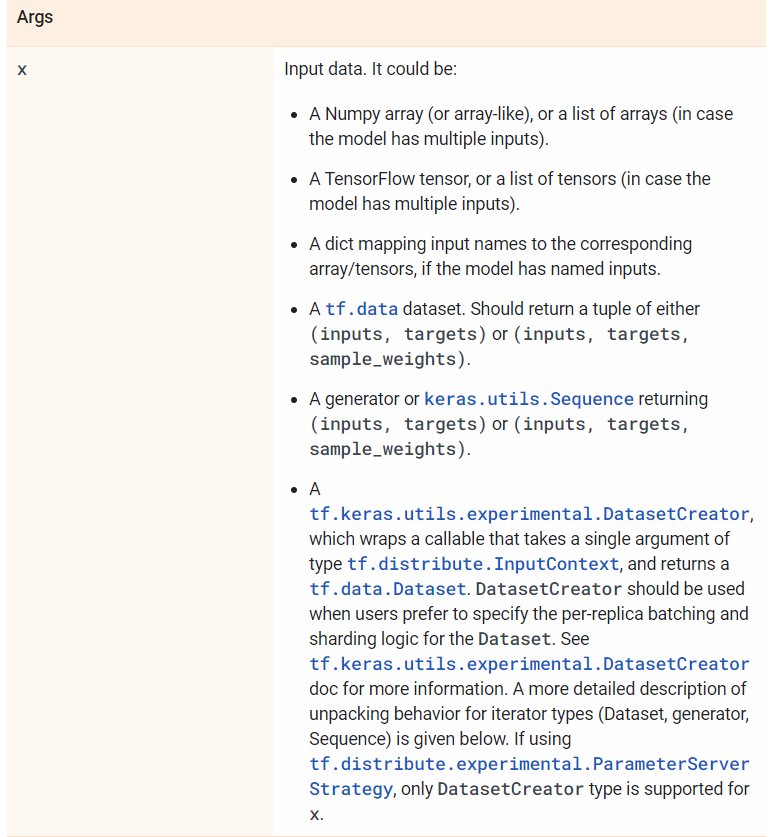

使用生成器generator或者tf.data.Dataset来进行输入。

### 用generator来做输入：x

generator应该每次产生一个（x，y）。

并且fit()函数中y参数为None，batch_size也是None

也就是说生成器每次yield的x，y是一个batch。

案例：

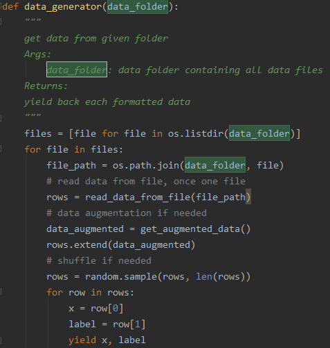

## tf.data

tf.data.Dataset是核心

tf.data.Dataset是一个python迭代器

### 从内存中加载数据

```python
tf.data.Dataset.from_tensors()
"""Creates a `Dataset` with a single element, comprising the given tensors.
    `from_tensors` produces a dataset containing only a single element. To slice
    the input tensor into multiple elements, use `from_tensor_slices` instead.
    """
tf.data.Dataset.from_tensor_slices()
"""Creates a `Dataset` whose elements are slices of the given tensors.
    The given tensors are sliced along their first dimension. This operation
    preserves the structure of the input tensors, removing the first dimension
    of each tensor and using it as the dataset dimension. All input tensors
    must have the same size in their first dimensions.
    """
```

在第一个维度上进行切片，所以一般图片的第一维度是batch

### tf.data.Dataset.element_spec

检查元素，要注意的是它检查的是单个元素：

```python
dataset2 = tf.data.Dataset.from_tensor_slices(
   (tf.random.uniform([4]),
    tf.random.uniform([4, 100], maxval=100, dtype=tf.int32)))

dataset2.element_spec

>>>
(TensorSpec(shape=(), dtype=tf.float32, name=None),
 TensorSpec(shape=(100,), dtype=tf.int32, name=None))
```

### Dataset.batch

Combines consecutive elements of this dataset into batches.

```python
dataset = tf.data.Dataset.range(8)
dataset = dataset.batch(3)
list(dataset.as_numpy_iterator())
[[0,1,2],[3,4,5],[6,7]]
```

## tf.nest

nest模块是用于处理nested structure结构的，nested structure目前支持的结构是tuple，dict，namedtuple。

对于nested_structure可以使用is_nested()判断。

```python
  tf.nest.is_nested(((7, 8), (5, 6)))
  >>>True
  tf.nest.is_nested({"a": 1, "b": 2})
  >>>True
  tf.nest.is_nested(set([1, 2]))
  >>>False
  ones = tf.ones([2, 3])
  >>>False
```

### functions

[`assert_same_structure(...)`](https://www.tensorflow.org/api_docs/python/tf/nest/assert_same_structure): Asserts that two structures are nested in the same way.

[`flatten(...)`](https://www.tensorflow.org/api_docs/python/tf/nest/flatten): Returns a flat list from a given nested structure.

[`is_nested(...)`](https://www.tensorflow.org/api_docs/python/tf/nest/is_nested): Returns true if its input is a collections.abc.Sequence (except strings).

[`map_structure(...)`](https://www.tensorflow.org/api_docs/python/tf/nest/map_structure): Applies `func` to each entry in `structure` and returns a new structure.

[`pack_sequence_as(...)`](https://www.tensorflow.org/api_docs/python/tf/nest/pack_sequence_as): Returns a given flattened sequence packed into a given structure.

**常用函数是flatten()**

## tf.nest.flatten

根据key来排序！

```python
dict = { "key3": "value3", "key1": "value1", "key2": "value2" }
tf.nest.flatten(dict)
>>>  ['value1','value2','value3'] 
```

tuple根据内存顺序

## graph

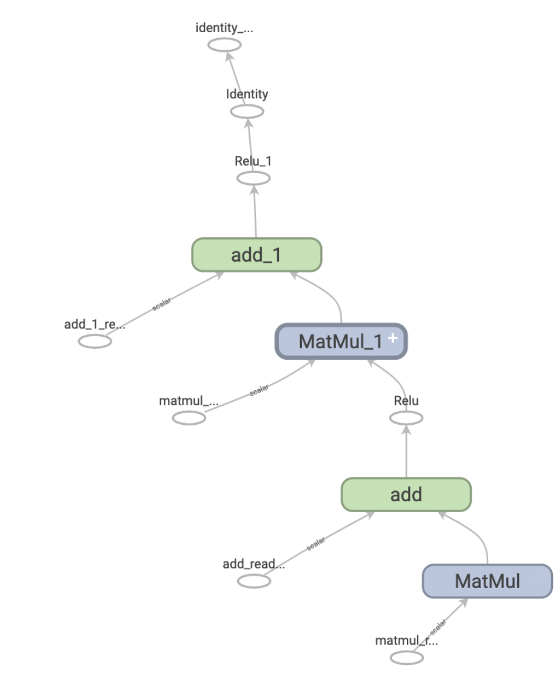

## keras

八股文写代码方法：

```python
# import 模块
# train test
# model
# model.compile
# model.fit
# model.summary
```

### sequential model

```python
# Define Sequential model with 3 layers
model = keras.Sequential(
    [
        layers.Dense(2, activation="relu", name="layer1"),
        layers.Dense(3, activation="relu", name="layer2"),
        layers.Dense(4, name="layer3"),
    ]
)
# Call model on a test input
x = tf.ones((3, 3))
y = model(x)
```

sequential model 不适用于：

多输入与多输出

层之间的共享

等等。。。

### 网络结构

拉直层

全连接层

卷积层

LSTM层

### model.compile

```python
model.compile(optimizer='sgd',loss,metrics=["accuracy"])
```

指定网络的优化器与损失函数

### model.fit

```python
model.fit(
    x,
    y,
    batch_size,
    validation_data,
    validation_split,
    validation_freq
)
```

### build(self, inputs_shape)

在继承tf.keras.layers.Layer时，可以重写call，build和init函数

build函数主要用于初始化参数，当call被第一次调用的时候，会先执行build()方法初始化变量，但后面再调用到call的时候，是不会再去执行build()方法初始化变量。一般用于需要知道输入tensor的形状，完成取决于输入tensor形状的初始化。

```python
class Linear(keras.layers.Layer):
    def __init__(self, units=32):
        super(Linear, self).__init__()
        self.units = units

    def build(self, input_shape):
        self.w = self.add_weight(
            shape=(input_shape[-1], self.units),
            initializer="random_normal",
            trainable=True,
        )
        self.b = self.add_weight(
            shape=(self.units,), initializer="random_normal", trainable=True
        )

    def call(self, inputs):
        return tf.matmul(inputs, self.w) + self.b
```

### keras.backend.rnn

在时间步维度上对张量进行迭代。

```python
tf.keras.backend.rnn(
    step_function,
    inputs,
    initial_states,
    go_backwards=False,
    mask=None,
    constants=None,
    unroll=False,
    input_length=None,
    time_major=False,
    zero_output_for_mask=False,
)
```

需要定义step function：

```python
step(input):
    """do some thing"""
    return output
```

input张量需要去除time_steps维度，为[batch, features]

output张量同样没有时间维度，为[batch, output_dimensions]

## 模型的保存与加载

一个模型包括多个部件：

- 模型的结构，包括layers，how they are connected
- 权重，也就是模型的参数
- 优化器，在compile 模型的时候指定
- 损失函数与metric，也是在compile时候指定

可以一次全部保存，也可以分别储存。

### 全部保存

```python
# 保存模型
model.save('path/to/location')
# 加载模型
model = keras.models.load_model('path/to/location')
```

model.save 保存所有，格式为**SavedModel**格式，也可以指定为**H5**格式

> SavedModel 其实是一个文件夹，保存了一些文件。详情可见
> 
> https://www.tensorflow.org/guide/saved_model#the_savedmodel_format_on_disk

### 保存结构

```python
model.get_config()
model.from_config()

tf.keras.models.model_to_json()
tf.keras.models.model_from_json()
```

### 保存权重，参数

```python
model.save_weights()
model.load_weights()
```

可以存储的文件格式有：

- TensorFlow Checkpoint
- HDF5
- H5

# pytorch

## 准备工作

查看cudn的版本

```python
nvcc --version
```

查看pytorch 版本

```pytho
print(torch.__version__)
print(torch.cuda.is_available())
```

```python
device = 'cuda' if torch.cuda.is_available() else 'cpu'
print('Using {} device'.format(device))
```

## torch.utils.data.Dataset

数据

- 自带数据集
- 自定义数据集

### 自定义数据集

```python
import os
import pandas as pd
from torchvision.io import read_image

class CustomImageDataset(Dataset):
    def __init__(self, annotations_file, img_dir, transform=None, target_transform=None):
        self.img_labels = pd.read_csv(annotations_file)
        self.img_dir = img_dir
        self.transform = transform
        self.target_transform = target_transform

    def __len__(self):
        return len(self.img_labels)

    def __getitem__(self, idx):
        img_path = os.path.join(self.img_dir, self.img_labels.iloc[idx, 0])
        image = read_image(img_path)
        label = self.img_labels.iloc[idx, 1]
        if self.transform:
            image = self.transform(image)
        if self.target_transform:
            label = self.target_transform(label)
        return image, label
```

Dataset是为file服务的。几个必须的函数：

1. init
2. len
3. getitem

用于之后传入dataloader

## torch.utils.data.DataLoader

这是一个可迭代类，为了就是将dataset打包成一个个batch，用于训练

所以说 dataloader是为训练服务的。

## nn.module

```python
class NeuralNetwork(nn.Module):
    def __init__(self):
        super(NeuralNetwork, self).__init__()
        self.flatten = nn.Flatten()
        self.linear_relu_stack = nn.Sequential(
            nn.Linear(28*28, 512),
            nn.ReLU(),
            nn.Linear(512, 512),
            nn.ReLU(),
            nn.Linear(512, 10),
        )

    def forward(self, x):
        x = self.flatten(x)
        logits = self.linear_relu_stack(x)
        return logits

model = NeuralNetwork().to(device)
```

在init中定义组件，在forward函数定义网络的前向传播

## nn.module中的layer

```python
nn.Flatten
nn.Linear
nn.ReLU
nn.Sequential   layer的容器
nn.Softmax
```

## 常用函数

```python
for name, param in model.named_parameters():
    print(f"Layer: {name} | Size: {param.size()} | Values : {param[:2]} \n")
```

## 训练网络

1. 定义损失函数
2. 定义优化器
3. 定义一个epoch的行为
4. 开始训练多个epoch

```python
# 1
loss_fn = nn.CrossEntropyLoss()
# 2 
optimizer = torch.optim.SGD(model.parameters(), lr=learning_rate)
# 3 
def train_loop(dataloader, model, loss_fn, optimizer):
    size = len(dataloader.dataset)
    for batch, (X, y) in enumerate(dataloader):
        # Compute prediction and loss
        pred = model(X)
        loss = loss_fn(pred, y)

        # Backpropagation
        optimizer.zero_grad()
        loss.backward()
        optimizer.step()

        if batch % 100 == 0:
            loss, current = loss.item(), batch * len(X)
            print(f"loss: {loss:>7f}  [{current:>5d}/{size:>5d}]")


def test_loop(dataloader, model, loss_fn):
    size = len(dataloader.dataset)
    num_batches = len(dataloader)
    test_loss, correct = 0, 0

    with torch.no_grad():
        for X, y in dataloader:
            pred = model(X)
            test_loss += loss_fn(pred, y).item()
            correct += (pred.argmax(1) == y).type(torch.float).sum().item()

    test_loss /= num_batches
    correct /= size
    print(f"Test Error: \n Accuracy: {(100*correct):>0.1f}%, Avg loss: {test_loss:>8f} \n")

loss_fn = nn.CrossEntropyLoss()
optimizer = torch.optim.SGD(model.parameters(), lr=learning_rate)

epochs = 10
for t in range(epochs):
    print(f"Epoch {t+1}\n-------------------------------")
    train_loop(train_dataloader, model, loss_fn, optimizer)
    test_loop(test_dataloader, model, loss_fn)
print("Done!")    
```

Call `optimizer.zero_grad()` to reset the gradients of model parameters. Gradients by default add up; to prevent double-counting, we explicitly zero them at each iteration.

## 反向传播

输入x，输出y，参数为$\theta$

定义损失函数 $J(\theta)$

我们需要计算的是 $\nabla _\theta J(\theta) $

### 计算图：

一个DAG，一个节点可以是变量，也可以是一个operation。

### 微积分中的链式法则

对于这样一个函数：
$$
y = g(x)\\
z = f(g(x))
$$
z对x求导，写为：
$$
dz/dx = dz/dy*dy/dx
$$
这只是标量的写法，如果扩展为向量：
$$
\nabla_x z = (\frac{\delta y}{\delta x})^T\nabla_y z
$$
其中z是一个标量 $x \in R^m, y \in R^n$, $\frac{\delta y}{\delta x}$ 是 n$\times$m的 Jacobian矩阵。

此时如果我们将 z看作：损失函数输出的标量。
$$
z = f(y)
$$
y看作神经网络的输出量，g()是一个神经网络：
$$
y = g(x)
$$
在训练过程中，输入实际上是网络参数$x$, 通过不断改变$x$ 使得损失函数最小。

### 第一个版本的反向传播

定义这样一个forward过程：

$u^{(1)},...,u^{(n_i)}$ 为输入节点（可以理解为参数w）

$u^{(n)}$为输出，是损失函数计算出来的标量值。

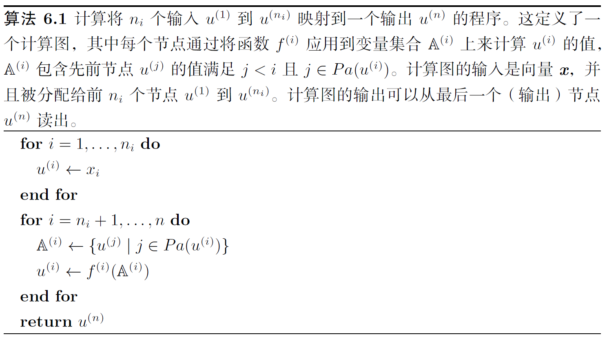

目标，求
$$
\frac{\partial u^{(n)}}{\partial u^{(j)}},j\in\{1,2,3...i\}\\
=\sum_{i: j \in P a\left(u^{(i)}\right)} \frac{\partial u^{(n)}}{\partial u^{(i)}} \frac{\partial u^{(i)}}{\partial u^{(j)}}
$$
执行反向传播所需要的计算量与G中边的数量成比例。反向传播算法的设计就是为了减少公共子表达式的数量，而不考虑储存的开销。

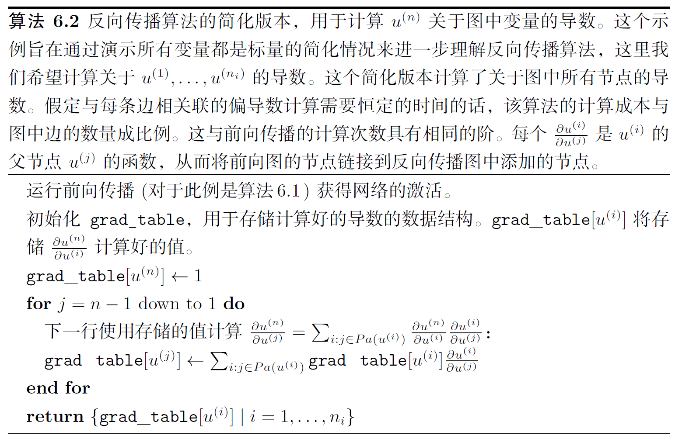

算法的简化版本，只适用于前面提到的前向传播过程。大致观察一下，可以看到新增了一个grad_table，用于存储已经计算过了的梯度，这就是一种牺牲空间换取时间的算法。

### 用例子来说明反向传播算法


对于这样一个图结构，记：$j < i , u_j是u_i的父节点$

1. $\frac{\partial u^{6}}{\partial u^{6}}=1$ 直接记下，写入grad_table
2. 进入迭代，j = 5
3. （若无grad_table）计算$\frac{\partial u^{6}}{\partial u^{5}}=\frac{\partial u^{6}}{\partial u^{5}}$ 
4. 有grad_table，$grad\_table[u^6]=1$，所以$grad\_table[u^5]=1\times\frac{\partial u^{6}}{\partial u^{5}}$
5. 进入迭代，j=4
6. （若无grad_table）计算$\frac{\partial u^{6}}{\partial u^{4}}=\frac{\partial u^{6}}{\partial u^{4}}$
7. 有grad_table，$grad\_table[u^6]=1$，所以$grad\_table[u^4]=1\times\frac{\partial u^{6}}{\partial u^{4}}$
8. 进入迭代，j=3
9. （若无grad_table）计算$\frac{\partial u^{6}}{\partial u^{3}}=\frac{\partial u^{6}}{\partial u^{5}}\frac{\partial u^{5}}{\partial u^{3}}$
10. 有grad_table，$grad\_table[u^5]=1\times\frac{\partial u^{6}}{\partial u^{5}}$，所以$grad\_table[u^3]=grad\_table[u^5]\times\frac{\partial u^{5}}{\partial u^{3}}$
11. 进入迭代，j=2
12. （若无grad_table）计算$\frac{\partial u^{6}}{\partial u^{2}}=\frac{\partial u^{6}}{\partial u^{4}}\frac{\partial u^{4}}{\partial u^{2}}+\frac{\partial u^{6}}{\partial u^{5}}\frac{\partial u^{5}}{\partial u^{2}}$
13. 有grad_table，所以$grad\_table[u^2]=grad\_table[u^5]\times\frac{\partial u^{5}}{\partial u^{2}}+grad\_table[u^4]\times\frac{\partial u^{4}}{\partial u^{2}}$
14. 以此类推

所以综上所述，节约了多次内积的计算时间,但是这只是一种简单且直观的情况。

### 真正地考虑一个神经网络模型：

它的forward过程如下描述：

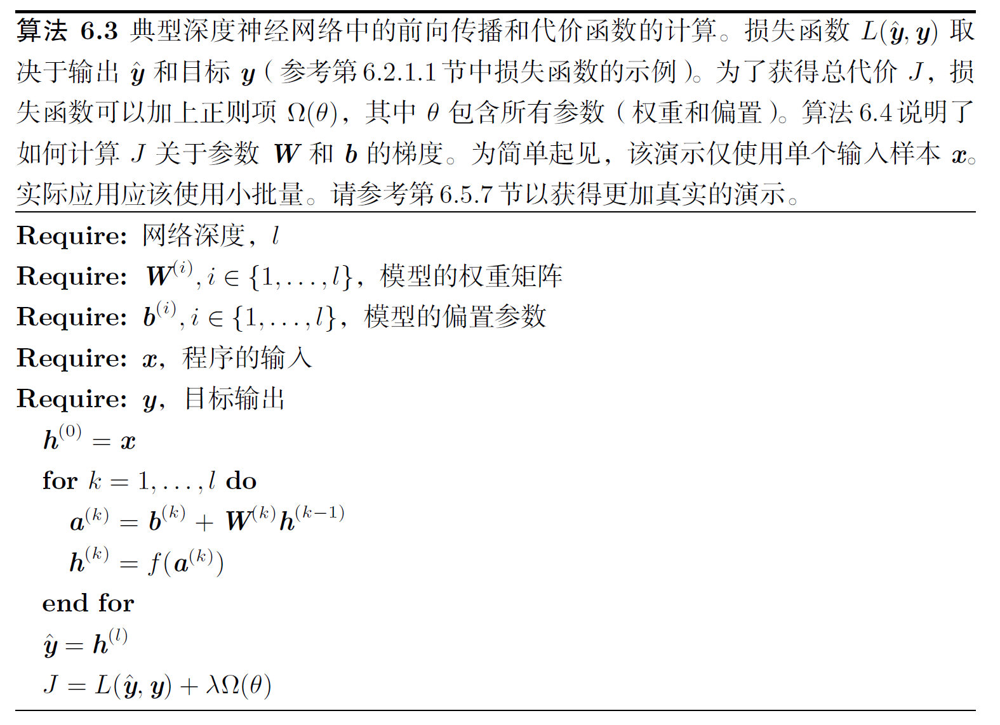

反向传播过程：

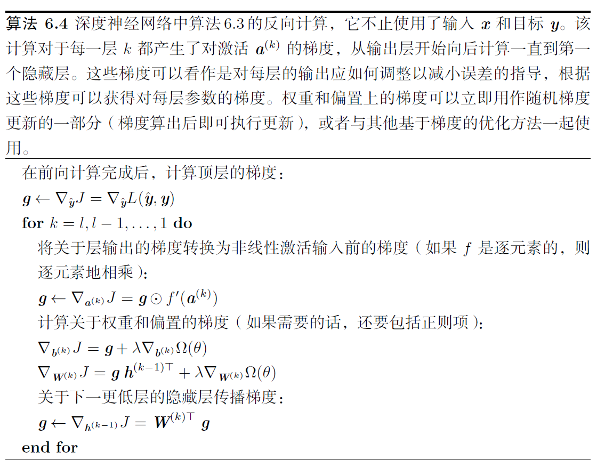

### reference

https://github.com/exacity/deeplearningbook-chinese

# RNN循环神经网络

本质上，任何包含循环的函数都可以被认为是一个循环神经网络。
$$
\boldsymbol{h}^{(t)}=f\left(\boldsymbol{h}^{(t-1)}, \boldsymbol{x}^{(t)} ; \boldsymbol{\theta}\right)
$$
网络通常使用$\boldsymbol{h}^{(t)}$ 作为过去序列与任务相关方面的有损摘要，一般而言一定是有损的。$\boldsymbol{h}^{(t)}$ 映射任意长度序列$\left(\boldsymbol{x}^{(t)}, \boldsymbol{x}^{(t-1)}, \boldsymbol{x}^{(t-2)}, \ldots, \boldsymbol{x}^{(2)}, \boldsymbol{x}^{(1)}\right)$到一定长度$\boldsymbol{h}^{(t)}$ 

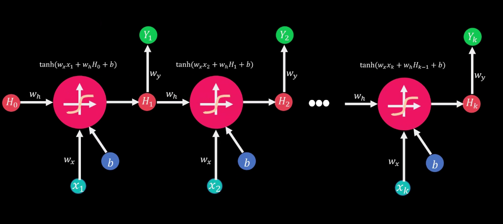

计算公式：
$$
h_t = tanh(w_xx_t+w_hh_{t-1}+b)  \\
y_t = w_yh_t
$$
其中整个模型共享参数：$w_h,w_x,w_y$

## 经典的RNN结构

n->n
n->1
n->m


## 优缺点

优点：

• Possibility of processing input of any length
• Model size not increasing with size of input
• Computation takes into account historical information
• Weights are shared across time

## 缺点：

• Computation being slow
• Difficulty of accessing information from a long time ago
• Cannot consider any future input for the current state

损失函数
$$
\mathcal{L}(\hat{y}, y)=\sum_{t=1}^{T_{y}} \mathcal{L}\left(\widehat{y}^{<t>}, y^{<t>}\right)
$$

如果我们需要的模型是n->1：


那么训练所给的数据也应该如：
$$
[X^n,y^n]\\
X^n=x_1,x_2,...,x_t\\
y^n=y_t
$$

## 损失函数：

根据时间步的连乘。
$$
\frac{\partial \mathcal{L}^{(T)}}{\partial W}=\left.\sum_{t=1}^{T} \frac{\partial \mathcal{L}^{(T)}}{\partial W}\right|_{(t)}
$$

常见问题: vanishing/ exploding gradient

The reason why they happen is that it is difficult to capture long term dependencies because of multiplicative gradient that can be exponentially decreasing/increasing with respect to the number of layers. 时间步一长，连乘就要出问题。

对梯度的最大值进行限制是一个放置exploding的方法。

## reference

https://stanford.edu/~shervine/teaching/cs-230/cheatsheet-recurrent-neural-networks#overview

## sequence to sequence 结构

一般RNN结构对于输入与输出的个数都做了限定，但实际上很多任务的序列长度是不固定的。


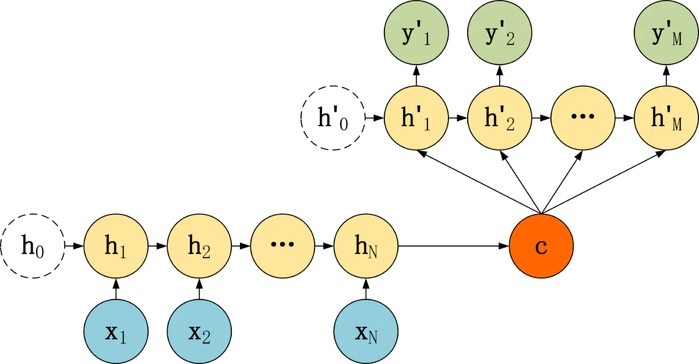


### 分析

可以观察到，其实前半部分是一个encoder模型，也可以理解为一个N->1的RNN模型。这个向量一般称作**上下文向量c**

当然c可以由$h_n$决定，也可以由$h_1,...h_n$决定。
$$
\begin{gathered}
c=h_{N} \\
c=q\left(h_{N}\right) \\
c=q\left(h_{1}, h_{2}, \ldots, h_{N}\right)
\end{gathered}
$$
然后使用decoder对c进行解码：

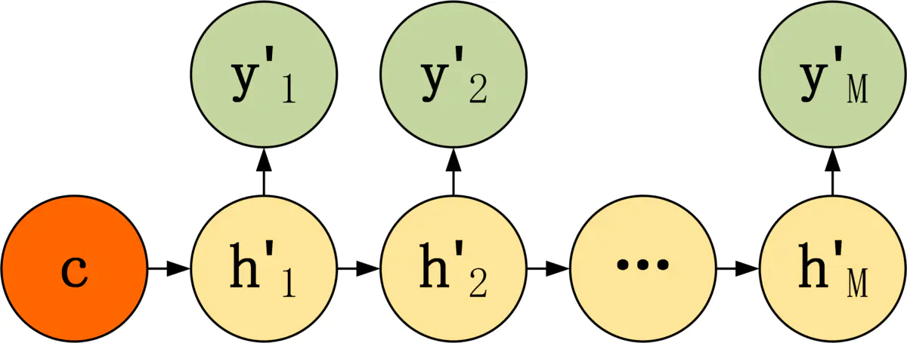

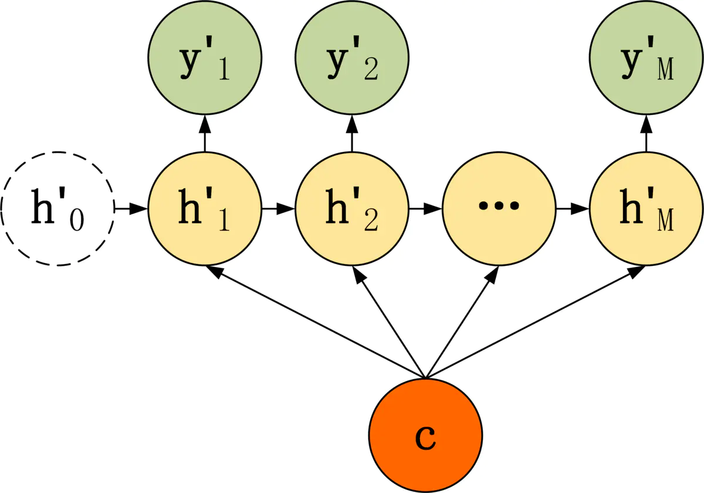

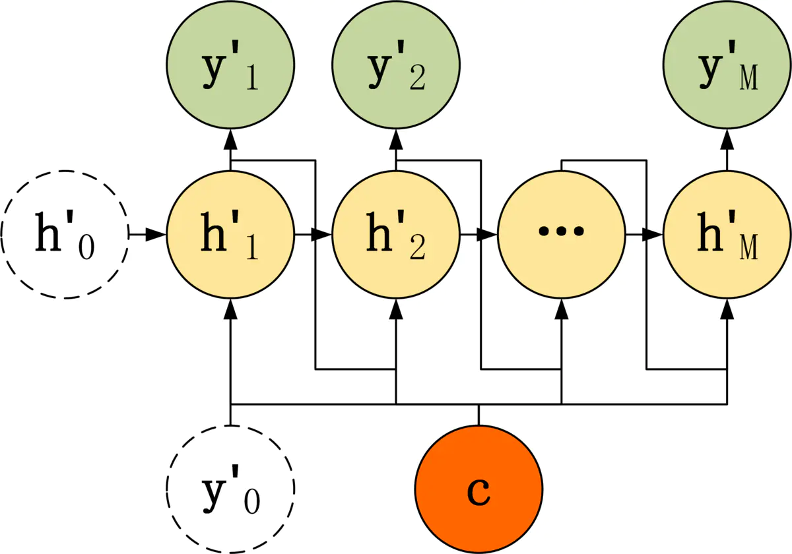

### teacher forcing

TODO

### attention

以上模型的缺陷：

- c如果定长，很难完全涵盖输入
- RNN 存在长序列梯度消失的问题，只使用最后一个神经元得到的向量 **c** 效果不理想。
- 与人类的注意力方式不同，即人类在阅读文章的时候，会把注意力放在当前的句子上。

使用attention机制，使得上下文向量c不再固定，而是根据当前信息计算c

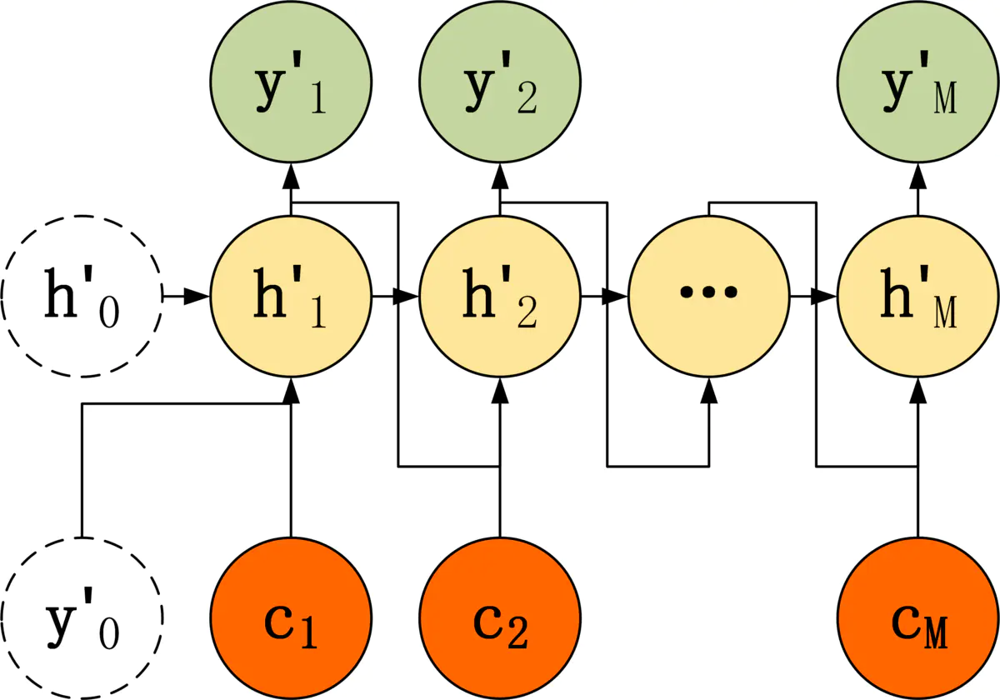

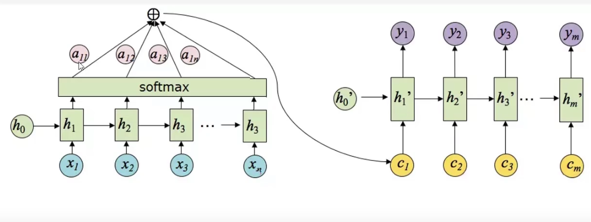

上下文向量--->受到拼接

#### keras.layers.SimpleRNN

对于一个循环神经网络，它的输入张量一般为：

```
(samples，timesteps,features)
```

例如手上的数据为：一小时一个时间戳，一个样本统计了100h，涉及到12个变量，统计了80次，那么数据可以写为：

(80,100,12)

为了方便之后参数计算的讨论，我们考虑的情况为

x.shape = (10,5,2)

y.shape = (10,2) 

来做一个二分类问题。

### SimpleRNN 的输入输出

- **它的输入被指定为3维(samples，timesteps, features)**

```python
x = tf.random.normal(shape=(3,10,5,4))
rnn = layers.SimpleRNN(units=1)
y = rnn(x)
print(y.shape)
>>>
ValueError: Input 0 of layer simple_rnn is incompatible with the layer: expected ndim=3, found ndim=4. Full shape received: (3, 10, 5, 4)
```

- 输出维度由唯一的参数units决定
  
  units: Positive integer, dimensionality of the output space。很显然，对于一个batch，他的输出为(batch_size,units)

### units到底是什么呢

$$
h_t = tanh(w_xx_t+w_hh_{t-1}+b)
$$

参数共享，所以看到的展开式，都是共享这一套参数。units，本质上是$h_t$的维度。

$(5,2)$的x进来，实际上就是一个两维的向量进来，输出的$h_t$也是一个两位向量，所以这样计算：

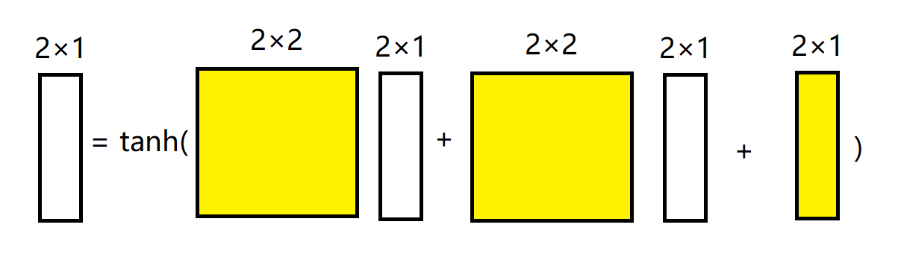

一共是10个参数。


注意，图中的$w_y$并不是RNN结构中参数，因为SimpleRNN中就不包括y，他直接将h向量输出，如果需要图中的y，需要自行添加dense层。

公式为：

**recurrent_weights**+ **input_weights** + **biases**

*num_units\* num_units + num_features\* num_units + biases*

这张图片也方便理解:

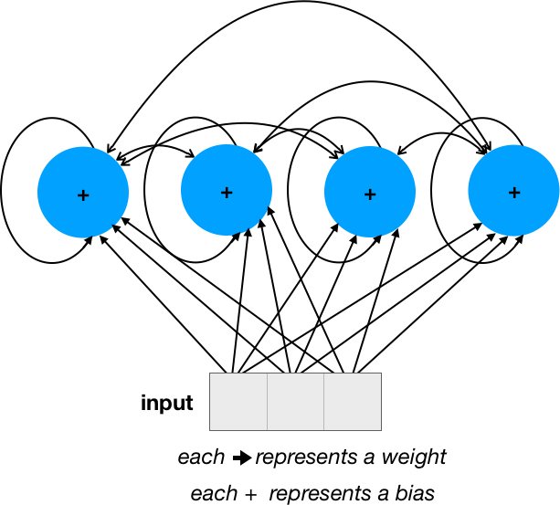

> https://stackoverflow.com/questions/50134334/number-of-parameters-for-keras-simplernn

## LSTM

LSTM的全称是Long Short Term Memory，顾名思义，它具有记忆长短期信息的能力的神经网络。LSTM首先在1997年由Hochreiter & Schmidhuber 提出，由于深度学习在2012年的兴起，LSTM又经过了若干代大牛(Felix Gers, Fred Cummins, Santiago Fernandez, Justin Bayer, Daan Wierstra, Julian Togelius, Faustino Gomez, Matteo Gagliolo, and Alex Gloves)的发展，由此便形成了比较系统且完整的LSTM框架，并且在很多领域得到了广泛的应用。本文着重介绍深度学习时代的LSTM。

LSTM提出的动机是为了解决上面我们提到的长期依赖问题。传统的RNN节点输出仅由权值，偏置以及激活函数决定（图3）。RNN是一个链式结构，每个时间片使用的是相同的参数。

> https://zhuanlan.zhihu.com/p/42717426

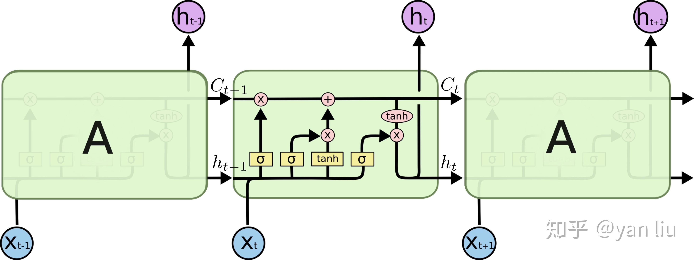

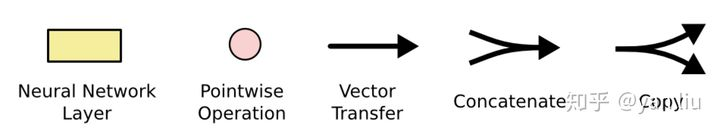

LSTM使用门的机制，控制特征的流通和损失。LSTM可以做到t9的时刻考虑t2的特征，

### cell state

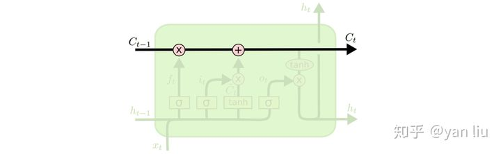
$$
C_{t}=f_{t} \times C_{t-1}+i_{t} \times \tilde{C}_{t}
$$
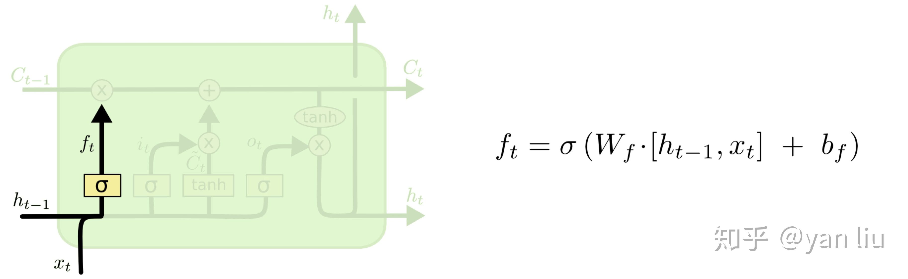

$f_{t}$是一个遗忘门，0~1之间

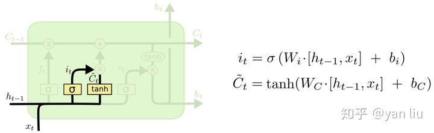

$i_{t}$是输入门，其功能非常相似用于保留与以往，$h_t,x_t$的信息

$\tilde{C}_{t}$表示单元状态更新值


$C_t$为cell状态

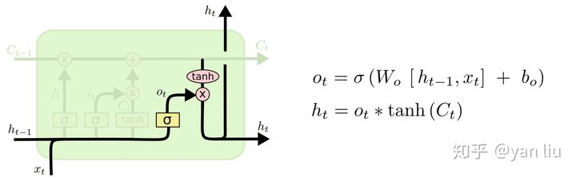

由根据$o_t$输出门，更新的 $h_t$ 值。

综上所述，LSTM一个cell里面输出了两个变量，分别为$C_t$，$h_t$。

### keras.layers.LSTM

```python
>>> inputs = tf.random.normal([32, 10, 8])
>>> lstm = tf.keras.layers.LSTM(4)
>>> output = lstm(inputs)
>>> print(output.shape)
  (32, 4)
>>> lstm = tf.keras.layers.LSTM(4, return_sequences=True, return_state=True)
>>> whole_seq_output, final_memory_state, final_carry_state = lstm(inputs)
>>> print(whole_seq_output.shape)
  (32, 10, 4)
>>> print(final_memory_state.shape)
  (32, 4)
>>> print(final_carry_state.shape)
  (32, 4)
```

units: $h_t$ 的维度

```python
whole_seq_output, final_memory_state, final_carry_state = lstm(inputs)
```

注意输出的顺序

sequence_output 是指 $h_t$

whole_seq_output 是指 $h_1,h_2,...h_t$

### tensorflow2 的 LSTM 源码阅读

LSTM是一个layer，它继承了RNN layer

使用的是LSTMCell

LSTM是一个循环操作（输入三维度张量），LSTMCell就是一次循环的操作（输入二维张量，去除了时间戳）。

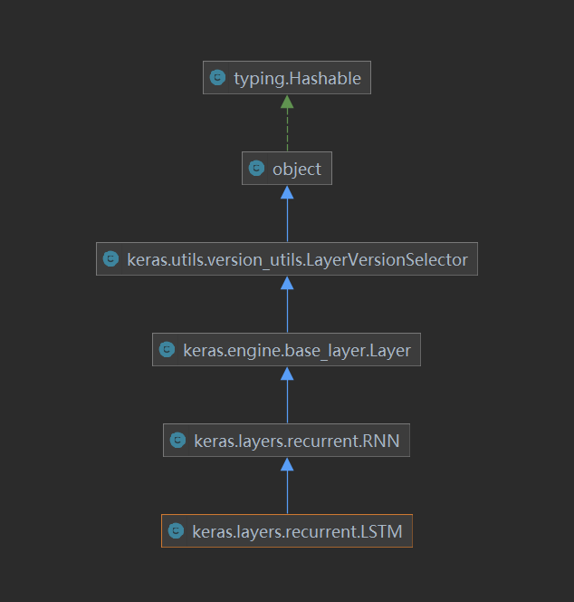

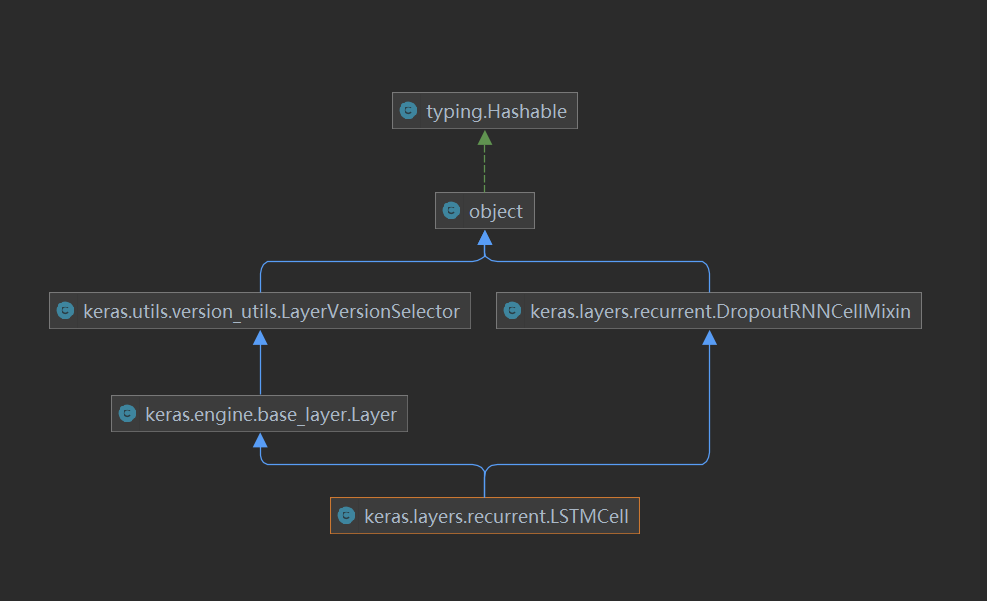

#### LSTMCell 类

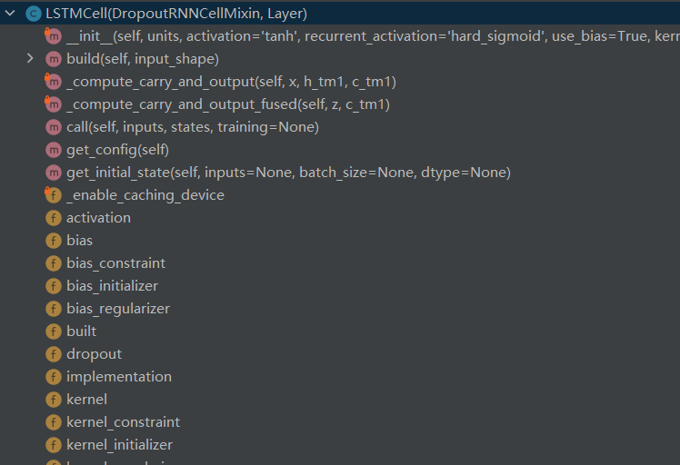

```python
class LSTMCell(DropoutRNNCellMixin, Layer):
  """Cell class for the LSTM layer.

  Args:
    units: Positive integer, dimensionality of the output space.
    activation: Activation function to use.
      Default: hyperbolic tangent (`tanh`).
      If you pass `None`, no activation is applied
      (ie. "linear" activation: `a(x) = x`).
    recurrent_activation: Activation function to use
      for the recurrent step.
      Default: hard sigmoid (`hard_sigmoid`).
      If you pass `None`, no activation is applied
      (ie. "linear" activation: `a(x) = x`).
    use_bias: Boolean, whether the layer uses a bias vector.
    kernel_initializer: Initializer for the `kernel` weights matrix,
      used for the linear transformation of the inputs.
    recurrent_initializer: Initializer for the `recurrent_kernel`
      weights matrix,
      used for the linear transformation of the recurrent state.
    bias_initializer: Initializer for the bias vector.
    unit_forget_bias: Boolean.
      If True, add 1 to the bias of the forget gate at initialization.
      Setting it to true will also force `bias_initializer="zeros"`.
      This is recommended in [Jozefowicz et al., 2015](
        http://www.jmlr.org/proceedings/papers/v37/jozefowicz15.pdf)
    kernel_regularizer: Regularizer function applied to
      the `kernel` weights matrix.
    recurrent_regularizer: Regularizer function applied to
      the `recurrent_kernel` weights matrix.
    bias_regularizer: Regularizer function applied to the bias vector.
    kernel_constraint: Constraint function applied to
      the `kernel` weights matrix.
    recurrent_constraint: Constraint function applied to
      the `recurrent_kernel` weights matrix.
    bias_constraint: Constraint function applied to the bias vector.
    dropout: Float between 0 and 1.
      Fraction of the units to drop for
      the linear transformation of the inputs.
    recurrent_dropout: Float between 0 and 1.
      Fraction of the units to drop for
      the linear transformation of the recurrent state.

  Call arguments:
    inputs: A 2D tensor.
    states: List of state tensors corresponding to the previous timestep.
    training: Python boolean indicating whether the layer should behave in
      training mode or in inference mode. Only relevant when `dropout` or
      `recurrent_dropout` is used.
  """
```

一个Cell只需要输入二维张量[batch,features]

call 函数返回值为  h, [h,c]

```python
def call(self, inputs, states, training=None):
    h_tm1 = states[0]  # previous memory state
      c_tm1 = states[1]  # previous carry state
    """
    省略
    """
      return h, [h, c]
```


正如这一个Cell所示，进去一个$x_t$ 出来 $h_t,c_t$

#### LSTM 类

```python
class LSTM(RNN):
    def __init__(self,units,**kwargs):
        """
        省略
        """
        cell = LSTMCell(units,**cell_kwargs)
        super(LSTM, self).__init__(cell,**kwargs)

    def call(self, inputs):
        return super(LSTM, self).call(inputs)
```

可以看到，本质上是使用了RNN的call函数，但是把Cell进行了更改。

前面已经提到了Cell是一个：

[batch, features] -----LSTMCell-----> h, [h, c]

接下来进入RNN的call函数中：

```python
    def call(self,inputs,):
    # The input should be dense, padded with zeros. If a ragged input is fed
    # into the layer, it is padded and the row lengths are used for masking.
    """
    进行一系列检查
    """
        inputs,initial_state,constants=
        self._process_inputs(inputs,initial_state,constants)
        # 定义step函数，执行Cell的call function
        def step(inputs, states):
            states = states[0] 
            if len(states) == 1 and is_tf_rnn_cell else states
            output, new_states = cell_call_fn(inputs, states, **kwargs)
            if not tf.nest.is_nested(new_states):
                  new_states = [new_states]
            return output, new_states
        # 将step函数放到K.rnn中执行
        last_output, outputs, states = backend.rnn(
        step,
        inputs,
        initial_state)
```


#### transformer中的位置编码

一种好的位置编码方案需要满足以下几条要求：  

它能为每个时间步输出一个独一无二的编码； 

不同长度的句子之间，任何两个时间步之间的距离应该保持一致； 

模型应该能毫不费力地泛化到更长的句子。

它的值应该是有界的； 

它必须是确定性的。


