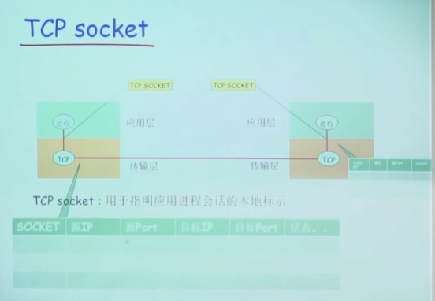

# 《计算机网络》读书笔记

## 互联网的组成

1. 边缘部分：端系统，可以是个人电脑，也可以是大型计算机
2. 核心部分

“主机A与主机B进行通信”，实际上指的是运行在主机A 上的某个程序和运行在主机B上的另一个程序进行通信。

### 端系统之间的通讯方式

客户-服务器：

​	进程之间服务和被服务的关系，客户是请求方，服务器是服务提供方。

​	服务器程序：一种专门用来提供某种服务的程序，可以同时处理多个远地或本地客户的请求

​	客户和服务器指的是**计算机进程**

对等连接方式：

两台主机运行了对等连接软件，P2P软件，他们就可以进行平等的对等两届通信。比如双方都可以下载对方的文档。

### 核心部分

路由器router，它是一种专门计算机，实现分组交换，转发收到的分组。

**电路交换**：按照某种方式动态地分配传输线路资源。

建立连接->通话->释放连接

特点：在童话的全部时间内，通话的两个用户始终占用端到端的通信资源。

**分组交换**：

报文：要发送的整块数据

分组

包

路由器暂时存储的是一个个短分组，而不是整个长报文。

分组在传输时，一段一段地占用通讯资源。

路由选择协议-->自动找到转发分组的最合适的路径

### internet 结构

其中有ISP，ISP分层

IXP将ISP高速连接起来

网络内容提供商ICP建立自己的数据中心，加快用户体验

中国教育与科研网 CERNET 骨干网分布

十大ISP：

电信：[中国公用计算机互联网](https://www.baidu.com/s?wd=中国公用计算机互联网&tn=SE_PcZhidaonwhc_ngpagmjz&rsv_dl=gh_pc_zhidao)(CHINANET，即[中国电信](https://www.baidu.com/s?wd=中国电信&tn=SE_PcZhidaonwhc_ngpagmjz&rsv_dl=gh_pc_zhidao)网) 

网通：[中国网通](https://www.baidu.com/s?wd=中国网通&tn=SE_PcZhidaonwhc_ngpagmjz&rsv_dl=gh_pc_zhidao)公用互联网(CNCNET，包括金桥网CHINAGBN) 

移动：中国移动互联网（CMNET）

联通：[中国联通](https://www.baidu.com/s?wd=中国联通&tn=SE_PcZhidaonwhc_ngpagmjz&rsv_dl=gh_pc_zhidao)互联网（UNINET）

铁通：[中国铁通](https://www.baidu.com/s?wd=中国铁通&tn=SE_PcZhidaonwhc_ngpagmjz&rsv_dl=gh_pc_zhidao)互联网（CRCNET）

卫星：[中国卫星](https://www.baidu.com/s?wd=中国卫星&tn=SE_PcZhidaonwhc_ngpagmjz&rsv_dl=gh_pc_zhidao)集团互联网（CSNET）

科技：[中国科技网](https://www.baidu.com/s?wd=中国科技网&tn=SE_PcZhidaonwhc_ngpagmjz&rsv_dl=gh_pc_zhidao)（CSTNET）

教育：[中国教育和科研计算机网](https://www.baidu.com/s?wd=中国教育和科研计算机网&tn=SE_PcZhidaonwhc_ngpagmjz&rsv_dl=gh_pc_zhidao)（CERNET）

贸易：中国国际经济贸易互联网（CIETNET）

长城：中国长城互联网（CGWNET）

## 计算机网络的性能指标

1. 速率
2. 带宽
3. 吞吐量
4. 时延
5. 利用率

## 计算机网络体系结构

OSI 太过于复杂，不实用。

TCP/IP四层协议比较清晰，并且广泛应用。

* 应用层：进程间的通信和交互规则，例如DNS,SMTP，处理的数据称为报文。
* 运输层：两台主机中，进程之间的通信提供通用的数据传输服务。TCP,UDP
  
* 网络层：把运输层产生的报文段或者用户数据报封装成分组或包进行传送，称为IP数据报。互联网使用的网络层协议为：网际协议IP和多种路由选择协议
* 数据链路层：将IP数据报组装成帧，每一帧包括数据和必要的控制信息。
* 物理层：传输比特

## 物理层

宽带接入技术

## 数据链路层

点对点信道

广播信道

1. 将IP数据报添加首部和尾部封装成帧
2. 发送给节点B
3. 节点B检查无误后提取IP数据报给上层网络层

三个基本问题：

封装成帧，透明传输，差错检测。

### 点对点协议PPP

PPPoE是PPP协议运用于以太网的例子。

## 网络层

## 运输层

## 应用层

可能的应用构架：

1. 客户端，服务端模式
2. P2P

### C/S模式

服务器上部署资源

服务器保持一直运行

监听知名IP

缺点：可拓展性差，高并发性弱

### P2P

peer to peer

平等

请求服务增加，服务规模也在增加

难以管理

### 进程通信

一台设备上两个进程通信方式：

管道，消息队列等

不同设备上的两个进程通信方式：

报文message

解决的问题：

进程标识

应用层与运输层的沟通

用户使用服务

### 进程标识

ip, udp/tcp，端口号

tcp与udp都有各自的端口号，16个比特 2^16 

### TCP之上的Scoket

### UDP socket 

### 应用层协议

### 传输层提供的服务

### web与http

url格式

prot://user:psw@

