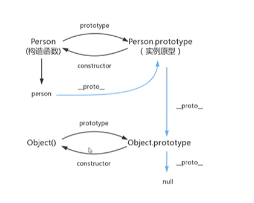

# JavaScript

结构层HTML

表现层CSS

行为层JavaScript

## 三大框架

angular

react

Vue，一款渐进式的JS框架

## UI框架

ant design

bootstrap

## 什么是JavaScript

JS是一种脚本语言。

一般放置在js文件中，再html的<script>标签中导入。

## 引入js

1. 内部引入

```html
<script>
 //...
</script>
```

			2. 外部引入

abc.js

在html中

```html
<script src="abc.js"></script>
```

## 基本语法

定义变量

```js
var name = 1;
var var_name = "content"
```

条件控制

```js
if (2>1){
alert("true")
}
```

打印变量

```javascript
console.log()
```

## 数值类型

数值，文本，图形，音频，视频。。。

## 面向对象编程

类：模板

对象：具体的实例

原型对象

xiaoming.\_\_proto\_\_ = student



##  操作BOM对象

bower object model

js的诞生就是为了他能在浏览器中运行。

### window对象 

浏览器的窗口

### navigator

封装了浏览器的信息

### screen

屏幕信息

### location

当前页面的URL信息

### document

当前页面的文档树

### history

代表浏览器的历史记录

##  操作表单

如何操作form？

* 文本框
* 下拉框
* 单选框
* 多选框

## JQuery

cdn引入

https://cdnjs.cloudflare.com/ajax/libs/jquery/3.6.0/jquery.min.js
