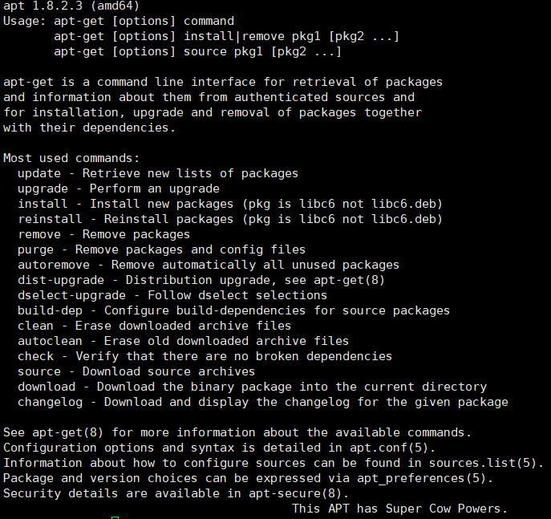

# yum

**一般来说著名的linux系统基本上分两大类：**

1.RedHat系列：Redhat、Centos、Fedora等

2.Debian系列：Debian、Ubuntu等

redhat系列对应 rpm安装包

debian系列对应 deb包

包管理工具

yum

apt-get

源码安装：

需要自己解包，然后进行安装三部曲，./configure, make, make install.　来安装软件

## 经验总结

能用yum尽量用yum，不要试图自己去解决依赖

更新：yum update

安装：yum install xxx

移除：yum remove xxx

使用技巧：

yum list package

可以使用资源通配符比如：yum list nginx*

## apt-get

