# 力扣题目总结

# 力扣刷题技巧

## 数组

数组是存放在连续内存空间上的相同类型数据的集合。

### 二分查找

二分查找一定是**有序数**，复杂度为 O(logn)

### 移除元素

原地一处某个数值的元素

方法1，第一层循环找该数值，第二层循环把后面的元素移动到前面来

方法2，双指针，左边指针找，右边指针维护一个[val,val,val] 数组

### 有序数组的平方

双指针法

用过一个额外的空间来储存结果

### 长度最小的子数组

滑动窗口，双指针法

窗口值 大于 目标值，窗口缩小

窗口值 小于，窗口增大

### 螺旋矩阵

按圈迭代

n = 4，迭代两圈

## 链表


类型

* 单链表
* 双链表
* 循环链表

### 移除链表元素

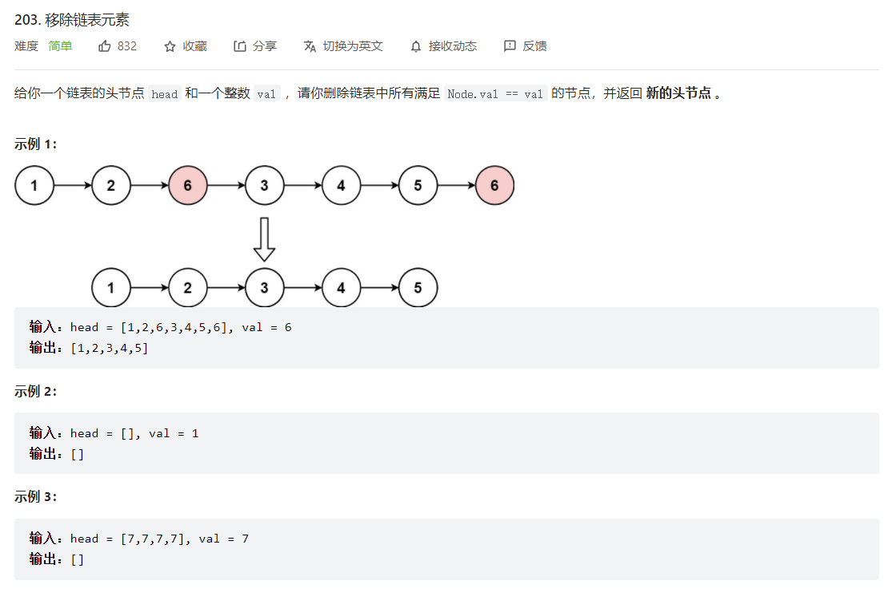

### 设计链表

链表的功能：

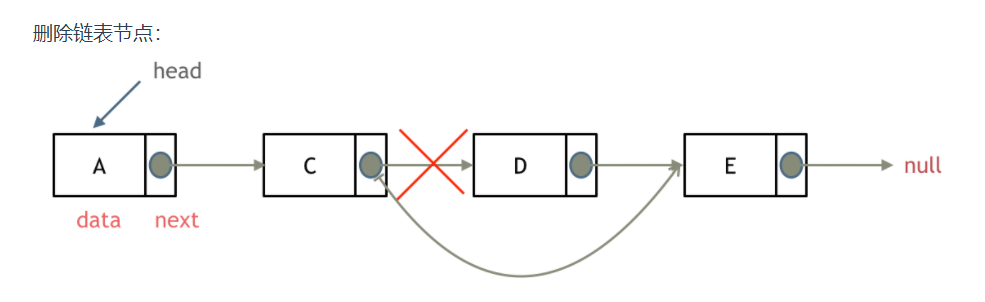

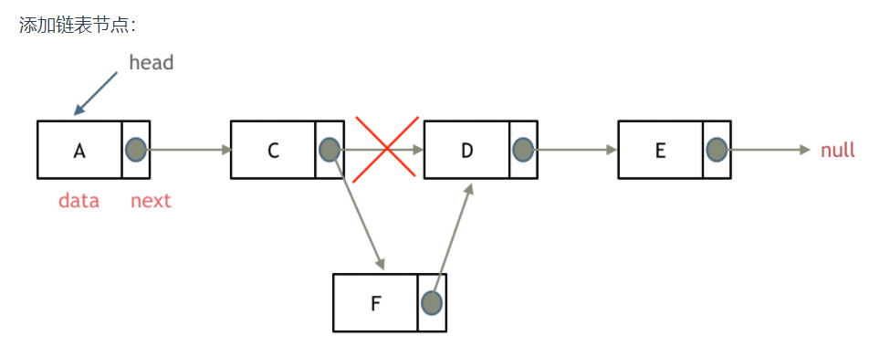

### 翻转链表

双指针维护

额外空间储存，遍历

递归

## 哈希表


### 四数相加

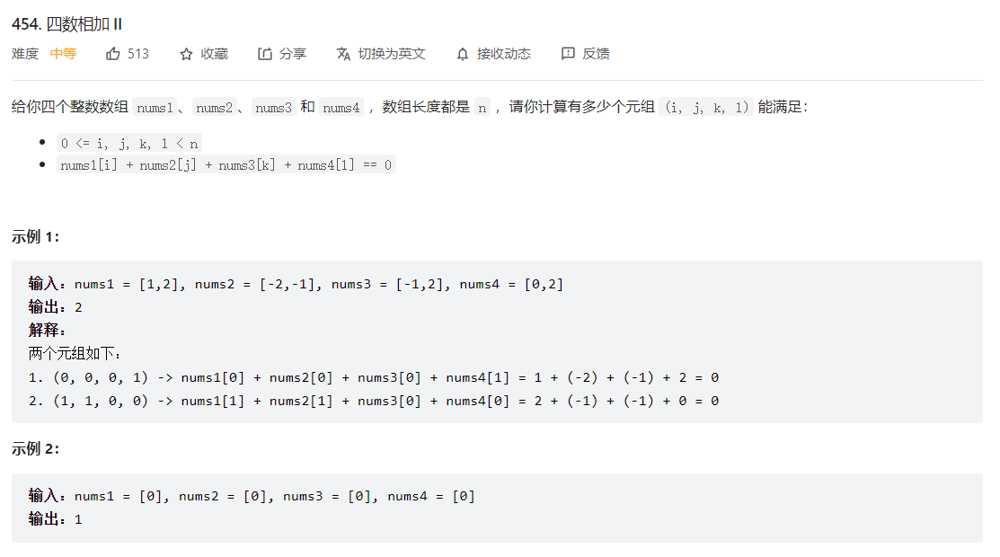

用哈希表做备忘录。

## 二叉树

满二叉树

完全二叉树

二叉搜索树

平衡二叉搜索树

### 二叉树的存储

1. 链式存储（常用）
2. 顺序存储

### 遍历

什么序指的是根节点的排位

前序遍历，中序遍历，后续遍历  ----> 深度优先搜索

层序 ---> 广度优先搜索  

* 递归遍历
* 非递归遍历，使用栈来模拟递归的过程


## 双指针

* 使用双指针进行搜索，可以减小搜索空间。双指针的奥义在于使用**排序**来**减小搜索空间**！
  * 在排序过的数组中，双指针找两数的**和**只用n，而遍历需要n^2
* 快慢指针
* 维护数组 ，链表

### 三数之和（最经典）

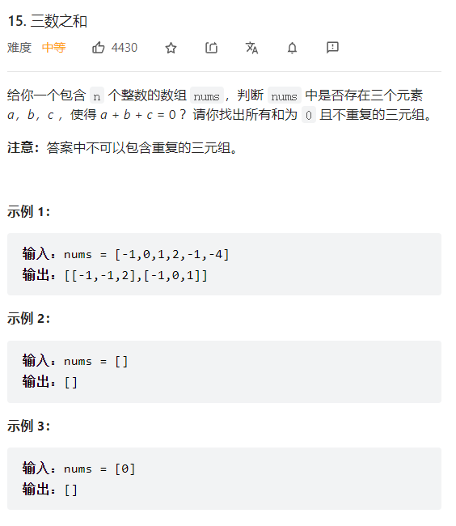

第一步，排序。

第二步，双指针。

### 最接近的三数之和

如前一题，使用额外的空间来保存gap，最后来比较

### 四数之和

固定两个数，然后再使用双指针

### 删除链表的倒数第 N 个结点

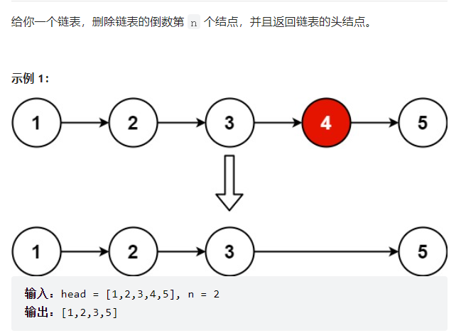

1. 链表的操作
2. dummy node用于记录头部
3. 快慢指针的距离来保证n

### 移除元素

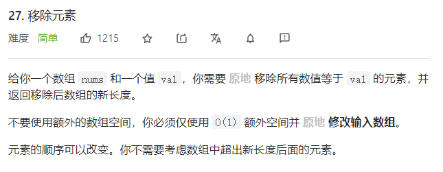

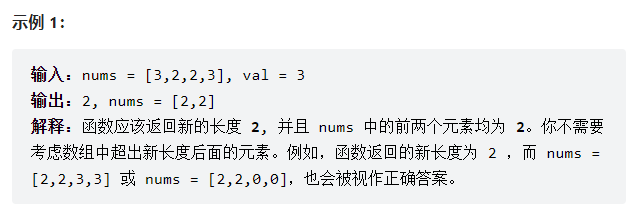

使用前后指针，来维护一个数组。

### 接雨水（好题）


常规思想：

对每个位置i，min(左边最高的列，右边最高的列)-height[i]，是这一列的水量

遍历，所以n^2复杂度

动态规划：

建立一个数组，记录该位置，左、右边的最高

时间复杂度为n

双指针：

优化空间复杂度

### 旋转链表

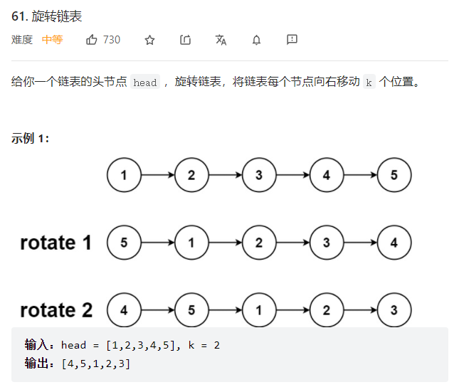

使用双指针来维护链表

其实就是找到合适的地方（依据k），进行截断操作。

### 移动零

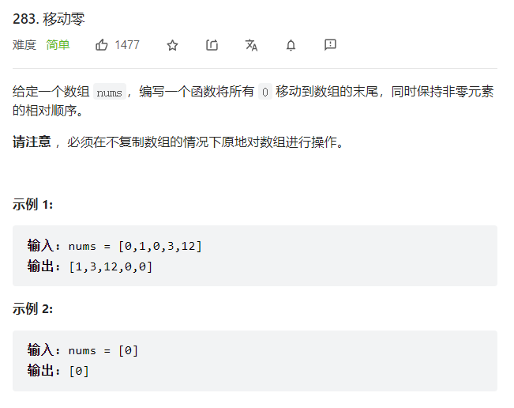

使用双指针来维护数组

### 反转字符串中的单词

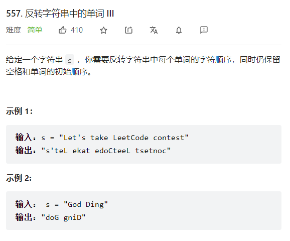

使用双指针来维护字符串。

方法1：使用双指针，使用额外的一个n的空间来存放新的字符串

如何节约n大小的空间呢？原地操作，但是由于**python的字符串是不可变的**，所以没办法节约空间

### 链表的中间结点

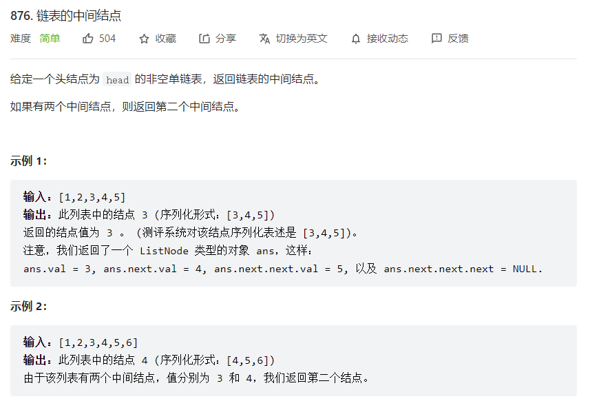

单指针，遍历 n +2/n 个元素就能找到

快慢指针，快的两个一走，慢的一个一走。

## 队列和栈

### 理论基础


**递归的实现就是：每一次递归调用都会把函数的局部变量、参数值和返回地址等压入调用栈中**，然后递归返回的时候，从栈顶弹出上一次递归的各项参数，所以这就是递归为什么可以返回上一层位置的原因。


### 用栈实现队列

肯定要用两个栈

1. 加元素，放到A
2. 出元素，A-B, 从B弹出

### 括号匹配

**括号匹配是使用栈解决的经典问题**


递归的思想

栈的思想

## 回溯，递归

* 组合问题

* 切割问题

* 子集问题

* 排列问题

* 棋盘问题

所有的回溯法都可以抽象为一个树形结构，递归来做纵向深度，横向枝选择用for循环

### 模板

```python
def backtracking(参数):
    if 终止条件:
        return 结果
    for：
    	减枝操作
    	处理节点
        backtracking()
    return
```

1. 终止条件用于定义叶子节点
2. for循环用于生成每个叶子下面的枝
   1. 方法一 使用index指针
   2. 方法二 使用 used数组 for i in [1,0,1,0] 
3. 在处理节点的时候，**不要轻易改变当前节点的数据**！例如，不要修改path，而是直接将修改后的path传入下一个节点！

网上的模板

```python
def backtrack(路径, 选择列表):
    if 满足结束条件:
        result.add(路径)
        return
    //相当于多叉树的遍历，i的个数从2变成了n，并且写成了for循环的形式
    for 选择 in 选择列表:
        if 选择 in 路径：
            continue
        路径.add(选择)
        backtrack(路径, 选择列表)
        //将数值改回成原来的状态
        路径.remove(选择)
```


---


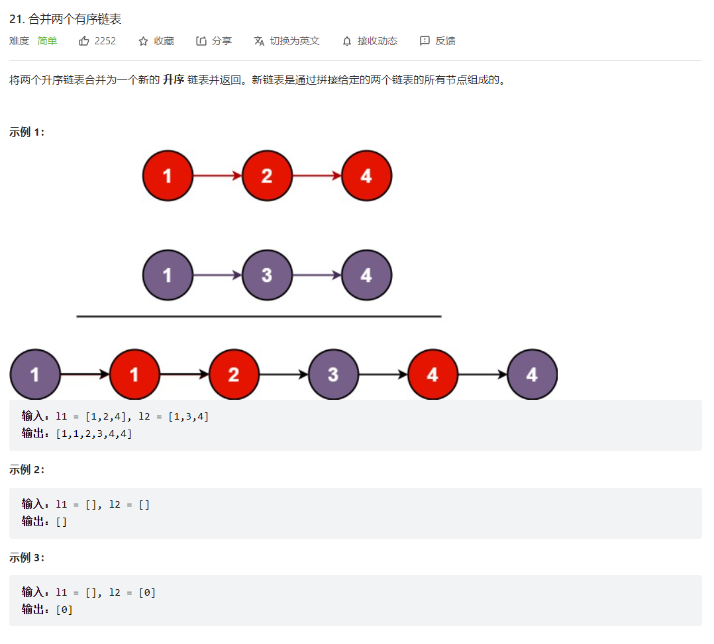

终止条件

自我调用

### 翻转链表

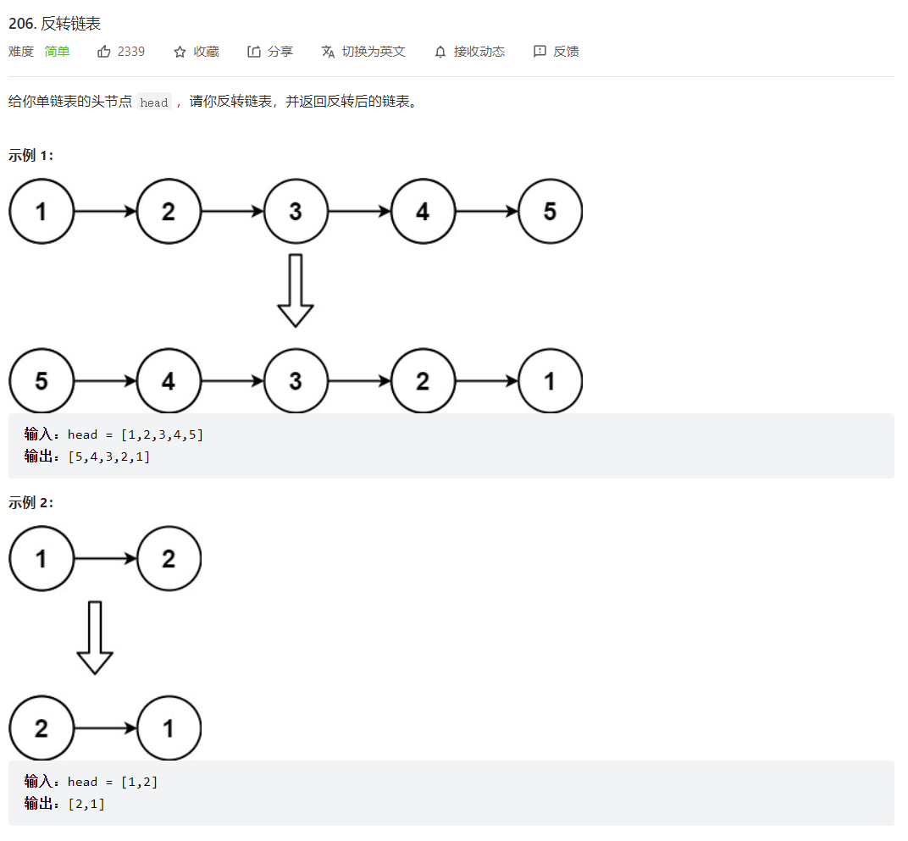

### 组合

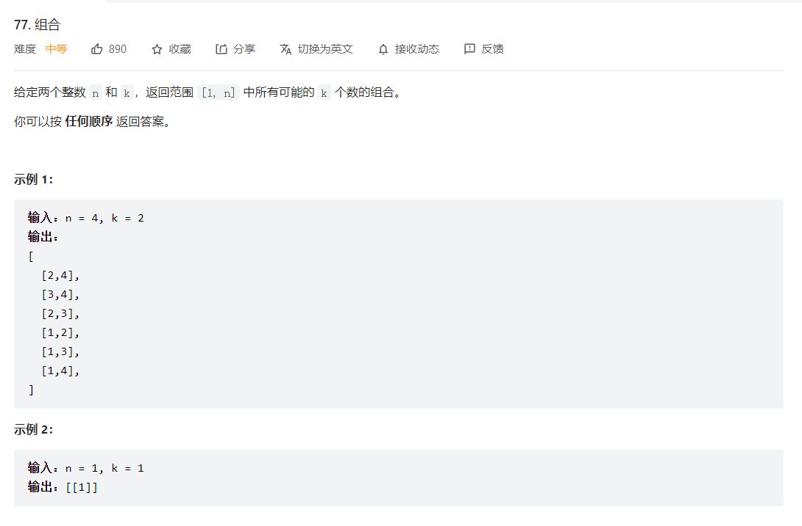

递归需要注意各种终止条件

### 子集

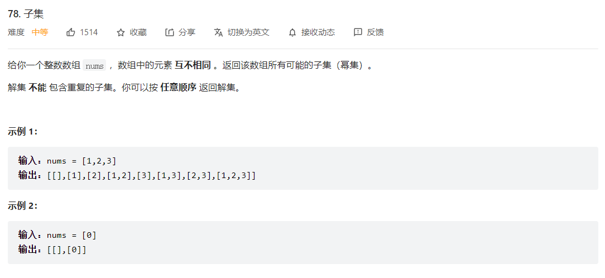

和排列有些相似，相当于在 每个节点都会添加result

### 全排列

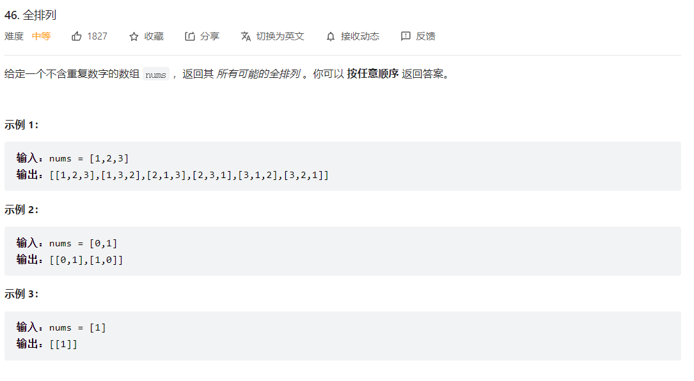

使用回溯算法

**回溯法** 采用试错的思想，它尝试分步的去解决一个问题。在分步解决问题的过程中，当它通过尝试发现现有的分步答案不能得到有效的正确的解答的时候，它将取消上一步甚至是上几步的计算，再通过其它的可能的分步解答再次尝试寻找问题的答案。回溯法通常用最简单的递归方法来实现，在反复重复上述的步骤后可能出现两种情况：

* 找到一个可能存在的正确的答案；
* 在尝试了所有可能的分步方法后宣告该问题没有答案。

（1，2，3）的全排列是 1+（2，3）的全排列

```python
class Solution:
    def permute(self, nums):
        """
        :type nums: List[int]
        :rtype: List[List[int]]
        """
        def backtrack(first = 0):
            # 所有数都填完了
            if first == n:  
                res.append(nums[:])
            for i in range(first, n):
                # 动态维护数组
                nums[first], nums[i] = nums[i], nums[first]
                # 继续递归填下一个数
                backtrack(first + 1)
                # 撤销操作
                nums[first], nums[i] = nums[i], nums[first]
        
        n = len(nums)
        res = []
        backtrack()
        return res

```

### 全排列2

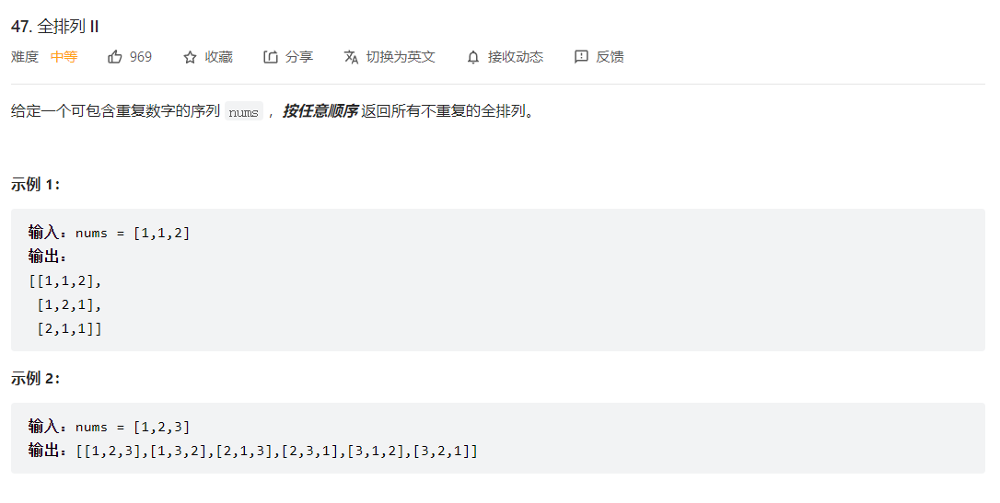

由于重复元素，涉及到去重，需要减枝操作

### N皇后

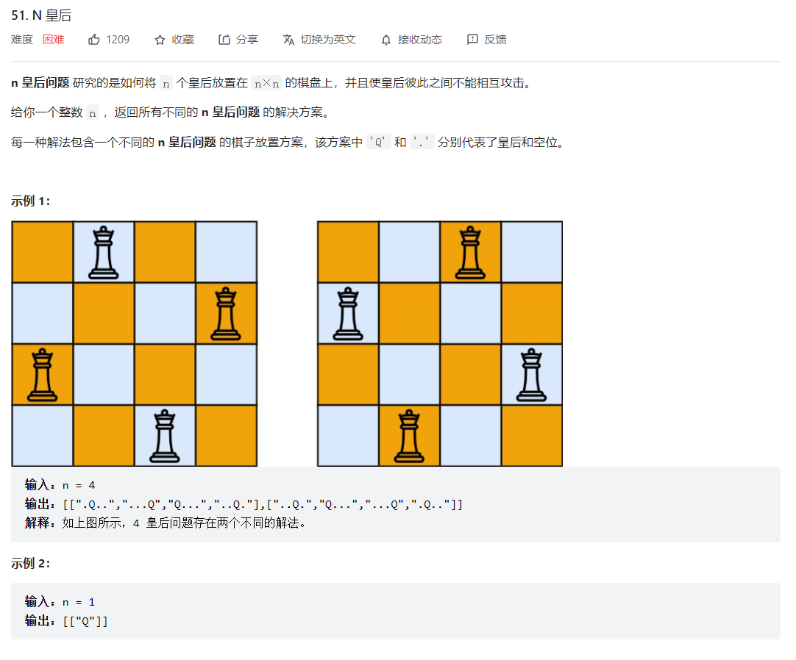

## 深度优先搜索/ 广度优先搜索

回溯算法其实就是深度优先算法

### 图像渲染

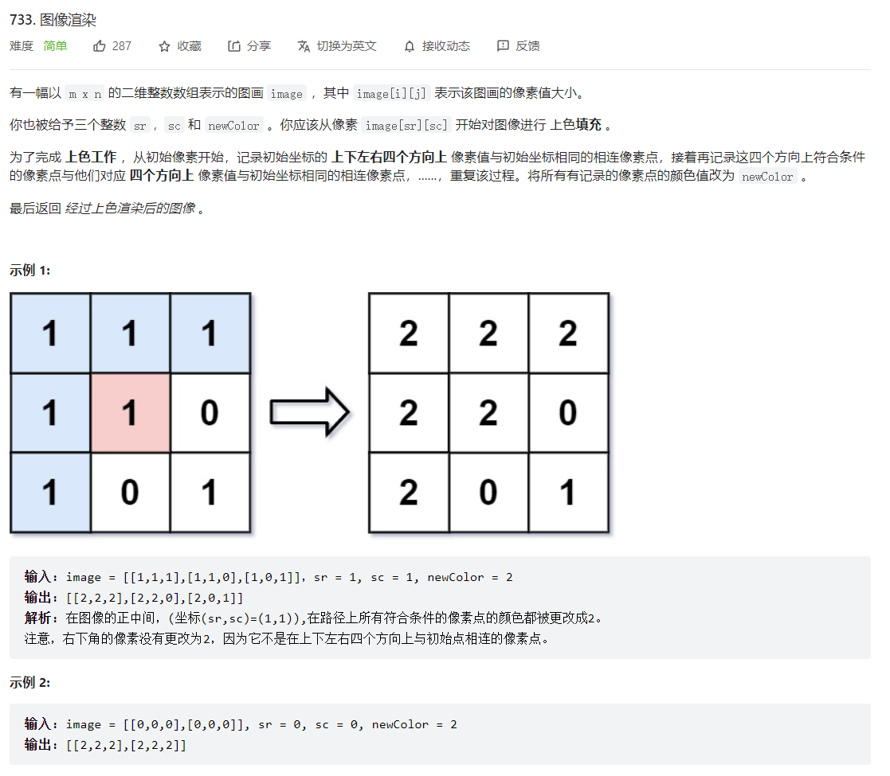

广度优先算法依靠队列来实现：


```python
class Solution:
    def floodFill(self, image: List[List[int]], sr: int, sc: int, newColor: int) -> List[List[int]]:
        # 特殊情况
        currColor = image[sr][sc]
        if currColor == newColor:
            return image
        
        n, m = len(image), len(image[0])
        que = collections.deque([(sr, sc)])
        image[sr][sc] = newColor
        while que:
            x, y = que.popleft()
            for mx, my in [(x - 1, y), (x + 1, y), (x, y - 1), (x, y + 1)]:
                if 0 <= mx < n and 0 <= my < m and image[mx][my] == currColor:
                    que.append((mx, my))
                    image[mx][my] = newColor
        
        return image
```

利用队列的先进先出

模板：

```
while queue 不空：
    cur = queue.pop()
    for 节点 in cur的所有相邻节点：
        if 该节点有效且未访问过：
            queue.push(该节点)
```

```python
depth = 0
while queue 不空：
    size = queue.size()
    for i in rang(size):
        # 取出这一层的元素
        cur = queue.popleft()
        for 节点 in cur的所有相邻节点：
            if 有效 and 未被访问：
                queue.append(节点)
                optional：处理该节点
    depth += 1

```

### 01矩阵

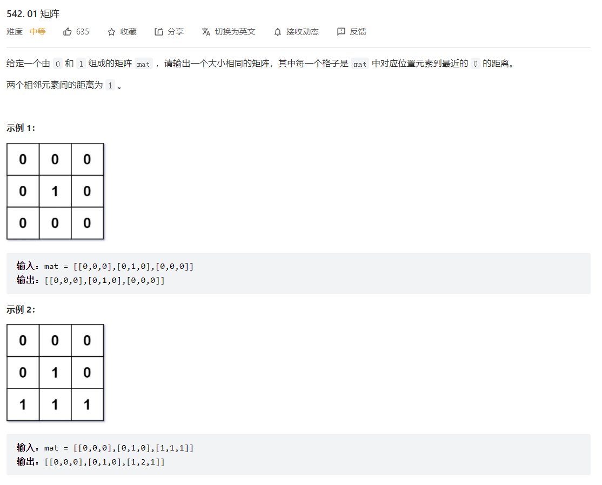


## 动态规划

问题：

1. 斐波那契额数列
2. 跳台阶
3. 背包问题
4. 打家劫舍
5. 股票问题
6. 子序列问题

高难度问题：区间dp，概率dp。

---

dp数组以及其下标的含义

递推公式

dp数组如何初始化

遍历顺序

打印dp数组

### 爬楼梯（经典）

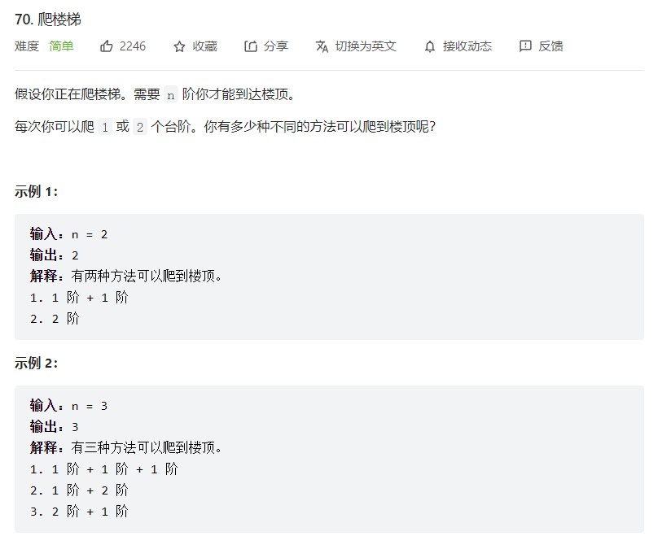
$$
f(n) = f(n-1)+f(n-2)
$$
五步法：

1. 确定dp数组的含义
2. 确定递归公式
3. 初始化dp数组
4. 确定遍历顺序

dp数组，dp[i]达到i阶有dp[i]种方法

dp[i] = dp[i-2]+dp[i-1]

### 01背包（经典，基础）

​    

| 物品 | 重量 | 价值 |
| ---- | ---- | ---- |
| 0    | 1    | 15   |
| 1    | 3    | 20   |
| 2    | 4    | 30   |

背包最大能装4。

如果使用回溯算法，那么2^3种情况要遍历，是暴力遍历。

定义二维dp[i][j\]数组。

[0:i]的物品任取放到容量为j的背包内的最大价值

dp[i][j\]=max(dp\[i-1\]\[j\], dp[i-1\][j-weight[i\]\]+weight[i\])

初始化，把表画出来看看：

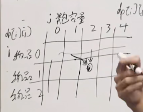

注意遍历顺序，虽然在这里可以颠倒。

### 完全背包


### 打家劫舍

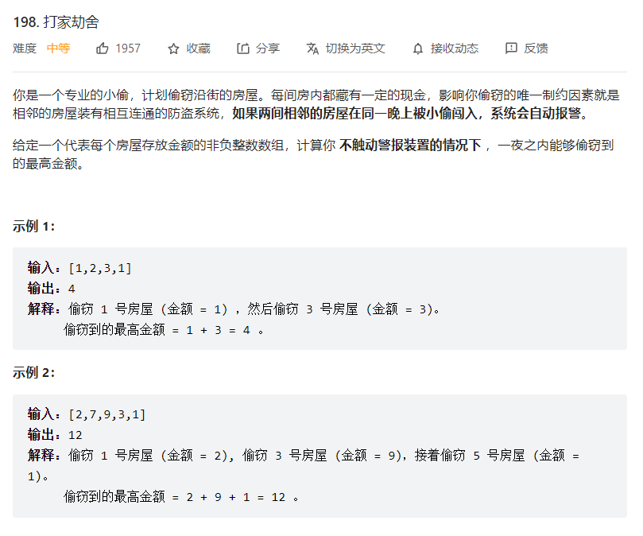
$$
d p[i]=\max (d p[i-2]+n u m s[i], d p[i-1])
$$
dp[i\] 指的是 0:i 家可以偷到的最多钱

### 最长回文串

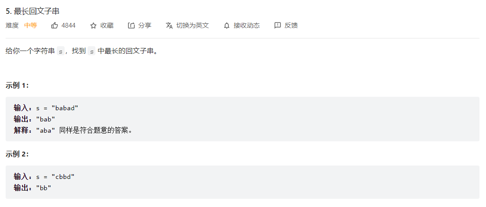

建立二维数组

dp[i][j\] = 1 如果 s[i:j\]是回文串


## 数据结构

### 用两个栈实现队列

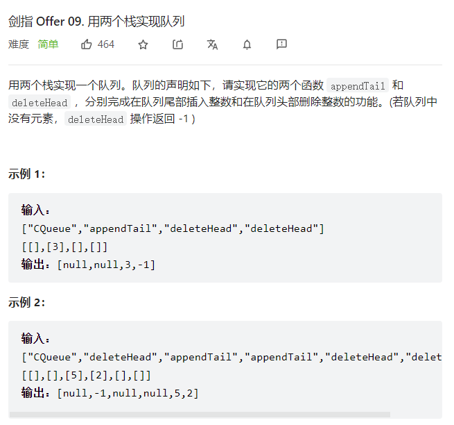

一个栈用于储存

一个栈用辅助操作

### 包含min函数的栈

一个栈用于储存数据

一个栈用于保存min

**注意pop会导致min的改变**

## 其他类型

### 颜色分类


快速排序

### 下一个排列

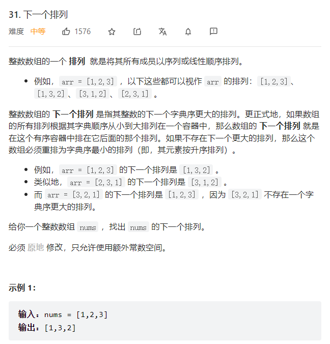

1. 将后面的大数放到前面
2. 为了保证增加幅度小，大数要靠右
3. 换位后，将大数后面的那部分改为升序，以使它最小

### 反转字符串中的单词

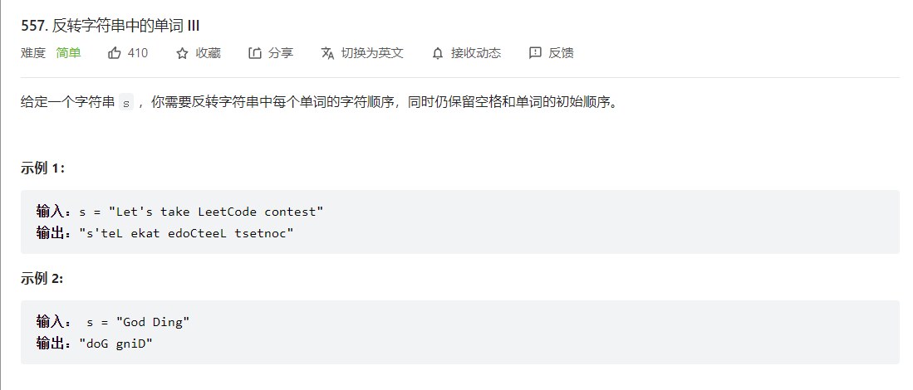

这题需要注意的是python的字符串不可变，不能原地操作

使用str.split进行操作会很简单