# 强化学习

- 无监督学习
- 有监督学习
- 强化学习

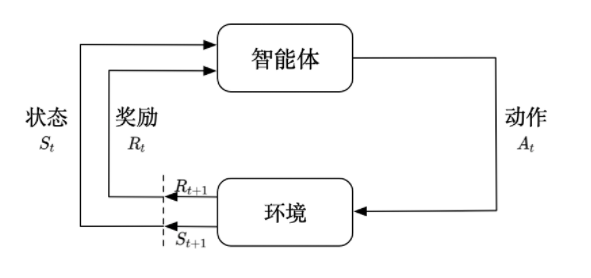

## 马尔科夫性

马尔可夫性指的是系统的下一个状态$s_{t+1}$仅与当前状态$s_{t}$有关，而与以前的状态无关。
$$
p(s_{t+1}|s_t)=p(s_{t+1}|s_1,...,s_t)
$$

## 马尔科夫过程

马尔科夫过程是一个二元组$(S,P)$, 且满足：s是有限状态集合，p是状态转移概率。状态转移矩阵为：
$$
P=\left[\begin{array}{ccc}
P_{11} & \cdots & P_{1 n} \\
\vdots & \vdots & \vdots \\
P_{n 1} & \cdots & P_{n n}
\end{array}\right]
$$

## 马尔可夫决策过程

$(S,A,P,R,\lambda)$ 

(状态集，动作集，状态转移矩阵，回报函数，折扣因子)

强化学习的目的是：给定一个马尔科夫决策过程，勋章最优策略，通常用$\pi$表示。

## 模型 

马尔可夫决策过程 -----核心

​		-动态规划 Neuro-Dynamic Programming

​		-近似动态规划 Approximate dynamic programming

​		-蒙特卡洛

隐马尔科夫模型

## 强化学习适用的场景

1. 试错探索，需要探索环境来获取对环境的理解
2. agent会从环境中获得延迟的奖励
3. 数据是时间序列的，而不是独立同分布的
4. agent的行为会影响它随后得到的数据

## 强化学习中的基本概念

t时刻的状态：
$$
s_t
$$
t时刻的动作：
$$
a_t
$$
t时刻采取了动作以后，获得的奖励：
$$
r_t
$$
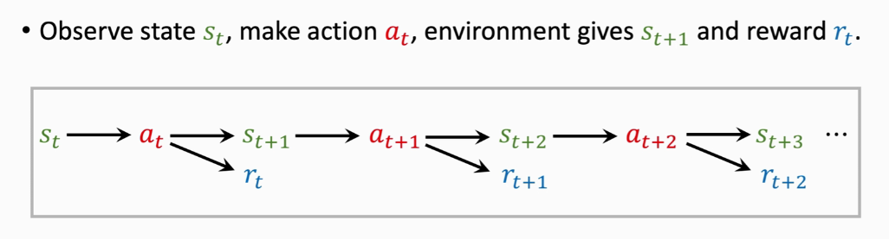

**回报**：回报是对于当前时刻t来说，未来获得的所有奖励的总和，只有给定了policy才是可以计算出来的。
$$
U_t = r_t+r_{t+1}+r_{t+2}+...
$$
policy：动作策略函数
$$
\pi(s)
$$
**价值函数**：q-function，value-function
$$
Q_{\pi}\left(s_{t}, a_{t}\right)=\mathbb{E}\left[U_{t} \mid S_{t}=s_{t}, A_{t}=a_{t}\right]
$$

> 价值函数本质上是与policy相关联的，因为回报的计算是需要指定policy的。由于状态变化的随机性，和policy函数的随机性，一般写为期望的形式。

**状态价值函数**：state-value function
$$
V(s ; \boldsymbol{\theta})=\sum_{a} \pi\left(\left.a\right|_{s} ; \boldsymbol{\theta}\right) \cdot Q_{\pi}(s, a)
$$

> 状态价值函数也是同理，其实本质上是与policy函数有所关联的。

智能体类型：

value-based： 显式地拟合q-function，policy可以通过q-function得到

policy-based：显式地拟合状态价值函数

actor-critic: 显式地拟合policy与value，也是目前最常用的。

## 动作轨迹

s, a, r, s, a, r ...

## return

考虑对未来的估计

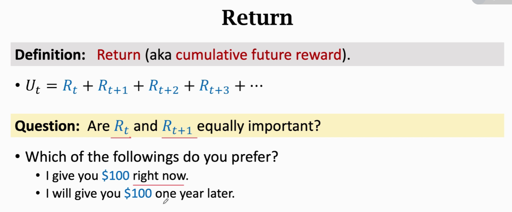

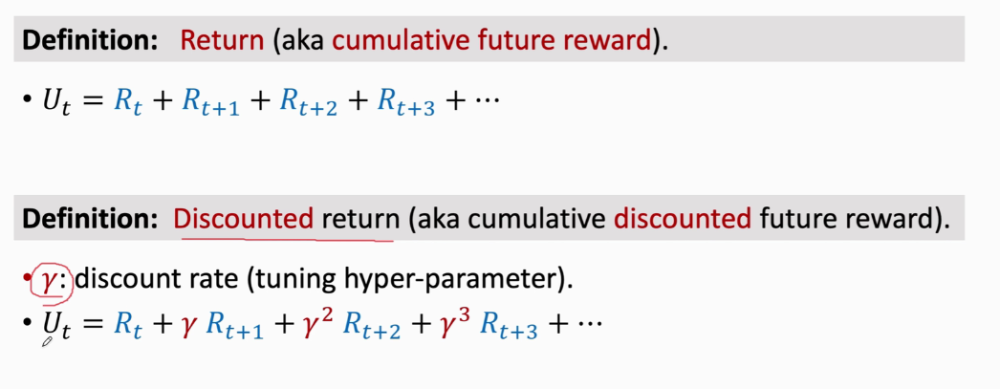

注意R也是具有随机性的。

## value function

因为$U_t$具有随机性，并不能在t时刻准确计算出了，我们对其求期望，则得到：

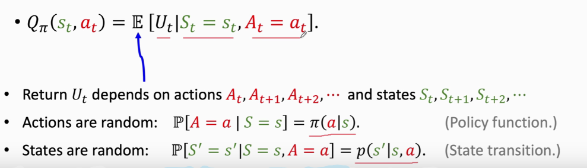

Q-函数非常重要。

## AI如何控制agent

学习 policy $\pi$

学习 q-函数

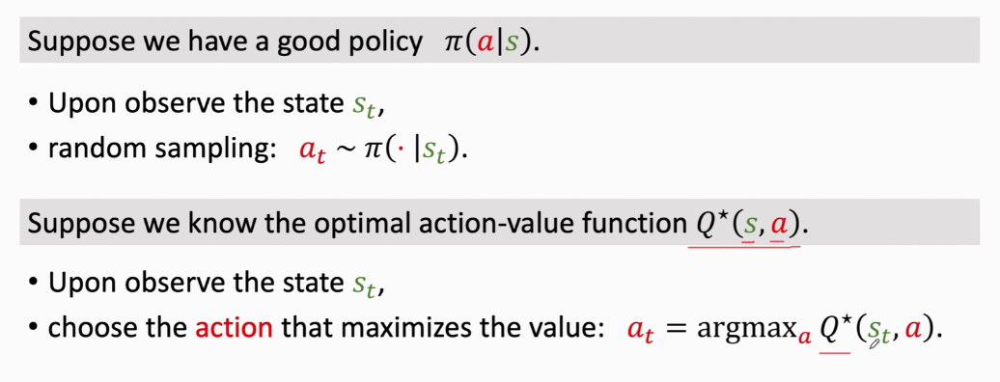

## q-函数，如何得到q-函数？

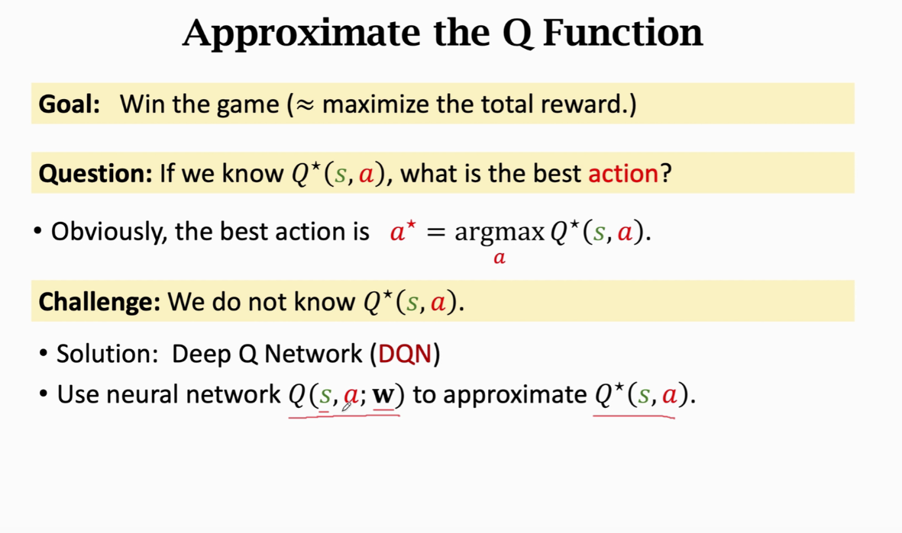

可以用神经网络近似Q-函数

### DQN

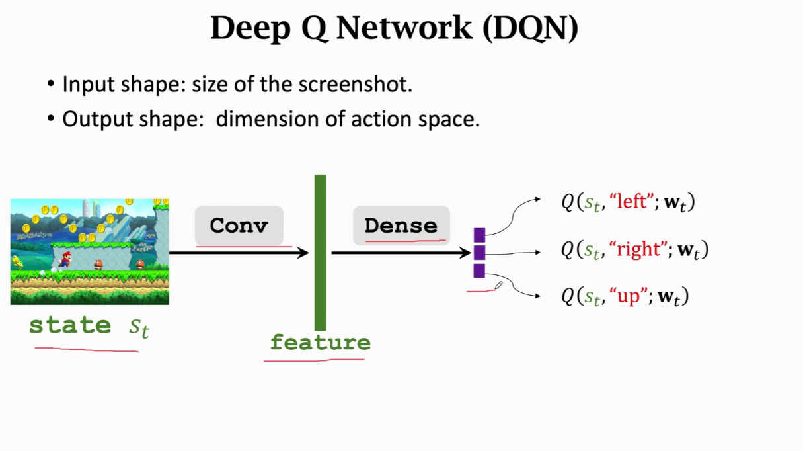

### 如何训练DQN？使用TD算法

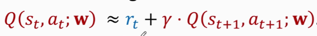 

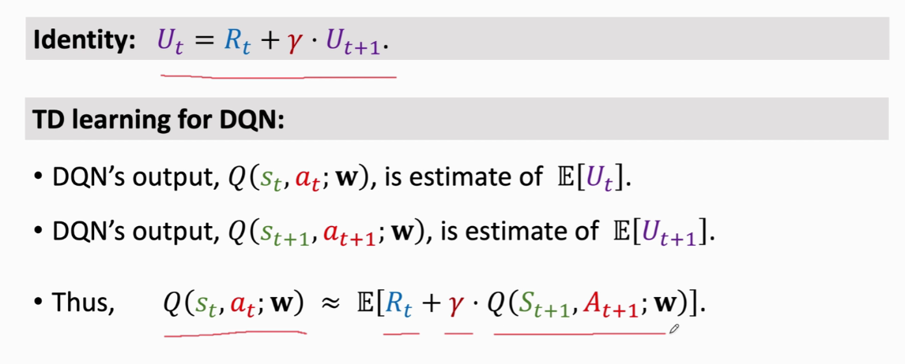

## 策略函数

给定状态，动作的分布概率。
$$
\pi(a \mid s)
$$
如果s有限，那么我们可以用表格的方式进行训练。但是s的状态空间非常庞大，那么就需要采用近似的方法。

### 动作价值函数

### 状态价值函数 

### 学习策略函数

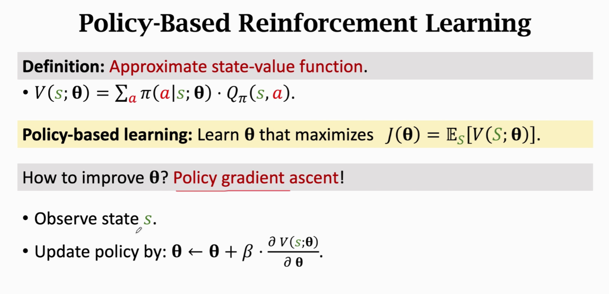

**策略梯度 policy gradient**

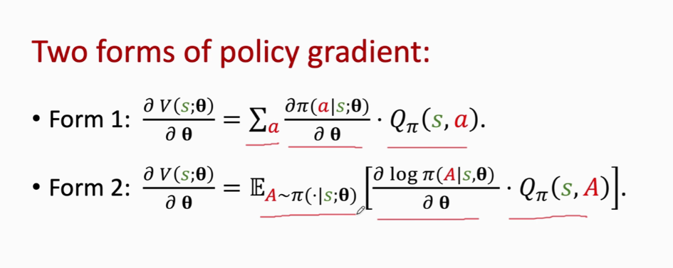

## actor-critic 算法

用两个神经网络分别近似 价值函数，策略函数。

actor：

critic

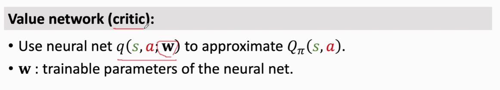

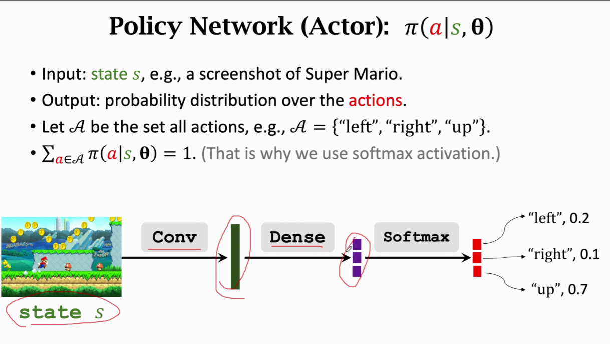

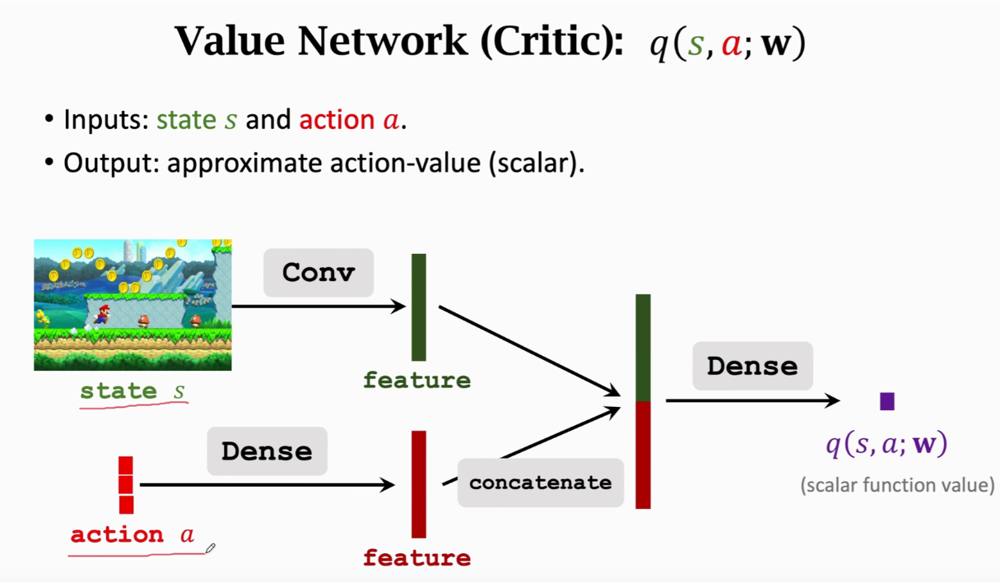

critic 输出实数。

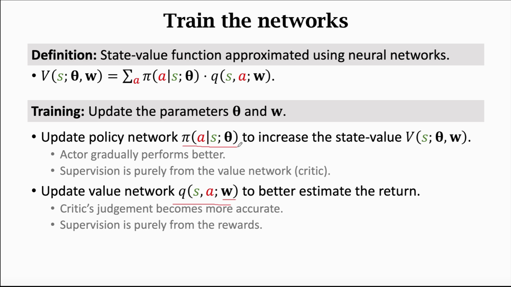

V(s) 状态价值函数：用于评价当前状态下的策略函数，其中策略函数可以写为：
$$
\pi(a \mid s ; \boldsymbol{\theta})
$$
它的参数为$\theta$ 。然后V(s)是根据q函数来评价策略函数的，所以我们也希望获得一个准确的q函数：
$$
q(s, a ; \mathbf{w})
$$
q函数也是要通过训练的，q函数需要从环境中得到训练。

总的过程可以理解为：环境与agent交互所产生的数据训练出一个越来越准确的q函数，通过q函数不断地优化$\pi()$策略函数。 

### 训练过程

1. 观察状态 $S_t$
2. 根据当前策略函数得到$a_t$，与$r_t$
3. 一直执行下去，直到得到所有的$r_t,r_{t+1},...,r_{n}=U_t$
4. 已经有了 $U_t$ ，那么更新 参数 w
5. 再用新的q函数去优化 $\pi()$策略函数。

### 梯度计算与数学推导

暂时不考虑，先了解框架

## 蒙特卡洛算法

通过随机样本估计真实值。

大数定律是理论基础。

两大功能：1. 求期望。2. 求积分

### 求积分

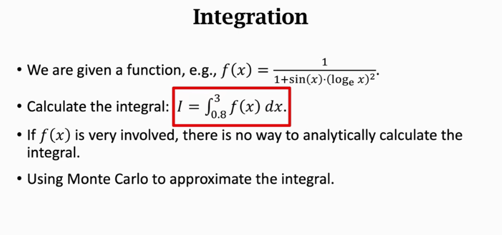

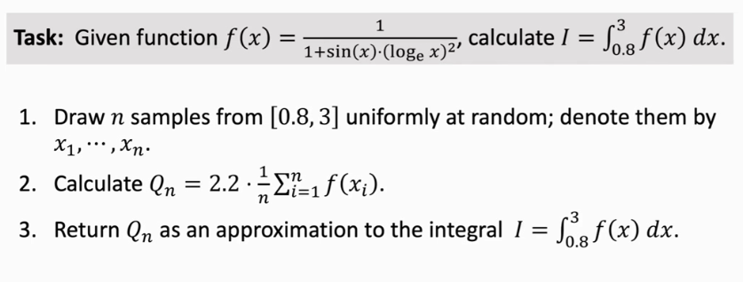

求定积分的时候就直接可以用蒙特卡洛算法求解。

该案例只说明了一元函数，实际上多元函数同样适用。

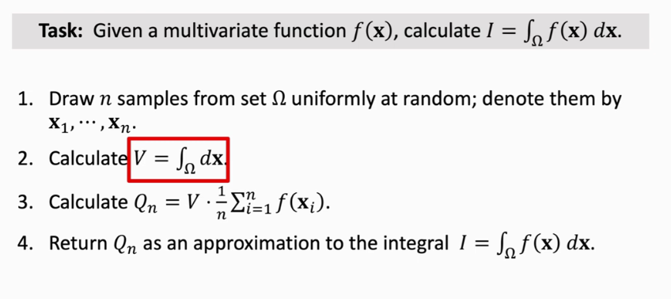

一般要求$\Omega$的体积好求。

**计算期望**

概率密度函数
$$
p(x)
$$
如果$f(x)$是x的函数，那么$f(x)$的期望可以写为：
$$
\mathbb{E}_{X \sim p}[f(X)]=\int_{\mathbb{R}^{d}} f(\mathbf{x}) \cdot p(\mathbf{x}) d \mathbf{x}
$$
这就需要使用蒙特卡罗方法。

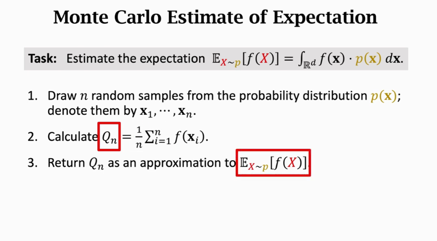

### 数学推导

蒙特卡洛方法是一种可以近似计算任意函数积分的数值方法，并不是一个求期望的方法（只是它常用于求期望）。

根据大数定律，样本均值[依概率收敛](https://zh.wikipedia.org/wiki/依概率收敛)于期望值。得到
$$
E[f(x)]=\int_{x \in S} f(x) p(x) d x \approx \frac{1}{N} \sum_{i=1}^{N} f\left(x^{i}\right)
$$
记$g(x)=f(x)p(x)$ , 带入可得：
$$
\int_{x \in S} g(x) d x \approx \frac{1}{N} \sum_{i=1}^{N} \frac{g\left(x^{i}\right)}{p\left(x^{i}\right)}
$$
$E[g(x)]$为：
$$
\begin{aligned}
E\left[\frac{1}{N} \sum_{i=1}^{N} \frac{g\left(x^{i}\right)}{p\left(x^{i}\right)}\right] &=\frac{1}{N} E\left[\sum_{i=1}^{N} \frac{g\left(x^{i}\right)}{p\left(x^{i}\right)}\right] \\
&=\frac{1}{N} N \times \int \frac{g(x)}{p(x)} p(x) d x \\
&=\int g(x) d x
\end{aligned}
$$
得到：
$$
E[g(x)] =\frac {1}{N} \sum_{i=1}^{N} g\left(x^{i}\right)=\int g(x) d x
$$

# 概念

## Sequential Decision Making

序列决策过程

agent与environment进行交互，得到一个历史：
$$
\mathrm{H}_{\mathrm{t}}=\mathrm{O}_{1}, \mathrm{R}_{1}, \mathrm{~A}_{1}, \ldots, \mathrm{A}_{\mathrm{t}-1}, \mathrm{O}_{\mathrm{t}}, \mathrm{R}_{\mathrm{t}}
$$
状态是历史的函数：
$$
\mathrm{S}_{\mathrm{t}}=\mathrm{f}\left(\mathrm{H}_{\mathrm{t}}\right)
$$
通常，观测是一个实值向量，矩阵。

### 马尔可夫决策过程

环境是完全可观测的。

## action spaces

- 离散动作空间
- 连续动作空间

## 强化学习的主要组成成分

1. 策略函数，agent会用这个函数来选取下一步的动作。
2. 价值函数，用价值函数来评估当前状态。agent 现在进入这个状态，对你后面的收益能带来多大的影响。
3. 模型，用于表示agent对环境的理解。

## policy

policy是agent的行为模型，它决定了这个agent的行为，分为两种：

1. 随机策略
2. 决定性策略

## value function

价值函数是对未来奖励的估计，用于判断agent 现在进入该状态能获得多大的收益。

eg. q-函数

## model

模型决定了下一个状态是怎么样的。

## agent 分类

- 基于价值的
- 基于策略的
- 混合 actor-critic agent

## model 

- 有模型
- 免模型

对于马尔可夫决策过程，四元组：状态，动作，转移函数，奖励函数。如果agent知道转移函数和奖励函数，那么就是有型学习。
$$
<\mathrm{S}, \mathrm{A}, \mathrm{P}, \mathrm{R}>
$$

## 马尔可夫决策过程 详解

### 马尔可夫过程

- 马尔可夫性质：如果一个状态转移是符合马尔可夫的，那就是说一个状态的下一个状态只取决于它当前状态，而跟它当前状态之前的状态都没有关系。

$$
\mathrm{p}\left(\mathrm{s}_{\mathrm{t}+1} \mid \mathrm{s}_{\mathrm{t}}\right)=\mathrm{p}\left(\mathrm{s}_{\mathrm{t}+1} \mid \mathrm{h}_{\mathrm{t}}\right)
$$

- 马尔可夫过程

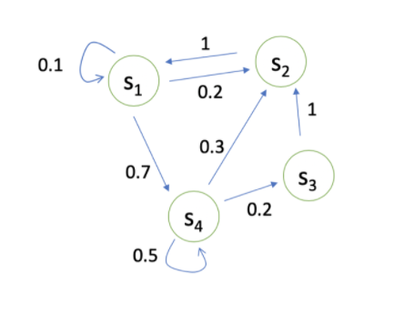

用状态转移矩阵来描述各个状态之间的变化：

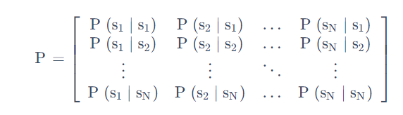

## 马尔可夫奖励过程

当达到一个状态时，可以获得相应的奖励

##  Bellman Equation

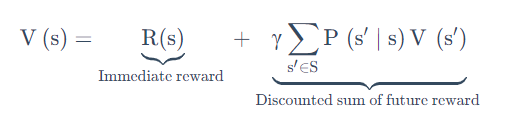

- s′ 可以看成未来的所有状态。
- 转移 P(s'|s)P(s′∣s) 是指从当前状态转移到未来状态的概率。
- V(s')V(s′) 代表的是未来某一个状态的价值。我们从当前这个位置开始，有一定的概率去到未来的所有状态，所以我们要把这个概率也写上去，这个转移矩阵也写上去，然后我们就得到了未来状态，然后再乘以一个 γ，这样就可以把未来的奖励打折扣。
- 第二部分可以看成是未来奖励的折扣总和(Discounted sum of future reward)。

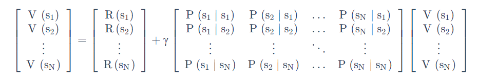

Bellman Equation 定义了当前状态与未来状态的迭代关系。

## 马尔可夫决策过程

状态转移矩阵：
$$
\mathrm{P}\left(\mathrm{s}_{\mathrm{t}+1}=\mathrm{s}^{\prime} \mid \mathrm{s}_{\mathrm{t}}=\mathrm{s}, \mathrm{a}_{\mathrm{t}}=\mathrm{a}\right)
$$
价值函数也改写为：
$$
\mathrm{R}\left(\mathrm{s}_{\mathrm{t}}=\mathrm{s}, \mathrm{a}_{\mathrm{t}}=\mathrm{a}\right)=\mathbb{E}\left[\mathrm{r}_{\mathrm{t}} \mid \mathrm{s}_{\mathrm{t}}=\mathrm{s}, \mathrm{a}_{\mathrm{t}}=\mathrm{a}\right]
$$
policy
$$
\pi(\mathrm{a} \mid \mathrm{s})=\mathrm{P}\left(\mathrm{a}_{\mathrm{t}}=\mathrm{a} \mid \mathrm{s}_{\mathrm{t}}=\mathrm{s}\right)
$$

## MRP与MDP比较：

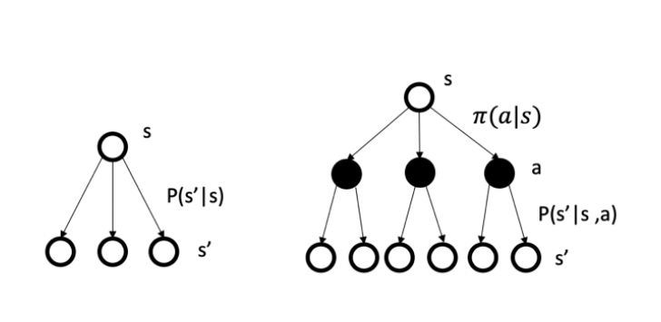

