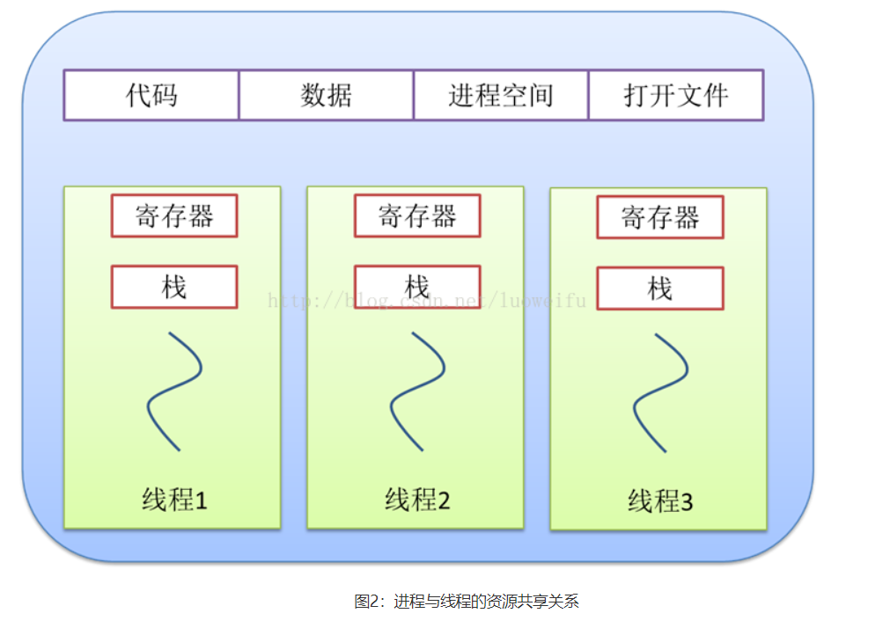
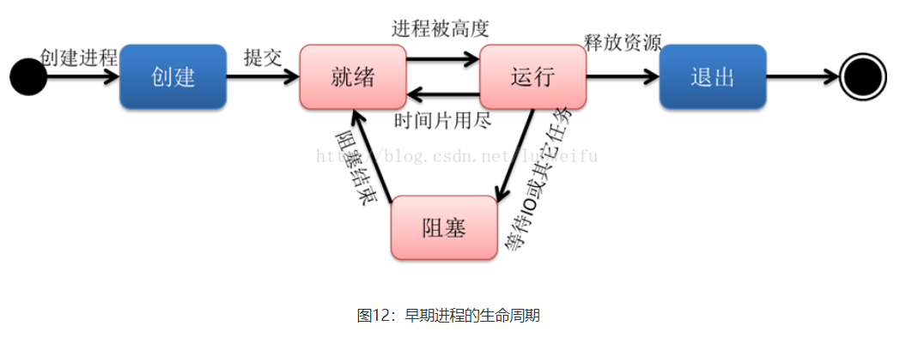

# 线程与进程

一个任务称为一个进程

一个进程内部的子任务称为线程

进程是**资源分配**的最小单位。

任意时刻，CPU的一个核心总是运行一个进程，一个进程里面可以多个线程

1. 线程是程序执行的最小单位，而进程是操作系统分配资源的最小单位；

线程是程序执行中一个单一的顺序控制流程，是程序执行流的最小单元，是处理器调度和分派的基本单位。一个进程可以有一个或多个线程，各个线程之间共享程序的内存空间(也就是所在进程的内存空间)。一个标准的线程由线程ID、当前指令指针(PC)、寄存器和堆栈组成。而进程由内存空间(代码、数据、进程空间、打开的文件)和一个或多个线程组成。

### 进程的运行

创建进程

就绪进程

运行进程

阻塞进程

退出进程

### Process

进程类，创建一个进程对象，用start()方法来生成进程

start()

join()

