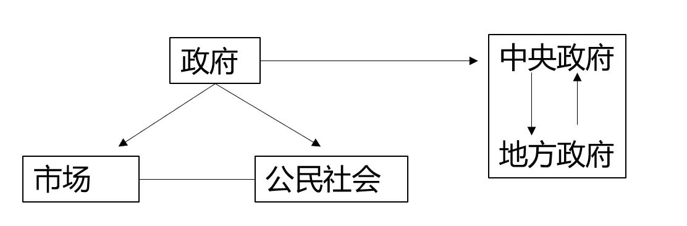

​        想要了解公共权力的运作，首先要从宏观角度搞清楚统治和治理这两个概念。因为在不同的管理方式下，公共权力的运作是不同的。我们首先从西方国家的政策转变种了解从统治到治理的发展过程，再在中国的环境下分析中国当前社会治理的情况。

## 分权化改革与公民社会的兴起——从统治到治理

正如我们在上一次科普读物中讲到的，资本主义制度内部存在不可避免的周期性经济危机，而每一次经济危机的爆发都会暴露当下国家和政府管理的弊端，并影响着政府、市场和社会三者的权力互动。

**市场失灵：**在自由资本主义时期，西方国家信奉自由主义经济理论，相信“管得最少的政府是最好的政府”，政府的职能被严格定位于保卫国家领土主权、防范个人和集体损害社会利益、保护私人财产和市场机制不受破坏，充当着“守夜人”的角色。20世纪初爆发的世界性经济危机，宣告了“自由放任”的破产，出现了市场失灵。

**政府失灵：**市场失灵使人们认识到了市场机制的缺陷，为政府全面干预经济和社会公共事务提供了空间。20世纪初中期，无论是单一制国家还是联邦制国家，权力向中央政府上移是普遍的现象，中央政府不断集权，政府职能无限扩张，实行科层官僚制度。另一方面，政府大规模的福利政策，使得财政危机日益严重；企业组织和公民背上沉重的税赋负担，减弱了市场和民间组织发展动力。此外，集权政府阻碍民主的参与式行政实践，使得公民很难进入政治与公共政策过程，参与公共事务，拉大了公民与政府的距离。政府越来越失去公民的信任，出现了管理危机，导致了政府失灵。

**分权化改革：**实施政府治理改革显然是摆脱困境的唯一出路。20世纪80年代，世界范围内国家政府围绕着分权化与市场化的中心进行改革。改革的主导目标都以分散政府权力为基础。改革的基本走向呈现出以下特点：第一，横向上的政府权力向市场和社会转移；第二，纵向上不同政府层级间的分层，表现中央政府权力与管理责任向地方政府下放。

**公民社会的兴起**：分权化改革也为公民社会能量和创造力的释放提供了广阔空间，唤起了公民参与公共事务管理的热情，促进公民社会理念产生和兴起。面对政府失灵，即使是完善的政府管理体系，也难以充分满足社会需求；面对市场失灵，即使是成熟的自由市场经济和完善的市场体制，也难以解决一些外部性强的资源配置问题，更何况政府体制并不总是完善的和有效的，市场体制并不都是成熟的，因此公民社会就成为面对市场失灵和政府失灵的一种解决方式。政府必须划定自己的作用边界，成为有限政府，该交给市场的就交给市场，该交给社会的就交给社会，形成政府、市场与社会的良性互动格局。

**总结：**分权化改革改变了传统公共行政的权力结构和运作模式，使得集中权力逐步走向下移和分散，权力主体和行为主体趋于多样化，在新的分权框架中得到了更多自主管理的权力，在公共事务和公共服务领域的作用和影响力扩大。

如图所示，治理实际上就是权力分散转移、重建权力结构，对国家、市场和公民社会三者间权力结构与权力关系重新调整与塑造的过程，这种施政理念是当前西方国家主流的施政理念。

政府统治的权力运行方向总是自上而下的，它运用政府的政治权威，通过发号施令、制定政策和实施政策，对社会公共事务实行单一向度的管理。与此不同，治理则是一个上下互动的管理过程，它主要通过合作、协商、伙伴关系、确立认同和共同的目标等方式实施对公共事务的管理。治理的实质在于建立在市场原则、公共利益和认同之上的合作。其管理机制所依靠的主要不是政府的权威，而是合作网络的权威。其权力向度是多元的、相互的，而不是单一的和自上而下的。

## 中国的社会管理和社会治理

中国政治的复杂性和特殊性使得其无法套用西方政治发展的过程。

新中国成立后在经济领域逐步形成了高度统一的**计划经济体制**。政企不分、政事不分、政社不分，企事业单位和社会组织，都像工厂的一个车间，被纳入到严格的国家计划管理之内，而政府作为国家计划的制定者、执行者和管理者，无处不在，无所不管，规模庞大，扮演着全能政府的角色。

1978年中国实行**改革开放**后，随着社会主义市场经济发展，政府职能定位经历了一个从全能到有限的转型过程，主要体现在一下四个方面：向市场社会放权、政企分开、社会发展、政府自身改革。

之后，中国政府在多次政策文件中提及要向社会治理的方向发展。

但中国的社会治理存在特殊性和复杂性。西方国家治理的不断发展是在国家制度建设完成，公民社会和市场经济发展完善的条件下出现的。而中国作为后发国家，在私营企业、市场发展、金融发展都不具备的背景下，国家通过政治权利干预经济发展。另外，由于政府政治权力集中，市场发展依赖政府干预，中国并没有发展公民社会的土壤，这也导致了中国并没有形成真正意义上的市民社会，在公共议题上，由公民和社会组织代表的社会力量并没有话语权。

## 案例

通过抖音视频，可以看出中国政府在社会治理上的矛盾在疫情防控中被放大。首先在中央与地方关系上，地方对中央防疫政策绝对服从。地方政府面临清零政策的压力，通过权力下放的手段，使得基层组织如居委会、村委会甚至小区保安获得管理权。这种科层性的挤压，不仅会带来权力的滥用，也会为带来群众内部的对立。

其次，根据上文提到的，中国并没有形成真正意义上的公民社会。这使得社会力量在国家治理层面不仅没有话语权也很难参与其中。在疫情防控中，政策制定和执行都是通过中央政府和各地政府，政府甚至为了防控疫情牺牲市场，更不用提本身就没有话语权的社会力量了。由此也看出，中国国家治理的特殊性，政府集权是远远优先于市场和社会的。因此也有学者对中国“治理”这一概念提出质疑，认为中国并没有达到“治理”的状态。

总而言之，中国的国家治理具有特殊性和复杂性，这种特殊性和复杂性在疫情防控中更突出，但很难做出好与不好的价值判断。

